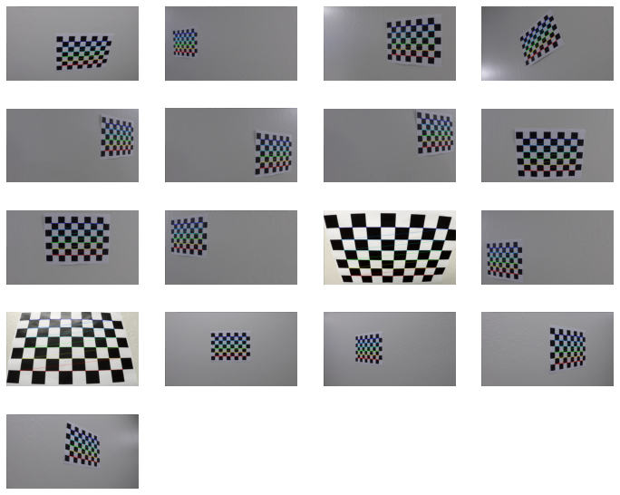

# Project2
My Advanced-Lane-Lines Project2

In this project, My goal is to find the Lane and apply to video.

---
### The goals / steps of this project are the following:
#### 1.Compute the camera calibration matrix and distortion coefficients given a set of chessboard images.  
#### 2.Apply a distortion correction to raw images. 
#### 3.Use color transforms, gradients, etc., to create a thresholded binary image. 
#### 4.Apply a perspective transform to rectify binary image ("birds-eye view"). 
#### 5.Detect lane pixels and fit to find the lane boundary. 
#### 6.Determine the curvature of the lane and vehicle position with respect to center. 
#### 7.Warp the detected lane boundaries back onto the original image. 
#### 8.Output visual display of the lane boundaries and numerical estimation of lane curvature and vehicle position. 
---

### 1.Compute the camera calibration matrix and distortion coefficients given a set of chessboard images.  

#### chose the image can find corner

#### there are some image don't find corner

### 2.Apply a distortion correction to raw images. 

### 3.Use color transforms, gradients, etc., to create a thresholded binary image. 
#### use color gradients to find the line

### 4.Apply a perspective transform to rectify binary image ("birds-eye view"). 

### 5.Detect lane pixels and fit to find the lane boundary. 

### 6.Determine the curvature of the lane and vehicle position with respect to center. 

### 7.Warp the detected lane boundaries back onto the original image. 

### 8.Output visual display of the lane boundaries and numerical estimation of lane curvature and vehicle position. 

#### And apply to video, more in the file
showing challenge video, it seems ok.

### Discussion
#### 1.Seting different situation Model maybe having better Result.
#### 2.Different  situation having different color situation
#### 3.Avoiding change too much, follow the last data to edit.
