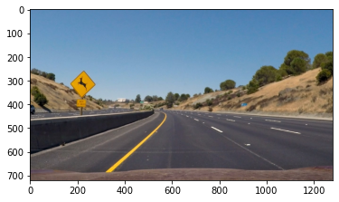
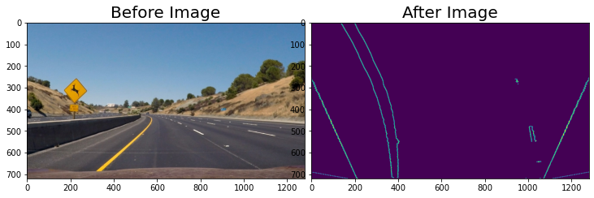
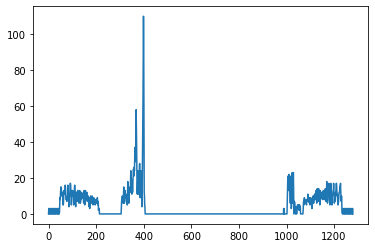

# Project2
My Advanced-Lane-Lines Project2

In this project, My goal is to find the Lane and apply to video.

### The goals / steps of this project are the following:
1.Compute the camera calibration matrix and distortion coefficients given a set of chessboard images. <br />
2.Apply a distortion correction to raw images.<br />
3.Use color transforms, gradients, etc., to create a thresholded binary image.<br />
4.Apply a perspective transform to rectify binary image ("birds-eye view").<br />
5.Detect lane pixels and fit to find the lane boundary.<br />
6.Determine the curvature of the lane and vehicle position with respect to center.<br />
7.Warp the detected lane boundaries back onto the original image.<br />
8.Output visual display of the lane boundaries and numerical estimation of lane curvature and vehicle position.<br />

### Import Package


```python
import matplotlib.pyplot as plt
import matplotlib.image as mpimg
import matplotlib.gridspec as gridspec
import numpy as np
import cv2
import glob
from moviepy.editor import VideoFileClip
import moviepy as mve

%matplotlib inline
# %%html
# <style>
# .output_wrapper, .output {
#     height:auto !important;
#     max-height:9999;
# }
# .output_scroll {
#     box-shadow:none !important;
#     webkit-box-shadow:none !important;
# }
# </style>
```

### Read a image for test


```python
# Read the image
image = mpimg.imread('test_images/test2.jpg')
plt.imshow(image)
```


    <matplotlib.image.AxesImage at 0x18a43d98340>





###  Parameter Setting


```python
# parameter
thresh_min = 50
thresh_max = 255
sobel_kernel = 3
mag_thresh = (50, 255)
dir_thresh = (0.7, 1.3)
hls_thresh = (50,255)
```

### color_threshold function 


```python
def color_threshold_setting(image,red_threshold=0, green_threshold=0, blue_threshold=0):
    # Grab the x and y size and make a copy of the image
    ysize = image.shape[0]
    xsize = image.shape[1]
    color_select = np.copy(image)
    # Define color selection criteria
    ###### MODIFY THESE VARIABLES TO MAKE YOUR COLOR SELECTION
    # rgb 三個顏色小於某個閥值 濾掉不看
    rgb_threshold = [red_threshold, green_threshold, blue_threshold]
    # Do a boolean or with the "|" character to identify
    # pixels below the thresholds
    # 其中一個符合 就濾掉給他等於[0,0,0] 使用 或 | 
    thresholds = (image[:,:,0] < rgb_threshold[0]) | (image[:,:,1] < rgb_threshold[1]) | (image[:,:,2] < rgb_threshold[2])
    color_select[thresholds] = [0,0,0]
    return color_select

```

### Setting focus view


```python
def focus_view_triangle(image):
    # Grab the x and y size and make a copy of the image
    ysize = image.shape[0]
    xsize = image.shape[1]
    triangle_image = np.copy(image)
    # Define the vertices of a triangular mask.
    # Keep in mind the origin (x=0, y=0) is in the upper left
    # MODIFY THESE VALUES TO ISOLATE THE REGION 
    # WHERE THE LANE LINES ARE IN THE IMAGE
    left_bottom = [0+50, ysize]
    right_bottom = [1280-50, ysize]
    apex = [xsize//2, ysize//2+30]
    # Perform a linear fit (y=Ax+B) to each of the three sides of the triangle
    # np.polyfit returns the coefficients [A, B] of the fit
    fit_left = np.polyfit((left_bottom[0], apex[0]), (left_bottom[1], apex[1]), 1)
    fit_right = np.polyfit((right_bottom[0], apex[0]), (right_bottom[1], apex[1]), 1)
    fit_bottom = np.polyfit((left_bottom[0], right_bottom[0]), (left_bottom[1], right_bottom[1]), 1)
    # Find the region inside the lines
    XX, YY = np.meshgrid(np.arange(0, xsize), np.arange(0, ysize))
    region_thresholds = (YY > (XX*fit_left[0] + fit_left[1])) & \
                        (YY > (XX*fit_right[0] + fit_right[1])) & \
                        (YY < (XX*fit_bottom[0] + fit_bottom[1]))
    # Color pixels red where both color and region selections met
    triangle_image[~region_thresholds] = [0, 0, 255]
#     x = [left_bottom[0], right_bottom[0], apex[0], left_bottom[0]]
#     y = [left_bottom[1], right_bottom[1], apex[1], left_bottom[1]]
#     triangle_image=plt.plot(x, y, 'b--', lw=4)
    return triangle_image

```

### Gray handle and DrawhoughLines


```python
def gray_image(image):
    gray = np.copy(image)
    gray = cv2.cvtColor(gray,cv2.COLOR_RGB2GRAY)
    # Define a kernel size for Gaussian smoothing / blurring
    kernel_size = kernel_size # Must be an odd number (3, 5, 7...)
    blur_gray = cv2.GaussianBlur(gray,(kernel_size, kernel_size),0)
    # Define our parameters for Canny and run it
    low_threshold = low_threshold
    high_threshold = high_threshold
    edges = cv2.Canny(blur_gray, low_threshold, high_threshold)
    return edges

def gray_drawhoughLines(image,kernel_size=3,low_threshold = 50,high_threshold = 150,
                        rho=2,theta=np.pi/180,threshold =15,min_line_length=10,max_line_gap=20):
    gray = np.copy(image)
    gray = cv2.cvtColor(gray,cv2.COLOR_RGB2GRAY)
    # Define a kernel size for Gaussian smoothing / blurring
    kernel_size = kernel_size # Must be an odd number (3, 5, 7...)
    blur_gray = cv2.GaussianBlur(gray,(kernel_size, kernel_size),0)
    # Define our parameters for Canny and run it
    low_threshold = low_threshold
    high_threshold = high_threshold
    edges = cv2.Canny(blur_gray, low_threshold, high_threshold)
    # Next we'll create a masked edges image using cv2.fillPoly()
    mask = np.zeros_like(edges)   
    ignore_mask_color = 255 
    # This time we are defining a four sided polygon to mask
    imshape = image.shape
#     left_bottom = [0, ysize]
#     right_bottom = [1280, ysize]
#     apex = [xsize//2, ysize//2]
    vertices = np.array([[(0,imshape[0]),(imshape[1]/2+10, imshape[0]//2+50),
                          (imshape[1]//2+10, imshape[0]//2+50), (imshape[1],imshape[0])]],
                        dtype=np.int32)
    cv2.fillPoly(mask, vertices, ignore_mask_color)
    masked_edges = cv2.bitwise_and(edges, mask)
    # Define the Hough transform parameters
    # Make a blank the same size as our image to draw on
    rho = rho # distance resolution in pixels of the Hough grid
    theta = theta # angular resolution in radians of the Hough grid
    threshold = threshold  # minimum number of votes (intersections in Hough grid cell)
    min_line_length = min_line_length #minimum number of pixels making up a line
    max_line_gap = max_line_gap   # maximum gap in pixels between connectable line segments
    line_image = np.copy(image)*0 # creating a blank to draw lines on
    # Run Hough on edge detected image
    # Output "lines" is an array containing endpoints of detected line segments
    lines = cv2.HoughLinesP(masked_edges, rho, theta, threshold, np.array([]),
                                min_line_length, max_line_gap)
    # Iterate over the output "lines" and draw lines on a blank image
    for line in lines:
        for x1,y1,x2,y2 in line:
            cv2.line(line_image,(x1,y1),(x2,y2),(255,0,0),10)

    # Create a "color" binary image to combine with line image
    color_edges = np.dstack((edges, edges, edges)) 

    # Draw the lines on the edge image
    lines_edges = cv2.addWeighted(color_edges, 0.8, line_image, 1, 0) 
    return lines_edges
```

### Calibrated 


```python
# image = mpimg.imread("camera_cal/calibration1.jpg")
# plt.imshow(image)
# some image can't find the right corner
# don't count it
# checkerboard = mpimg.imread('camera_cal/calibration1.jpg')
# # convert to grayscale
# gray = cv2.cvtColor(image, cv2.COLOR_RGB2GRAY)
# # find the chessboard corners
# pattern_size=(9,6)
# f, corners = cv2.findChessboardCorners(gray, pattern_size, None)
# f
# from skimage import io
# fname = 'camera_cal/calibration2.jpg'
# img = io.imread(fname)
# fname = 'camera_cal/calibration2.jpg'
# img = cv2.imread(fname)
# prepare object points
nx = 9 # count by yourself
ny = 6 # count by yourself
pattern_size=(9,6)
fnames = glob.glob("camera_cal/calibration*.jpg")
pattern = np.zeros((pattern_size[1] * pattern_size[0], 3), np.float32)
pattern[:, :2] = np.mgrid[0:pattern_size[0], 0:pattern_size[1]].T.reshape(-1, 2)
pattern_points = [] # points in real world image
image_points = []   # points in image plane
image_size = None
calibrated_images=[]
failed_images=[]
for fname in fnames:
    checkerboard = mpimg.imread(fname)
    gray = cv2.cvtColor(checkerboard, cv2.COLOR_RGB2GRAY)
    # Find the chessboard corners
    ret, corners = cv2.findChessboardCorners(gray, (nx, ny), None)
    if ret:
        pattern_points.append(pattern)
        image_points.append(corners)
        image_size = (checkerboard.shape[1], checkerboard.shape[0])
        cv2.drawChessboardCorners(checkerboard, (nx, ny), corners, ret)
        calibrated_images.append(checkerboard)
    else:
        failed_images.append(checkerboard)
if pattern_points and image_points:
    ret, mtx, dist, rvecs, tvecs = cv2.calibrateCamera(pattern_points, image_points, image_size,None,None)
    
    
def undistort(image, pattern_points=pattern_points, image_points=image_points):
    """ undistort image """
    undistort_image=cv2.undistort(image, mtx, dist, None, mtx)
    return undistort_image
# TODO 
# 找出可以看到頂角的圖片留下 處理 
# 找不到的去掉 
# 留下的建了 還原失真矩陣
# calibrated_camera_images = (glob.glob('camera_cal/calibration*.jpg'))
# fnames = glob.glob("camera_cal/calibration*.jpg")
# for fname in fnames:
#     image = mpimg.imread(fname)
#     print(image.shape)
# 視野角度 處理
def perspective_transform(image):
    # 圖片的 寬 高
    height = image.shape[0]
    width = image.shape[1]
    # Quadrangle verties coordinates in the source image
    # 取要關注的點
    s1 = [width // 2 - 76, height * 0.625]
    s2 = [width // 2 + 76, height * 0.625]
    s3 = [-100, height]
    s4 = [width + 100, height]
    src = np.float32([s1, s2, s3, s4])
    # Quadrangle verties coordinates in the destination image
    # 轉成自己要的圖片
    d1 = [100, 0]
    d2 = [width - 100, 0]
    d3 = [100, height]
    d4 = [width - 100, height]
    dst = np.float32([d1, d2, d3, d4])
    # Given src and dst points we calculate the perspective transform matrix
    M = cv2.getPerspectiveTransform(src, dst)
    # Warp the image
    warped = cv2.warpPerspective(image, M, (width, height))
    # We also calculate the oposite transform
    unwrap_m = cv2.getPerspectiveTransform(dst, src)
    # Return the resulting image and matrix 
    return (warped, unwrap_m)
```


```python
plt.figure(figsize=(12, 10))
gridspec.GridSpec(5, 4)
print('Corners detected:')
# Loop through the images and look for the chessboard corners
for i, calibrated_images, in enumerate(calibrated_images):
    plt.subplot2grid((5, 4), (i//4, i%4), colspan=1, rowspan=1)
    plt.imshow(calibrated_images)
    plt.axis('off')
plt.show()
print('Unable to detect corners:')
for i, failed_images, in enumerate(failed_images):
    plt.subplot2grid((5, 4), (i//4, i%4), colspan=1, rowspan=1)
    plt.imshow(failed_images)
    plt.axis('off')
plt.show()
```

    Corners detected:
    


    Unable to detect corners:
    


# Sobel combined function 


```python
def hls_select(image, thresh=hls_thresh):
    hls = cv2.cvtColor(image, cv2.COLOR_RGB2HLS)
    s_channel = hls[:,:,2]
    hls_output = np.zeros_like(s_channel)
    hls_output[(s_channel > thresh[0]) & (s_channel <= thresh[1])] = 1
    return hls_output

def Sobel_Operator(image,axis='x',thresh_min=thresh_min,thresh_max = thresh_max):
    image_c = np.copy(image)
#   gray = cv2.cvtColor(image_c, cv2.COLOR_RGB2GRAY)
#   hls = cv2.cvtColor(np.copy(image_c), cv2.COLOR_RGB2HLS).astype(np.float)
#   s = hls[:, :, 2]
    if axis == 'x':      
        abs_sobel = np.absolute(cv2.Sobel(image_c, cv2.CV_64F, 1, 0))
    elif axis == 'y':      
        abs_sobel = np.absolute(cv2.Sobel(image_c, cv2.CV_64F, 0, 1))
    thresh_min = thresh_min
    thresh_max = thresh_max
    scaled_sobel = np.uint8(255*abs_sobel/np.max(abs_sobel))
    output = np.zeros_like(scaled_sobel)
    output[(scaled_sobel >= thresh_min) & (scaled_sobel <= thresh_max)] = 1
    return output      
# output=Sobel_Operator(image,axis='x')
# plt.imshow(output, cmap='gray')
# show_bf_af_image(image,binary_output)
def mag_thresh(image, sobel_kernel=sobel_kernel, mag_thresh=mag_thresh):
    # Convert to grayscale
    image_c = np.copy(image)
#   gray = cv2.cvtColor(image_c, cv2.COLOR_RGB2GRAY)
#     hls = cv2.cvtColor(np.copy(image_c), cv2.COLOR_RGB2HLS).astype(np.float)
#     s = hls[:, :, 2]
    # Take both Sobel x and y gradients
    sobelx = cv2.Sobel(image_c, cv2.CV_64F, 1, 0, ksize=sobel_kernel)
    sobely = cv2.Sobel(image_c, cv2.CV_64F, 0, 1, ksize=sobel_kernel)
    # Calculate the gradient magnitude
    gradmag = np.sqrt(sobelx**2 + sobely**2)
    # Rescale to 8 bit
    scale_factor = np.max(gradmag)/255 
    gradmag = (gradmag/scale_factor).astype(np.uint8) 
    # Create a binary image of ones where threshold is met, zeros otherwise
    output_mag = np.zeros_like(gradmag)
    output_mag[(gradmag >= mag_thresh[0]) & (gradmag <= mag_thresh[1])] = 1
    # Return the binary image
    return output_mag
# output_mag=mag_thresh(image)
# plt.imshow(output_mag)
# Define a function to threshold an image for a given range and Sobel kernel
def dir_threshold(image, sobel_kernel=3, thresh=dir_thresh):
    # Grayscale
    image_c = np.copy(image)
#   gray = cv2.cvtColor(image_c, cv2.COLOR_RGB2GRAY)
#     hls = cv2.cvtColor(np.copy(image_c), cv2.COLOR_RGB2HLS).astype(np.float)
#     s = hls[:, :, 2]
    # Calculate the x and y gradients
    sobelx = cv2.Sobel(image_c, cv2.CV_64F, 1, 0, ksize=sobel_kernel)
    sobely = cv2.Sobel(image_c, cv2.CV_64F, 0, 1, ksize=sobel_kernel)
    # Take the absolute value of the gradient direction, 
    # apply a threshold, and create a binary image result
    absgraddir = np.arctan2(np.absolute(sobely), np.absolute(sobelx))
    binary_output_dir =  np.zeros_like(absgraddir)
    binary_output_dir[(absgraddir >= thresh[0]) & (absgraddir <= thresh[1])] = 1
    # Return the binary image
    return binary_output_dir
# binary_output_dir=dir_threshold(image)
# plt.imshow(binary_output_dir)
def Sobel_combined(image):
#     image_c = np.copy(image)
    image_c=hls_select(image)
    gradx = Sobel_Operator(image_c)
    grady = Sobel_Operator(image_c)
    mag_binary = mag_thresh(image_c)
    dir_binary = dir_threshold(image_c)
    combined = np.zeros_like(dir_binary)
    combined[((gradx == 1) & (grady == 1)) | ((mag_binary == 1) & (dir_binary == 1))] = 1
    return combined
```

# Finding the Lines: Sliding Window


```python
# Load our image
def find_lane_pixels(image):
    # Take a histogram of the bottom half of the image
    histogram = np.sum(image[image.shape[0]//2:,:], axis=0)
    # Create an output image to draw on and visualize the result
    out_img = np.dstack((image, image, image))
    # Find the peak of the left and right halves of the histogram
    # These will be the starting point for the left and right lines
    midpoint = np.int(histogram.shape[0]//2)
    leftx_base = np.argmax(histogram[:midpoint])
    rightx_base = np.argmax(histogram[midpoint:]) + midpoint

    # HYPERPARAMETERS
    # Choose the number of sliding windows
    nwindows = 9
    # Set the width of the windows +/- margin
    margin = 100
    # Set minimum number of pixels found to recenter window
    minpix = 50

    # Set height of windows - based on nwindows above and image shape
    window_height = np.int(image.shape[0]//nwindows)
    # Identify the x and y positions of all nonzero pixels in the image
    nonzero = image.nonzero()
    nonzeroy = np.array(nonzero[0])
    nonzerox = np.array(nonzero[1])
    # Current positions to be updated later for each window in nwindows
    leftx_current = leftx_base
    rightx_current = rightx_base

    # Create empty lists to receive left and right lane pixel indices
    left_lane_inds = []
    right_lane_inds = []

    # Step through the windows one by one
    for window in range(nwindows):
        # Identify window boundaries in x and y (and right and left)
        win_y_low = image.shape[0] - (window+1)*window_height
        win_y_high = image.shape[0] - window*window_height
        win_xleft_low = leftx_current - margin
        win_xleft_high = leftx_current + margin
        win_xright_low = rightx_current - margin
        win_xright_high = rightx_current + margin
        
        # Draw the windows on the visualization image
        cv2.rectangle(out_img,(win_xleft_low,win_y_low),(win_xleft_high,win_y_high),(0,255,0), 2) 
        cv2.rectangle(out_img,(win_xright_low,win_y_low),(win_xright_high,win_y_high),(0,255,0), 2) 
        
        # Identify the nonzero pixels in x and y within the window #
        good_left_inds = ((nonzeroy >= win_y_low) & (nonzeroy < win_y_high) & 
        (nonzerox >= win_xleft_low) &  (nonzerox < win_xleft_high)).nonzero()[0]
        good_right_inds = ((nonzeroy >= win_y_low) & (nonzeroy < win_y_high) & 
        (nonzerox >= win_xright_low) &  (nonzerox < win_xright_high)).nonzero()[0]
        
        # Append these indices to the lists
        left_lane_inds.append(good_left_inds)
        right_lane_inds.append(good_right_inds)
        
        # If you found > minpix pixels, recenter next window on their mean position
        if len(good_left_inds) > minpix:
            leftx_current = np.int(np.mean(nonzerox[good_left_inds]))
        if len(good_right_inds) > minpix:        
            rightx_current = np.int(np.mean(nonzerox[good_right_inds]))

    # Concatenate the arrays of indices (previously was a list of lists of pixels)
    try:
        left_lane_inds = np.concatenate(left_lane_inds)
        right_lane_inds = np.concatenate(right_lane_inds)
    except ValueError:
        # Avoids an error if the above is not implemented fully
        pass

    # Extract left and right line pixel positions
    leftx = nonzerox[left_lane_inds]
    lefty = nonzeroy[left_lane_inds] 
    rightx = nonzerox[right_lane_inds]
    righty = nonzeroy[right_lane_inds]

    # Fit a second order polynomial to each
    if len(leftx) == 0:
        left_fit =[]
    else:
        left_fit = np.polyfit(lefty, leftx, 2)
    
    if len(rightx) == 0:
        right_fit =[]
    else:
        right_fit = np.polyfit(righty, rightx, 2)
    

    
    out_img[nonzeroy[left_lane_inds], nonzerox[left_lane_inds]] = [255, 0, 0]
    out_img[nonzeroy[right_lane_inds], nonzerox[right_lane_inds]] = [0, 0, 255]
    
    ploty = np.linspace(0, binary_warped.shape[0]-1, binary_warped.shape[0] )


    return left_fit, right_fit,out_img, lefty, leftx, righty, rightx, ploty


# def fit_polynomial(image):
#     # Find our lane pixels first
#     leftx, lefty, rightx, righty, out_img = find_lane_pixels(image)

#     # Fit a second order polynomial to each using `np.polyfit`
#     left_fit = np.polyfit(lefty, leftx, 2)
#     right_fit = np.polyfit(righty, rightx, 2)

#     # Generate x and y values for plotting
#     ploty = np.linspace(0, image.shape[0]-1, image.shape[0] )
#     try:
#         left_fitx = left_fit[0]*ploty**2 + left_fit[1]*ploty + left_fit[2]
#         right_fitx = right_fit[0]*ploty**2 + right_fit[1]*ploty + right_fit[2]
#     except TypeError:
#         # Avoids an error if `left` and `right_fit` are still none or incorrect
#         print('The function failed to fit a line!')
#         left_fitx = 1*ploty**2 + 1*ploty
#         right_fitx = 1*ploty**2 + 1*ploty

#     ## Visualization ##
#     # Colors in the left and right lane regions
#     out_img[lefty, leftx] = [255, 0, 0]
#     out_img[righty, rightx] = [0, 0, 255]

#     # Plots the left and right polynomials on the lane lines
#     plt.plot(left_fitx, ploty, color='yellow')
#     plt.plot(right_fitx, ploty, color='yellow')
#     return  out_img, left_fit, right_fit, ploty, lefty, leftx, righty, rightx

def curvatures(lefty, leftx, righty, rightx, ploty):
    
    # Define conversions in x and y from pixels space to meters
    ym_per_pix = 30/720 # meters per pixel in y dimension
    xm_per_pix = 3.7/730 # meters per pixel in x dimension
    
    y_eval = np.max(ploty)

    # Fit new polynomials to x,y in world space
#     if lefty & leftx
    
    left_fit_cr = np.polyfit(lefty*ym_per_pix, leftx*xm_per_pix, 2)
    right_fit_cr = np.polyfit(righty*ym_per_pix, rightx*xm_per_pix, 2)
    # Calculate the new radii of curvature
    left_curverad = ((1 + (2*left_fit_cr[0]*y_eval*ym_per_pix + left_fit_cr[1])**2)**1.5) / np.absolute(2*left_fit_cr[0])
    right_curverad = ((1 + (2*right_fit_cr[0]*y_eval*ym_per_pix + right_fit_cr[1])**2)**1.5) / np.absolute(2*right_fit_cr[0])

    return left_curverad, right_curverad
```

### Draw lane Function


```python
def draw_lane(img, warped, left_fit, right_fit, ploty, left_curverad, right_curverad, utransformed):

    # Create an image to draw the lines on
    warp_zero = np.zeros_like(warped).astype(np.uint8)
    color_warp = np.dstack((warp_zero, warp_zero, warp_zero))
    
    left_fitx = left_fit[0]*ploty**2 + left_fit[1]*ploty + left_fit[2]
    right_fitx = right_fit[0]*ploty**2 + right_fit[1]*ploty + right_fit[2]

    # Recast the x and y points into usable format for cv2.fillPoly()
    pts_left = np.array([np.transpose(np.vstack([left_fitx, ploty]))])
    pts_right = np.array([np.flipud(np.transpose(np.vstack([right_fitx, ploty])))])
    pts = np.hstack((pts_left, pts_right))

    # Draw the lane onto the warped blank image
    cv2.fillPoly(color_warp, np.int_([pts]), (0,255, 0))

    # Warp the blank back to original image space using inverse perspective matrix (Minv)
    newwarp = cv2.warpPerspective(color_warp, utransformed, (image.shape[1], image.shape[0])) 
    
    # Creating Text and set font parameters
    TextL = "Left  Curvature: " + str(int(left_curverad)) + " m"
    TextR = "Right Curvature: " + str(int(right_curverad))+ " m"
    fontScale=1.5
    thickness=3
    fontFace = cv2.FONT_HERSHEY_SIMPLEX

    # Using CV2 putText to write text into images
    cv2.putText(newwarp, TextL, (110,60), fontFace, fontScale,(255,255,255), thickness,  lineType = cv2.LINE_AA)
    cv2.putText(newwarp, TextR, (110,110), fontFace, fontScale,(255,255,255), thickness,  lineType = cv2.LINE_AA)

    # Combine the result with the original image
    result = cv2.addWeighted(img, 1, newwarp, 0.3, 0)
    
    return result

# Testing the Function
# drawed_lane = draw_lane(img, binary_warped, left_fit, right_fit, ploty, left_curverad, right_curverad, utransformed)
# # Plot the Result
# plt.figure(figsize=(20,10))
# plt.imshow(drawed_lane)
```

### Pipeline


```python
def pipeline(image):
    # creating a Binary Undistorced Warped Image
    trans, utransformed = combined(image)
    # Fiting Lines
    left_fit, right_fit,out_img, lefty, leftx, righty, rightx, ploty = find_lane_pixels(trans) 
    # Calulating the left and right lines curvatures
    left_curverad, right_curverad = curvatures(lefty, leftx, righty, rightx, ploty)
    # Draw Lane between road lines
    result_lane = draw_lane(image, trans, left_fit, right_fit, ploty, left_curverad, right_curverad, utransformed)                              
    return result_lane   
```


```python
# Finding the Lines: Search from Prior
# Polynomial fit values from the previous frame
# Make sure to grab the actual values from the previous step in your project!
# left_fit = np.array([ 2.13935315e-04, -3.77507980e-01,  4.76902175e+02])
# right_fit = np.array([4.17622148e-04, -4.93848953e-01,  1.11806170e+03])

# def fit_poly(img_shape, leftx, lefty, rightx, righty):
#      ### TO-DO: Fit a second order polynomial to each with np.polyfit() ###
#     left_fit = np.polyfit(lefty, leftx, 2)
#     right_fit = np.polyfit(righty, rightx, 2)
#     # Generate x and y values for plotting
#     ploty = np.linspace(0, img_shape[0]-1, img_shape[0])
#     ### TO-DO: Calc both polynomials using ploty, left_fit and right_fit ###
#     left_fitx = left_fit[0]*ploty**2 + left_fit[1]*ploty + left_fit[2]
#     right_fitx = right_fit[0]*ploty**2 + right_fit[1]*ploty + right_fit[2]
    
#     return left_fitx, right_fitx, ploty

# def search_around_poly(binary_warped):
#     # HYPERPARAMETER
#     # Choose the width of the margin around the previous polynomial to search
#     # The quiz grader expects 100 here, but feel free to tune on your own!
#     margin = 100

#     # Grab activated pixels
#     nonzero = binary_warped.nonzero()
#     nonzeroy = np.array(nonzero[0])
#     nonzerox = np.array(nonzero[1])
    
#     ### TO-DO: Set the area of search based on activated x-values ###
#     ### within the +/- margin of our polynomial function ###
#     ### Hint: consider the window areas for the similarly named variables ###
#     ### in the previous quiz, but change the windows to our new search area ###
#     left_lane_inds = ((nonzerox > (left_fit[0]*(nonzeroy**2) + left_fit[1]*nonzeroy + 
#                     left_fit[2] - margin)) & (nonzerox < (left_fit[0]*(nonzeroy**2) + 
#                     left_fit[1]*nonzeroy + left_fit[2] + margin)))
#     right_lane_inds = ((nonzerox > (right_fit[0]*(nonzeroy**2) + right_fit[1]*nonzeroy + 
#                     right_fit[2] - margin)) & (nonzerox < (right_fit[0]*(nonzeroy**2) + 
#                     right_fit[1]*nonzeroy + right_fit[2] + margin)))
    
#     # Again, extract left and right line pixel positions
#     leftx = nonzerox[left_lane_inds]
#     lefty = nonzeroy[left_lane_inds] 
#     rightx = nonzerox[right_lane_inds]
#     righty = nonzeroy[right_lane_inds]

#     # Fit new polynomials
#     left_fitx, right_fitx, ploty = fit_poly(binary_warped.shape, leftx, lefty, rightx, righty)
    
#     ## Visualization ##
#     # Create an image to draw on and an image to show the selection window
#     out_img = np.dstack((binary_warped, binary_warped, binary_warped))*255
#     window_img = np.zeros_like(out_img)
#     # Color in left and right line pixels
#     out_img[nonzeroy[left_lane_inds], nonzerox[left_lane_inds]] = [255, 0, 0]
#     out_img[nonzeroy[right_lane_inds], nonzerox[right_lane_inds]] = [0, 0, 255]

#     # Generate a polygon to illustrate the search window area
#     # And recast the x and y points into usable format for cv2.fillPoly()
#     left_line_window1 = np.array([np.transpose(np.vstack([left_fitx-margin, ploty]))])
#     left_line_window2 = np.array([np.flipud(np.transpose(np.vstack([left_fitx+margin, 
#                               ploty])))])
#     left_line_pts = np.hstack((left_line_window1, left_line_window2))
#     right_line_window1 = np.array([np.transpose(np.vstack([right_fitx-margin, ploty]))])
#     right_line_window2 = np.array([np.flipud(np.transpose(np.vstack([right_fitx+margin, 
#                               ploty])))])
#     right_line_pts = np.hstack((right_line_window1, right_line_window2))

#     # Draw the lane onto the warped blank image
#     cv2.fillPoly(window_img, np.int_([left_line_pts]), (0,255, 0))
#     cv2.fillPoly(window_img, np.int_([right_line_pts]), (0,255, 0))
#     result = cv2.addWeighted(out_img, 1, window_img, 0.3, 0)
    
#     # Plot the polynomial lines onto the image
#     plt.plot(left_fitx, ploty, color='yellow')
#     plt.plot(right_fitx, ploty, color='yellow')
#     ## End visualization steps ##
    
#     return result
```

### Myself function 


```python
def show_bf_af_image(before,after):
    f, (ax1, ax2) = plt.subplots(1, 2, figsize=(48, 18))
    f.tight_layout()
    ax1.imshow(before)
    ax1.set_title('Before Image', fontsize=20)
    ax2.imshow(after)
    ax2.set_title('After Image', fontsize=20)
    plt.subplots_adjust(left=0.2, right=0.4, top=0.9, bottom=0.5)
    
def is_same_image(image1,image2):
    difference = cv2.subtract(image1, image2)
    find = not np.any(difference) #if difference is all zeros it will return False
    if image.shape==edges.shape==0:
        result = "兩張圖片格式就已經不同了"
    elif find is True:
        result = "兩張圖片一樣"
    else:
        cv2.imwrite("result.jpg", difference)
        result = "兩張圖片不一樣"
    return result
```

### Color,View amd Hough
#### 1.Limit the threshold from 0 to 250, keep the view I need and using houghLine to draw the line.


```python
color_select = color_threshold_setting(image,250,0,0)
triangle_image = focus_view_triangle(color_select)
lines_edges = gray_drawhoughLines(triangle_image)
# Uncomment the following code if you are running the code locally and wish to save the image
# mpimg.imsave("test-after.png", color_select)
show_bf_af_image(image,lines_edges)
```


### Undistort
#### 2.To undistort the image


```python
undistort_image=undistort(image)
show_bf_af_image(image,undistort_image)
```


### Perspective
#### 3.change the view to bird view, so I can know the curvatures of the Lane.


```python
# 將每一個圖片轉換
# for image in glob.glob('test_images/test*.jpg'):
#     image = mpimg.imread(image)
#     transformed, _ = perspective_transform(image) 
    
#     _, (x1, x2) = plt.subplots(1, 2, figsize=(24, 9))
#     x1.axis('off')
#     x1.imshow(image)
#     x1.set_title('Original', fontsize=20)

#     x2.axis('off')
#     x2.imshow(transformed)
#     x2.set_title('Transformed', fontsize=20)
transformed, utransformed = perspective_transform(image) 
show_bf_af_image(image,transformed)
```


### Sobel
#### 4.Using Sobel to fing the edges


```python
test=Sobel_combined(image)
show_bf_af_image(image,test)
```


### Combined the Sobel method


```python
def combined(image):
    undistort_image=undistort(image)
#    color_select = color_threshold_setting(undistort_image,250,0,0)
    triangle_image = focus_view_triangle(undistort_image)
#     lines_edges = gray_drawhoughLines(triangle_image)
    transformed, utransformed = perspective_transform(triangle_image) 
    image=Sobel_combined(transformed)
    return image,utransformed
# Uncomment the following code if you are running the code locally and wish to save the image
# mpimg.imsave("test-after.png", color_select)
test,utransformed=combined(image)
show_bf_af_image(image,test)
```





### Detecting Lanes using Histogram


```python
binary_warped,utransformed=combined(image)
histogram = np.sum(binary_warped[binary_warped.shape[0]//2:,:], axis=0)
plt.plot(histogram)
```


    [<matplotlib.lines.Line2D at 0x18a47ff5a60>]





### Slide Window


```python
test,utransformed=combined(image)
# out_img,left_fit, right_fit,ploty,out_img, lefty, leftx, righty, rightx = fitlines(binary_warped)
left_fit, right_fit,out_img, lefty, leftx, righty, rightx, ploty = find_lane_pixels(test)
#Testing Function
left_curverad, right_curverad = curvatures(lefty, leftx, righty, rightx, ploty)    
# Now our radius of curvature is in meters
print(left_curverad, 'm', right_curverad, 'm')
plt.imshow(out_img)
```

    Clipping input data to the valid range for imshow with RGB data ([0..1] for floats or [0..255] for integers).
    

    383.87439049471425 m 401.08144731233915 m
    


    <matplotlib.image.AxesImage at 0x18a48050760>


```python
# Search from Prior
# result = search_around_poly(test)
# # View your output
# plt.imshow(result)
```

### Pipeline image


```python
#read image
image = mpimg.imread('test_images/test3.jpg')
resultado = pipeline(image)
plt.figure(figsize=(10,5))
plt.imshow(resultado)
```


    <matplotlib.image.AxesImage at 0x18a4625b760>


# Output_images


```python
# test_images = glob.glob('test_images/test*.jpg')
for image_path in glob.glob('test_images/test*.jpg'):
    image = mpimg.imread(image_path)
    edit = pipeline(image)
   
    mpimg.imsave(image_path.replace('test_images', 'output_images'), edit)
    plt.figure(figsize=(5, 2.5))
    plt.imshow(edit)
    plt.subplots_adjust(left=0.0, right=1, top=0.9, bottom=0.0)
    plt.show() 
```


### Create video file pipeline


```python
output = 'out_test_video.mp4'
clip1 = VideoFileClip("videos/project_video.mp4")
#clip1 = VideoFileClip("project_video.mp4").subclip(1,2)

out_clip = clip1.fl_image(pipeline) #NOTE: this function expects color images!!
%time out_clip.write_videofile(output, audio=False)
```

                                                                   
                                                                
    
    t:  46%|████▌     | 577/1260 [37:06<02:10,  5.25it/s, now=None]
    t:  46%|████▌     | 579/1260 [16:37<01:36,  7.08it/s, now=None]
    
                                                                   [A
                                                                
    
    t:  46%|████▌     | 577/1260 [37:06<02:10,  5.25it/s, now=None]
    t:  46%|████▌     | 579/1260 [16:37<01:36,  7.08it/s, now=None]
    
    t:  23%|██▎       | 113/485 [00:56<00:59,  6.27it/s, now=None]
    
    
    t:   0%|          | 0/1260 [00:00<?, ?it/s, now=None]
    
    
    t:   0%|          | 2/1260 [00:00<01:39, 12.69it/s, now=None]

    Moviepy - Building video out_test_video.mp4.
    Moviepy - Writing video out_test_video.mp4
    
    

    
    
    
    t:   0%|          | 3/1260 [00:00<02:10,  9.65it/s, now=None]
    
    
    t:   0%|          | 4/1260 [00:00<02:34,  8.14it/s, now=None]
    
    
    t:   0%|          | 5/1260 [00:00<02:47,  7.49it/s, now=None]
    
    
    t:   0%|          | 6/1260 [00:00<02:57,  7.07it/s, now=None]
    
    
    t:   1%|          | 7/1260 [00:00<03:02,  6.87it/s, now=None]
    
    
    t:   1%|          | 8/1260 [00:01<03:13,  6.48it/s, now=None]
    
    
    t:   1%|          | 9/1260 [00:01<03:13,  6.46it/s, now=None]
    
    
    t:   1%|          | 10/1260 [00:01<03:09,  6.59it/s, now=None]
    
    
    t:   1%|          | 11/1260 [00:01<03:10,  6.57it/s, now=None]
    
    
    t:   1%|          | 12/1260 [00:01<03:10,  6.54it/s, now=None]
    
    
    t:   1%|          | 13/1260 [00:01<03:09,  6.57it/s, now=None]
    
    
    t:   1%|          | 14/1260 [00:02<03:09,  6.56it/s, now=None]
    
    
    t:   1%|          | 15/1260 [00:02<03:13,  6.42it/s, now=None]
    
    
    t:   1%|▏         | 16/1260 [00:02<03:12,  6.47it/s, now=None]
    
    
    t:   1%|▏         | 17/1260 [00:02<03:13,  6.41it/s, now=None]
    
    
    t:   1%|▏         | 18/1260 [00:02<03:13,  6.41it/s, now=None]
    
    
    t:   2%|▏         | 19/1260 [00:02<03:12,  6.43it/s, now=None]
    
    
    t:   2%|▏         | 20/1260 [00:02<03:11,  6.47it/s, now=None]
    
    
    t:   2%|▏         | 21/1260 [00:03<03:10,  6.50it/s, now=None]
    
    
    t:   2%|▏         | 22/1260 [00:03<03:12,  6.42it/s, now=None]
    
    
    t:   2%|▏         | 23/1260 [00:03<03:13,  6.40it/s, now=None]
    
    
    t:   2%|▏         | 24/1260 [00:03<03:18,  6.21it/s, now=None]
    
    
    t:   2%|▏         | 25/1260 [00:03<03:17,  6.24it/s, now=None]
    
    
    t:   2%|▏         | 26/1260 [00:03<03:16,  6.27it/s, now=None]
    
    
    t:   2%|▏         | 27/1260 [00:04<03:14,  6.34it/s, now=None]
    
    
    t:   2%|▏         | 28/1260 [00:04<03:16,  6.28it/s, now=None]
    
    
    t:   2%|▏         | 29/1260 [00:04<03:13,  6.37it/s, now=None]
    
    
    t:   2%|▏         | 30/1260 [00:04<03:12,  6.40it/s, now=None]
    
    
    t:   2%|▏         | 31/1260 [00:04<03:12,  6.38it/s, now=None]
    
    
    t:   3%|▎         | 32/1260 [00:04<03:11,  6.42it/s, now=None]
    
    
    t:   3%|▎         | 33/1260 [00:05<03:09,  6.47it/s, now=None]
    
    
    t:   3%|▎         | 34/1260 [00:05<03:07,  6.53it/s, now=None]
    
    
    t:   3%|▎         | 35/1260 [00:05<03:12,  6.35it/s, now=None]
    
    
    t:   3%|▎         | 36/1260 [00:05<03:12,  6.36it/s, now=None]
    
    
    t:   3%|▎         | 37/1260 [00:05<03:13,  6.32it/s, now=None]
    
    
    t:   3%|▎         | 38/1260 [00:05<03:13,  6.32it/s, now=None]
    
    
    t:   3%|▎         | 39/1260 [00:05<03:13,  6.31it/s, now=None]
    
    
    t:   3%|▎         | 40/1260 [00:06<03:13,  6.31it/s, now=None]
    
    
    t:   3%|▎         | 41/1260 [00:06<03:16,  6.19it/s, now=None]
    
    
    t:   3%|▎         | 42/1260 [00:06<03:12,  6.33it/s, now=None]
    
    
    t:   3%|▎         | 43/1260 [00:06<03:12,  6.31it/s, now=None]
    
    
    t:   3%|▎         | 44/1260 [00:06<03:12,  6.31it/s, now=None]
    
    
    t:   4%|▎         | 45/1260 [00:06<03:10,  6.37it/s, now=None]
    
    
    t:   4%|▎         | 46/1260 [00:07<03:08,  6.45it/s, now=None]
    
    
    t:   4%|▎         | 47/1260 [00:07<03:07,  6.47it/s, now=None]
    
    
    t:   4%|▍         | 48/1260 [00:07<03:04,  6.56it/s, now=None]
    
    
    t:   4%|▍         | 49/1260 [00:07<03:03,  6.58it/s, now=None]
    
    
    t:   4%|▍         | 50/1260 [00:07<03:02,  6.62it/s, now=None]
    
    
    t:   4%|▍         | 51/1260 [00:07<03:03,  6.60it/s, now=None]
    
    
    t:   4%|▍         | 52/1260 [00:07<03:05,  6.50it/s, now=None]
    
    
    t:   4%|▍         | 53/1260 [00:08<03:09,  6.35it/s, now=None]
    
    
    t:   4%|▍         | 54/1260 [00:08<03:08,  6.39it/s, now=None]
    
    
    t:   4%|▍         | 55/1260 [00:08<03:08,  6.40it/s, now=None]
    
    
    t:   4%|▍         | 56/1260 [00:08<03:06,  6.46it/s, now=None]
    
    
    t:   5%|▍         | 57/1260 [00:08<03:07,  6.42it/s, now=None]
    
    
    t:   5%|▍         | 58/1260 [00:08<03:12,  6.25it/s, now=None]
    
    
    t:   5%|▍         | 59/1260 [00:09<03:11,  6.28it/s, now=None]
    
    
    t:   5%|▍         | 60/1260 [00:09<03:10,  6.31it/s, now=None]
    
    
    t:   5%|▍         | 61/1260 [00:09<03:07,  6.39it/s, now=None]
    
    
    t:   5%|▍         | 62/1260 [00:09<03:07,  6.40it/s, now=None]
    
    
    t:   5%|▌         | 63/1260 [00:09<03:06,  6.43it/s, now=None]
    
    
    t:   5%|▌         | 64/1260 [00:09<03:05,  6.45it/s, now=None]
    
    
    t:   5%|▌         | 65/1260 [00:10<03:05,  6.46it/s, now=None]
    
    
    t:   5%|▌         | 66/1260 [00:10<03:04,  6.48it/s, now=None]
    
    
    t:   5%|▌         | 67/1260 [00:10<03:03,  6.49it/s, now=None]
    
    
    t:   5%|▌         | 68/1260 [00:10<03:04,  6.46it/s, now=None]
    
    
    t:   5%|▌         | 69/1260 [00:10<03:07,  6.35it/s, now=None]
    
    
    t:   6%|▌         | 70/1260 [00:10<03:07,  6.33it/s, now=None]
    
    
    t:   6%|▌         | 71/1260 [00:10<03:08,  6.31it/s, now=None]
    
    
    t:   6%|▌         | 72/1260 [00:11<03:07,  6.33it/s, now=None]
    
    
    t:   6%|▌         | 73/1260 [00:11<03:07,  6.33it/s, now=None]
    
    
    t:   6%|▌         | 74/1260 [00:11<03:10,  6.23it/s, now=None]
    
    
    t:   6%|▌         | 75/1260 [00:11<03:19,  5.95it/s, now=None]
    
    
    t:   6%|▌         | 76/1260 [00:11<03:25,  5.76it/s, now=None]
    
    
    t:   6%|▌         | 77/1260 [00:12<03:29,  5.64it/s, now=None]
    
    
    t:   6%|▌         | 78/1260 [00:12<03:32,  5.56it/s, now=None]
    
    
    t:   6%|▋         | 79/1260 [00:12<03:29,  5.65it/s, now=None]
    
    
    t:   6%|▋         | 80/1260 [00:12<03:23,  5.80it/s, now=None]
    
    
    t:   6%|▋         | 81/1260 [00:12<03:18,  5.95it/s, now=None]
    
    
    t:   7%|▋         | 82/1260 [00:12<03:14,  6.04it/s, now=None]
    
    
    t:   7%|▋         | 83/1260 [00:13<03:12,  6.12it/s, now=None]
    
    
    t:   7%|▋         | 84/1260 [00:13<03:16,  5.99it/s, now=None]
    
    
    t:   7%|▋         | 85/1260 [00:13<03:23,  5.77it/s, now=None]
    
    
    t:   7%|▋         | 86/1260 [00:13<03:18,  5.90it/s, now=None]
    
    
    t:   7%|▋         | 87/1260 [00:13<03:14,  6.03it/s, now=None]
    
    
    t:   7%|▋         | 88/1260 [00:13<03:16,  5.97it/s, now=None]
    
    
    t:   7%|▋         | 89/1260 [00:14<03:20,  5.83it/s, now=None]
    
    
    t:   7%|▋         | 90/1260 [00:14<03:13,  6.03it/s, now=None]
    
    
    t:   7%|▋         | 91/1260 [00:14<03:08,  6.21it/s, now=None]
    
    
    t:   7%|▋         | 92/1260 [00:14<03:08,  6.19it/s, now=None]
    
    
    t:   7%|▋         | 93/1260 [00:14<03:23,  5.73it/s, now=None]
    
    
    t:   7%|▋         | 94/1260 [00:14<03:17,  5.89it/s, now=None]
    
    
    t:   8%|▊         | 95/1260 [00:15<03:15,  5.97it/s, now=None]
    
    
    t:   8%|▊         | 96/1260 [00:15<03:08,  6.17it/s, now=None]
    
    
    t:   8%|▊         | 97/1260 [00:15<03:05,  6.26it/s, now=None]
    
    
    t:   8%|▊         | 98/1260 [00:15<03:01,  6.39it/s, now=None]
    
    
    t:   8%|▊         | 99/1260 [00:15<03:03,  6.34it/s, now=None]
    
    
    t:   8%|▊         | 100/1260 [00:15<03:01,  6.39it/s, now=None]
    
    
    t:   8%|▊         | 101/1260 [00:15<03:04,  6.29it/s, now=None]
    
    
    t:   8%|▊         | 102/1260 [00:16<03:02,  6.33it/s, now=None]
    
    
    t:   8%|▊         | 103/1260 [00:16<03:00,  6.41it/s, now=None]
    
    
    t:   8%|▊         | 104/1260 [00:16<03:02,  6.35it/s, now=None]
    
    
    t:   8%|▊         | 105/1260 [00:16<03:00,  6.41it/s, now=None]
    
    
    t:   8%|▊         | 106/1260 [00:16<03:01,  6.36it/s, now=None]
    
    
    t:   8%|▊         | 107/1260 [00:16<03:11,  6.01it/s, now=None]
    
    
    t:   9%|▊         | 108/1260 [00:17<03:18,  5.81it/s, now=None]
    
    
    t:   9%|▊         | 109/1260 [00:17<03:12,  5.99it/s, now=None]
    
    
    t:   9%|▊         | 110/1260 [00:17<03:09,  6.06it/s, now=None]
    
    
    t:   9%|▉         | 111/1260 [00:17<03:06,  6.15it/s, now=None]
    
    
    t:   9%|▉         | 112/1260 [00:17<03:13,  5.92it/s, now=None]
    
    
    t:   9%|▉         | 113/1260 [00:17<03:22,  5.68it/s, now=None]
    
    
    t:   9%|▉         | 114/1260 [00:18<03:18,  5.77it/s, now=None]
    
    
    t:   9%|▉         | 115/1260 [00:18<03:22,  5.65it/s, now=None]
    
    
    t:   9%|▉         | 116/1260 [00:18<03:24,  5.61it/s, now=None]
    
    
    t:   9%|▉         | 117/1260 [00:18<03:24,  5.58it/s, now=None]
    
    
    t:   9%|▉         | 118/1260 [00:18<03:16,  5.81it/s, now=None]
    
    
    t:   9%|▉         | 119/1260 [00:18<03:12,  5.94it/s, now=None]
    
    
    t:  10%|▉         | 120/1260 [00:19<03:06,  6.12it/s, now=None]
    
    
    t:  10%|▉         | 121/1260 [00:19<03:06,  6.10it/s, now=None]
    
    
    t:  10%|▉         | 122/1260 [00:19<03:12,  5.92it/s, now=None]
    
    
    t:  10%|▉         | 123/1260 [00:19<03:13,  5.89it/s, now=None]
    
    
    t:  10%|▉         | 124/1260 [00:19<03:07,  6.06it/s, now=None]
    
    
    t:  10%|▉         | 125/1260 [00:19<03:06,  6.08it/s, now=None]
    
    
    t:  10%|█         | 126/1260 [00:20<03:03,  6.19it/s, now=None]
    
    
    t:  10%|█         | 127/1260 [00:20<03:00,  6.26it/s, now=None]
    
    
    t:  10%|█         | 128/1260 [00:20<03:01,  6.22it/s, now=None]
    
    
    t:  10%|█         | 129/1260 [00:20<03:00,  6.27it/s, now=None]
    
    
    t:  10%|█         | 130/1260 [00:20<02:58,  6.32it/s, now=None]
    
    
    t:  10%|█         | 131/1260 [00:20<03:01,  6.22it/s, now=None]
    
    
    t:  10%|█         | 132/1260 [00:21<03:03,  6.16it/s, now=None]
    
    
    t:  11%|█         | 133/1260 [00:21<03:00,  6.23it/s, now=None]
    
    
    t:  11%|█         | 134/1260 [00:21<02:57,  6.33it/s, now=None]
    
    
    t:  11%|█         | 135/1260 [00:21<02:59,  6.28it/s, now=None]
    
    
    t:  11%|█         | 136/1260 [00:21<02:59,  6.27it/s, now=None]
    
    
    t:  11%|█         | 137/1260 [00:21<02:59,  6.27it/s, now=None]
    
    
    t:  11%|█         | 138/1260 [00:22<03:00,  6.22it/s, now=None]
    
    
    t:  11%|█         | 139/1260 [00:22<03:00,  6.20it/s, now=None]
    
    
    t:  11%|█         | 140/1260 [00:22<02:59,  6.24it/s, now=None]
    
    
    t:  11%|█         | 141/1260 [00:22<02:58,  6.27it/s, now=None]
    
    
    t:  11%|█▏        | 142/1260 [00:22<03:03,  6.09it/s, now=None]
    
    
    t:  11%|█▏        | 143/1260 [00:22<03:03,  6.08it/s, now=None]
    
    
    t:  11%|█▏        | 144/1260 [00:23<03:01,  6.16it/s, now=None]
    
    
    t:  12%|█▏        | 145/1260 [00:23<02:59,  6.20it/s, now=None]
    
    
    t:  12%|█▏        | 146/1260 [00:23<02:56,  6.31it/s, now=None]
    
    
    t:  12%|█▏        | 147/1260 [00:23<02:58,  6.24it/s, now=None]
    
    
    t:  12%|█▏        | 148/1260 [00:23<02:58,  6.24it/s, now=None]
    
    
    t:  12%|█▏        | 149/1260 [00:23<03:07,  5.93it/s, now=None]
    
    
    t:  12%|█▏        | 150/1260 [00:24<03:05,  5.98it/s, now=None]
    
    
    t:  12%|█▏        | 151/1260 [00:24<03:02,  6.08it/s, now=None]
    
    
    t:  12%|█▏        | 152/1260 [00:24<02:58,  6.20it/s, now=None]
    
    
    t:  12%|█▏        | 153/1260 [00:24<02:57,  6.25it/s, now=None]
    
    
    t:  12%|█▏        | 154/1260 [00:24<02:57,  6.23it/s, now=None]
    
    
    t:  12%|█▏        | 155/1260 [00:24<02:55,  6.28it/s, now=None]
    
    
    t:  12%|█▏        | 156/1260 [00:24<02:56,  6.26it/s, now=None]
    
    
    t:  12%|█▏        | 157/1260 [00:25<02:55,  6.28it/s, now=None]
    
    
    t:  13%|█▎        | 158/1260 [00:25<02:51,  6.43it/s, now=None]
    
    
    t:  13%|█▎        | 159/1260 [00:25<02:52,  6.38it/s, now=None]
    
    
    t:  13%|█▎        | 160/1260 [00:25<02:53,  6.36it/s, now=None]
    
    
    t:  13%|█▎        | 161/1260 [00:25<02:53,  6.35it/s, now=None]
    
    
    t:  13%|█▎        | 162/1260 [00:25<02:55,  6.26it/s, now=None]
    
    
    t:  13%|█▎        | 163/1260 [00:26<02:56,  6.20it/s, now=None]
    
    
    t:  13%|█▎        | 164/1260 [00:26<02:57,  6.19it/s, now=None]
    
    
    t:  13%|█▎        | 165/1260 [00:26<02:58,  6.13it/s, now=None]
    
    
    t:  13%|█▎        | 166/1260 [00:26<03:05,  5.89it/s, now=None]
    
    
    t:  13%|█▎        | 167/1260 [00:26<03:03,  5.96it/s, now=None]
    
    
    t:  13%|█▎        | 168/1260 [00:26<03:00,  6.04it/s, now=None]
    
    
    t:  13%|█▎        | 169/1260 [00:27<02:57,  6.16it/s, now=None]
    
    
    t:  13%|█▎        | 170/1260 [00:27<02:58,  6.12it/s, now=None]
    
    
    t:  14%|█▎        | 171/1260 [00:27<02:57,  6.13it/s, now=None]
    
    
    t:  14%|█▎        | 172/1260 [00:27<02:59,  6.05it/s, now=None]
    
    
    t:  14%|█▎        | 173/1260 [00:27<02:59,  6.05it/s, now=None]
    
    
    t:  14%|█▍        | 174/1260 [00:27<03:01,  5.99it/s, now=None]
    
    
    t:  14%|█▍        | 175/1260 [00:28<03:03,  5.91it/s, now=None]
    
    
    t:  14%|█▍        | 176/1260 [00:28<03:02,  5.94it/s, now=None]
    
    
    t:  14%|█▍        | 177/1260 [00:28<02:58,  6.07it/s, now=None]
    
    
    t:  14%|█▍        | 178/1260 [00:28<03:01,  5.96it/s, now=None]
    
    
    t:  14%|█▍        | 179/1260 [00:28<02:57,  6.08it/s, now=None]
    
    
    t:  14%|█▍        | 180/1260 [00:28<02:58,  6.07it/s, now=None]
    
    
    t:  14%|█▍        | 181/1260 [00:29<02:56,  6.11it/s, now=None]
    
    
    t:  14%|█▍        | 182/1260 [00:29<03:02,  5.91it/s, now=None]
    
    
    t:  15%|█▍        | 183/1260 [00:29<02:57,  6.06it/s, now=None]
    
    
    t:  15%|█▍        | 184/1260 [00:29<02:56,  6.11it/s, now=None]
    
    
    t:  15%|█▍        | 185/1260 [00:29<02:56,  6.10it/s, now=None]
    
    
    t:  15%|█▍        | 186/1260 [00:29<02:56,  6.07it/s, now=None]
    
    
    t:  15%|█▍        | 187/1260 [00:30<02:54,  6.14it/s, now=None]
    
    
    t:  15%|█▍        | 188/1260 [00:30<02:53,  6.19it/s, now=None]
    
    
    t:  15%|█▌        | 189/1260 [00:30<02:51,  6.25it/s, now=None]
    
    
    t:  15%|█▌        | 190/1260 [00:30<02:53,  6.18it/s, now=None]
    
    
    t:  15%|█▌        | 191/1260 [00:30<02:51,  6.24it/s, now=None]
    
    
    t:  15%|█▌        | 192/1260 [00:30<02:50,  6.25it/s, now=None]
    
    
    t:  15%|█▌        | 193/1260 [00:31<02:49,  6.31it/s, now=None]
    
    
    t:  15%|█▌        | 194/1260 [00:31<02:54,  6.11it/s, now=None]
    
    
    t:  15%|█▌        | 195/1260 [00:31<02:49,  6.28it/s, now=None]
    
    
    t:  16%|█▌        | 196/1260 [00:31<02:49,  6.26it/s, now=None]
    
    
    t:  16%|█▌        | 197/1260 [00:31<02:51,  6.22it/s, now=None]
    
    
    t:  16%|█▌        | 198/1260 [00:31<02:51,  6.19it/s, now=None]
    
    
    t:  16%|█▌        | 199/1260 [00:31<02:49,  6.27it/s, now=None]
    
    
    t:  16%|█▌        | 200/1260 [00:32<02:54,  6.07it/s, now=None]
    
    
    t:  16%|█▌        | 201/1260 [00:32<02:50,  6.23it/s, now=None]
    
    
    t:  16%|█▌        | 202/1260 [00:32<02:49,  6.24it/s, now=None]
    
    
    t:  16%|█▌        | 203/1260 [00:32<02:51,  6.15it/s, now=None]
    
    
    t:  16%|█▌        | 204/1260 [00:32<02:50,  6.21it/s, now=None]
    
    
    t:  16%|█▋        | 205/1260 [00:32<02:54,  6.04it/s, now=None]
    
    
    t:  16%|█▋        | 206/1260 [00:33<02:54,  6.04it/s, now=None]
    
    
    t:  16%|█▋        | 207/1260 [00:33<02:52,  6.11it/s, now=None]
    
    
    t:  17%|█▋        | 208/1260 [00:33<02:52,  6.09it/s, now=None]
    
    
    t:  17%|█▋        | 209/1260 [00:33<02:51,  6.13it/s, now=None]
    
    
    t:  17%|█▋        | 210/1260 [00:33<02:47,  6.26it/s, now=None]
    
    
    t:  17%|█▋        | 211/1260 [00:33<02:52,  6.10it/s, now=None]
    
    
    t:  17%|█▋        | 212/1260 [00:34<02:50,  6.16it/s, now=None]
    
    
    t:  17%|█▋        | 213/1260 [00:34<02:52,  6.08it/s, now=None]
    
    
    t:  17%|█▋        | 214/1260 [00:34<02:53,  6.04it/s, now=None]
    
    
    t:  17%|█▋        | 215/1260 [00:34<02:50,  6.12it/s, now=None]
    
    
    t:  17%|█▋        | 216/1260 [00:34<02:50,  6.13it/s, now=None]
    
    
    t:  17%|█▋        | 217/1260 [00:34<02:50,  6.11it/s, now=None]
    
    
    t:  17%|█▋        | 218/1260 [00:35<02:48,  6.19it/s, now=None]
    
    
    t:  17%|█▋        | 219/1260 [00:35<02:50,  6.10it/s, now=None]
    
    
    t:  17%|█▋        | 220/1260 [00:35<02:51,  6.06it/s, now=None]
    
    
    t:  18%|█▊        | 221/1260 [00:35<02:46,  6.23it/s, now=None]
    
    
    t:  18%|█▊        | 222/1260 [00:35<02:44,  6.31it/s, now=None]
    
    
    t:  18%|█▊        | 223/1260 [00:35<02:52,  6.02it/s, now=None]
    
    
    t:  18%|█▊        | 224/1260 [00:36<02:49,  6.11it/s, now=None]
    
    
    t:  18%|█▊        | 225/1260 [00:36<02:50,  6.06it/s, now=None]
    
    
    t:  18%|█▊        | 226/1260 [00:36<02:48,  6.13it/s, now=None]
    
    
    t:  18%|█▊        | 227/1260 [00:36<02:45,  6.24it/s, now=None]
    
    
    t:  18%|█▊        | 228/1260 [00:36<02:50,  6.06it/s, now=None]
    
    
    t:  18%|█▊        | 229/1260 [00:36<02:47,  6.14it/s, now=None]
    
    
    t:  18%|█▊        | 230/1260 [00:37<02:43,  6.28it/s, now=None]
    
    
    t:  18%|█▊        | 231/1260 [00:37<02:45,  6.21it/s, now=None]
    
    
    t:  18%|█▊        | 232/1260 [00:37<02:42,  6.33it/s, now=None]
    
    
    t:  18%|█▊        | 233/1260 [00:37<02:41,  6.36it/s, now=None]
    
    
    t:  19%|█▊        | 234/1260 [00:37<02:40,  6.38it/s, now=None]
    
    
    t:  19%|█▊        | 235/1260 [00:37<02:39,  6.44it/s, now=None]
    
    
    t:  19%|█▊        | 236/1260 [00:37<02:42,  6.29it/s, now=None]
    
    
    t:  19%|█▉        | 237/1260 [00:38<02:43,  6.26it/s, now=None]
    
    
    t:  19%|█▉        | 238/1260 [00:38<02:42,  6.28it/s, now=None]
    
    
    t:  19%|█▉        | 239/1260 [00:38<02:41,  6.30it/s, now=None]
    
    
    t:  19%|█▉        | 240/1260 [00:38<02:40,  6.35it/s, now=None]
    
    
    t:  19%|█▉        | 241/1260 [00:38<02:42,  6.26it/s, now=None]
    
    
    t:  19%|█▉        | 242/1260 [00:38<02:47,  6.07it/s, now=None]
    
    
    t:  19%|█▉        | 243/1260 [00:39<02:44,  6.17it/s, now=None]
    
    
    t:  19%|█▉        | 244/1260 [00:39<02:44,  6.16it/s, now=None]
    
    
    t:  19%|█▉        | 245/1260 [00:39<02:45,  6.14it/s, now=None]
    
    
    t:  20%|█▉        | 246/1260 [00:39<02:43,  6.22it/s, now=None]
    
    
    t:  20%|█▉        | 247/1260 [00:39<02:46,  6.08it/s, now=None]
    
    
    t:  20%|█▉        | 248/1260 [00:39<02:47,  6.02it/s, now=None]
    
    
    t:  20%|█▉        | 249/1260 [00:40<02:46,  6.08it/s, now=None]
    
    
    t:  20%|█▉        | 250/1260 [00:40<02:46,  6.08it/s, now=None]
    
    
    t:  20%|█▉        | 251/1260 [00:40<02:44,  6.12it/s, now=None]
    
    
    t:  20%|██        | 252/1260 [00:40<02:44,  6.12it/s, now=None]
    
    
    t:  20%|██        | 253/1260 [00:40<02:44,  6.12it/s, now=None]
    
    
    t:  20%|██        | 254/1260 [00:40<02:47,  6.02it/s, now=None]
    
    
    t:  20%|██        | 255/1260 [00:41<02:43,  6.15it/s, now=None]
    
    
    t:  20%|██        | 256/1260 [00:41<02:41,  6.21it/s, now=None]
    
    
    t:  20%|██        | 257/1260 [00:41<02:40,  6.25it/s, now=None]
    
    
    t:  20%|██        | 258/1260 [00:41<02:38,  6.32it/s, now=None]
    
    
    t:  21%|██        | 259/1260 [00:41<02:39,  6.29it/s, now=None]
    
    
    t:  21%|██        | 260/1260 [00:41<02:39,  6.26it/s, now=None]
    
    
    t:  21%|██        | 261/1260 [00:42<02:41,  6.18it/s, now=None]
    
    
    t:  21%|██        | 262/1260 [00:42<02:43,  6.11it/s, now=None]
    
    
    t:  21%|██        | 263/1260 [00:42<02:41,  6.18it/s, now=None]
    
    
    t:  21%|██        | 264/1260 [00:42<02:40,  6.19it/s, now=None]
    
    
    t:  21%|██        | 265/1260 [00:42<02:42,  6.11it/s, now=None]
    
    
    t:  21%|██        | 266/1260 [00:42<02:45,  6.00it/s, now=None]
    
    
    t:  21%|██        | 267/1260 [00:43<02:49,  5.87it/s, now=None]
    
    
    t:  21%|██▏       | 268/1260 [00:43<02:44,  6.01it/s, now=None]
    
    
    t:  21%|██▏       | 269/1260 [00:43<02:40,  6.17it/s, now=None]
    
    
    t:  21%|██▏       | 270/1260 [00:43<02:39,  6.20it/s, now=None]
    
    
    t:  22%|██▏       | 271/1260 [00:43<02:39,  6.20it/s, now=None]
    
    
    t:  22%|██▏       | 272/1260 [00:43<02:39,  6.21it/s, now=None]
    
    
    t:  22%|██▏       | 273/1260 [00:43<02:39,  6.18it/s, now=None]
    
    
    t:  22%|██▏       | 274/1260 [00:44<02:40,  6.16it/s, now=None]
    
    
    t:  22%|██▏       | 275/1260 [00:44<02:35,  6.32it/s, now=None]
    
    
    t:  22%|██▏       | 276/1260 [00:44<02:38,  6.22it/s, now=None]
    
    
    t:  22%|██▏       | 277/1260 [00:44<02:36,  6.30it/s, now=None]
    
    
    t:  22%|██▏       | 278/1260 [00:44<02:35,  6.33it/s, now=None]
    
    
    t:  22%|██▏       | 279/1260 [00:44<02:39,  6.15it/s, now=None]
    
    
    t:  22%|██▏       | 280/1260 [00:45<02:37,  6.23it/s, now=None]
    
    
    t:  22%|██▏       | 281/1260 [00:45<02:36,  6.24it/s, now=None]
    
    
    t:  22%|██▏       | 282/1260 [00:45<02:38,  6.18it/s, now=None]
    
    
    t:  22%|██▏       | 283/1260 [00:45<02:40,  6.09it/s, now=None]
    
    
    t:  23%|██▎       | 284/1260 [00:45<02:37,  6.21it/s, now=None]
    
    
    t:  23%|██▎       | 285/1260 [00:45<02:39,  6.13it/s, now=None]
    
    
    t:  23%|██▎       | 286/1260 [00:46<02:36,  6.22it/s, now=None]
    
    
    t:  23%|██▎       | 287/1260 [00:46<02:37,  6.19it/s, now=None]
    
    
    t:  23%|██▎       | 288/1260 [00:46<02:35,  6.27it/s, now=None]
    
    
    t:  23%|██▎       | 289/1260 [00:46<02:33,  6.32it/s, now=None]
    
    
    t:  23%|██▎       | 290/1260 [00:46<02:35,  6.25it/s, now=None]
    
    
    t:  23%|██▎       | 291/1260 [00:46<02:32,  6.34it/s, now=None]
    
    
    t:  23%|██▎       | 292/1260 [00:47<02:34,  6.27it/s, now=None]
    
    
    t:  23%|██▎       | 293/1260 [00:47<02:36,  6.16it/s, now=None]
    
    
    t:  23%|██▎       | 294/1260 [00:47<02:34,  6.24it/s, now=None]
    
    
    t:  23%|██▎       | 295/1260 [00:47<02:35,  6.21it/s, now=None]
    
    
    t:  23%|██▎       | 296/1260 [00:47<02:35,  6.19it/s, now=None]
    
    
    t:  24%|██▎       | 297/1260 [00:47<02:34,  6.23it/s, now=None]
    
    
    t:  24%|██▎       | 298/1260 [00:47<02:33,  6.27it/s, now=None]
    
    
    t:  24%|██▎       | 299/1260 [00:48<02:33,  6.27it/s, now=None]
    
    
    t:  24%|██▍       | 300/1260 [00:48<02:31,  6.34it/s, now=None]
    
    
    t:  24%|██▍       | 301/1260 [00:48<02:33,  6.26it/s, now=None]
    
    
    t:  24%|██▍       | 302/1260 [00:48<02:32,  6.28it/s, now=None]
    
    
    t:  24%|██▍       | 303/1260 [00:48<02:33,  6.25it/s, now=None]
    
    
    t:  24%|██▍       | 304/1260 [00:48<02:32,  6.27it/s, now=None]
    
    
    t:  24%|██▍       | 305/1260 [00:49<02:31,  6.32it/s, now=None]
    
    
    t:  24%|██▍       | 306/1260 [00:49<02:30,  6.34it/s, now=None]
    
    
    t:  24%|██▍       | 307/1260 [00:49<02:30,  6.32it/s, now=None]
    
    
    t:  24%|██▍       | 308/1260 [00:49<02:28,  6.40it/s, now=None]
    
    
    t:  25%|██▍       | 309/1260 [00:49<02:29,  6.35it/s, now=None]
    
    
    t:  25%|██▍       | 310/1260 [00:49<02:32,  6.24it/s, now=None]
    
    
    t:  25%|██▍       | 311/1260 [00:50<02:31,  6.25it/s, now=None]
    
    
    t:  25%|██▍       | 312/1260 [00:50<02:31,  6.25it/s, now=None]
    
    
    t:  25%|██▍       | 313/1260 [00:50<02:32,  6.22it/s, now=None]
    
    
    t:  25%|██▍       | 314/1260 [00:50<02:30,  6.29it/s, now=None]
    
    
    t:  25%|██▌       | 315/1260 [00:50<02:30,  6.29it/s, now=None]
    
    
    t:  25%|██▌       | 316/1260 [00:50<02:32,  6.18it/s, now=None]
    
    
    t:  25%|██▌       | 317/1260 [00:51<02:31,  6.21it/s, now=None]
    
    
    t:  25%|██▌       | 318/1260 [00:51<02:29,  6.28it/s, now=None]
    
    
    t:  25%|██▌       | 319/1260 [00:51<02:26,  6.41it/s, now=None]
    
    
    t:  25%|██▌       | 320/1260 [00:51<02:27,  6.35it/s, now=None]
    
    
    t:  25%|██▌       | 321/1260 [00:51<02:30,  6.23it/s, now=None]
    
    
    t:  26%|██▌       | 322/1260 [00:51<02:27,  6.36it/s, now=None]
    
    
    t:  26%|██▌       | 323/1260 [00:51<02:27,  6.34it/s, now=None]
    
    
    t:  26%|██▌       | 324/1260 [00:52<02:26,  6.41it/s, now=None]
    
    
    t:  26%|██▌       | 325/1260 [00:52<02:25,  6.42it/s, now=None]
    
    
    t:  26%|██▌       | 326/1260 [00:52<02:28,  6.29it/s, now=None]
    
    
    t:  26%|██▌       | 327/1260 [00:52<02:32,  6.13it/s, now=None]
    
    
    t:  26%|██▌       | 328/1260 [00:52<02:30,  6.20it/s, now=None]
    
    
    t:  26%|██▌       | 329/1260 [00:52<02:29,  6.23it/s, now=None]
    
    
    t:  26%|██▌       | 330/1260 [00:53<02:26,  6.35it/s, now=None]
    
    
    t:  26%|██▋       | 331/1260 [00:53<02:26,  6.33it/s, now=None]
    
    
    t:  26%|██▋       | 332/1260 [00:53<02:23,  6.47it/s, now=None]
    
    
    t:  26%|██▋       | 333/1260 [00:53<02:24,  6.42it/s, now=None]
    
    
    t:  27%|██▋       | 334/1260 [00:53<02:23,  6.44it/s, now=None]
    
    
    t:  27%|██▋       | 335/1260 [00:53<02:30,  6.14it/s, now=None]
    
    
    t:  27%|██▋       | 336/1260 [00:54<02:32,  6.06it/s, now=None]
    
    
    t:  27%|██▋       | 337/1260 [00:54<02:33,  6.03it/s, now=None]
    
    
    t:  27%|██▋       | 338/1260 [00:54<02:30,  6.11it/s, now=None]
    
    
    t:  27%|██▋       | 339/1260 [00:54<02:33,  6.01it/s, now=None]
    
    
    t:  27%|██▋       | 340/1260 [00:54<02:32,  6.03it/s, now=None]
    
    
    t:  27%|██▋       | 341/1260 [00:54<02:30,  6.10it/s, now=None]
    
    
    t:  27%|██▋       | 342/1260 [00:55<02:31,  6.06it/s, now=None]
    
    
    t:  27%|██▋       | 343/1260 [00:55<02:30,  6.08it/s, now=None]
    
    
    t:  27%|██▋       | 344/1260 [00:55<02:31,  6.03it/s, now=None]
    
    
    t:  27%|██▋       | 345/1260 [00:55<02:31,  6.05it/s, now=None]
    
    
    t:  27%|██▋       | 346/1260 [00:55<02:30,  6.08it/s, now=None]
    
    
    t:  28%|██▊       | 347/1260 [00:55<02:28,  6.14it/s, now=None]
    
    
    t:  28%|██▊       | 348/1260 [00:56<02:30,  6.04it/s, now=None]
    
    
    t:  28%|██▊       | 349/1260 [00:56<02:31,  6.02it/s, now=None]
    
    
    t:  28%|██▊       | 350/1260 [00:56<02:30,  6.06it/s, now=None]
    
    
    t:  28%|██▊       | 351/1260 [00:56<02:30,  6.05it/s, now=None]
    
    
    t:  28%|██▊       | 352/1260 [00:56<02:29,  6.06it/s, now=None]
    
    
    t:  28%|██▊       | 353/1260 [00:56<02:30,  6.04it/s, now=None]
    
    
    t:  28%|██▊       | 354/1260 [00:57<02:29,  6.07it/s, now=None]
    
    
    t:  28%|██▊       | 355/1260 [00:57<02:30,  6.03it/s, now=None]
    
    
    t:  28%|██▊       | 356/1260 [00:57<02:27,  6.12it/s, now=None]
    
    
    t:  28%|██▊       | 357/1260 [00:57<02:31,  5.98it/s, now=None]
    
    
    t:  28%|██▊       | 358/1260 [00:57<02:32,  5.91it/s, now=None]
    
    
    t:  28%|██▊       | 359/1260 [00:57<02:30,  5.97it/s, now=None]
    
    
    t:  29%|██▊       | 360/1260 [00:58<02:28,  6.05it/s, now=None]
    
    
    t:  29%|██▊       | 361/1260 [00:58<02:29,  6.02it/s, now=None]
    
    
    t:  29%|██▊       | 362/1260 [00:58<02:24,  6.20it/s, now=None]
    
    
    t:  29%|██▉       | 363/1260 [00:58<02:24,  6.23it/s, now=None]
    
    
    t:  29%|██▉       | 364/1260 [00:58<02:26,  6.14it/s, now=None]
    
    
    t:  29%|██▉       | 365/1260 [00:58<02:23,  6.22it/s, now=None]
    
    
    t:  29%|██▉       | 366/1260 [00:58<02:26,  6.12it/s, now=None]
    
    
    t:  29%|██▉       | 367/1260 [00:59<02:24,  6.17it/s, now=None]
    
    
    t:  29%|██▉       | 368/1260 [00:59<02:27,  6.07it/s, now=None]
    
    
    t:  29%|██▉       | 369/1260 [00:59<02:30,  5.92it/s, now=None]
    
    
    t:  29%|██▉       | 370/1260 [00:59<02:32,  5.83it/s, now=None]
    
    
    t:  29%|██▉       | 371/1260 [00:59<02:33,  5.80it/s, now=None]
    
    
    t:  30%|██▉       | 372/1260 [01:00<02:31,  5.86it/s, now=None]
    
    
    t:  30%|██▉       | 373/1260 [01:00<02:30,  5.88it/s, now=None]
    
    
    t:  30%|██▉       | 374/1260 [01:00<02:27,  6.01it/s, now=None]
    
    
    t:  30%|██▉       | 375/1260 [01:00<02:28,  5.97it/s, now=None]
    
    
    t:  30%|██▉       | 376/1260 [01:00<02:25,  6.08it/s, now=None]
    
    
    t:  30%|██▉       | 377/1260 [01:00<02:22,  6.18it/s, now=None]
    
    
    t:  30%|███       | 378/1260 [01:00<02:22,  6.21it/s, now=None]
    
    
    t:  30%|███       | 379/1260 [01:01<02:20,  6.27it/s, now=None]
    
    
    t:  30%|███       | 380/1260 [01:01<02:19,  6.31it/s, now=None]
    
    
    t:  30%|███       | 381/1260 [01:01<02:19,  6.28it/s, now=None]
    
    
    t:  30%|███       | 382/1260 [01:01<02:18,  6.36it/s, now=None]
    
    
    t:  30%|███       | 383/1260 [01:01<02:23,  6.13it/s, now=None]
    
    
    t:  30%|███       | 384/1260 [01:01<02:25,  6.04it/s, now=None]
    
    
    t:  31%|███       | 385/1260 [01:02<02:21,  6.19it/s, now=None]
    
    
    t:  31%|███       | 386/1260 [01:02<02:22,  6.14it/s, now=None]
    
    
    t:  31%|███       | 387/1260 [01:02<02:20,  6.19it/s, now=None]
    
    
    t:  31%|███       | 388/1260 [01:02<02:22,  6.14it/s, now=None]
    
    
    t:  31%|███       | 389/1260 [01:02<02:21,  6.16it/s, now=None]
    
    
    t:  31%|███       | 390/1260 [01:02<02:19,  6.26it/s, now=None]
    
    
    t:  31%|███       | 391/1260 [01:03<02:18,  6.25it/s, now=None]
    
    
    t:  31%|███       | 392/1260 [01:03<02:19,  6.22it/s, now=None]
    
    
    t:  31%|███       | 393/1260 [01:03<02:20,  6.18it/s, now=None]
    
    
    t:  31%|███▏      | 394/1260 [01:03<02:19,  6.19it/s, now=None]
    
    
    t:  31%|███▏      | 395/1260 [01:03<02:20,  6.15it/s, now=None]
    
    
    t:  31%|███▏      | 396/1260 [01:03<02:20,  6.14it/s, now=None]
    
    
    t:  32%|███▏      | 397/1260 [01:04<02:20,  6.16it/s, now=None]
    
    
    t:  32%|███▏      | 398/1260 [01:04<02:19,  6.17it/s, now=None]
    
    
    t:  32%|███▏      | 399/1260 [01:04<02:17,  6.27it/s, now=None]
    
    
    t:  32%|███▏      | 400/1260 [01:04<02:16,  6.28it/s, now=None]
    
    
    t:  32%|███▏      | 401/1260 [01:04<02:16,  6.28it/s, now=None]
    
    
    t:  32%|███▏      | 402/1260 [01:04<02:15,  6.32it/s, now=None]
    
    
    t:  32%|███▏      | 403/1260 [01:04<02:16,  6.28it/s, now=None]
    
    
    t:  32%|███▏      | 404/1260 [01:05<02:15,  6.30it/s, now=None]
    
    
    t:  32%|███▏      | 405/1260 [01:05<02:16,  6.27it/s, now=None]
    
    
    t:  32%|███▏      | 406/1260 [01:05<02:16,  6.24it/s, now=None]
    
    
    t:  32%|███▏      | 407/1260 [01:05<02:17,  6.18it/s, now=None]
    
    
    t:  32%|███▏      | 408/1260 [01:05<02:19,  6.10it/s, now=None]
    
    
    t:  32%|███▏      | 409/1260 [01:05<02:21,  6.00it/s, now=None]
    
    
    t:  33%|███▎      | 410/1260 [01:06<02:19,  6.10it/s, now=None]
    
    
    t:  33%|███▎      | 411/1260 [01:06<02:19,  6.07it/s, now=None]
    
    
    t:  33%|███▎      | 412/1260 [01:06<02:19,  6.09it/s, now=None]
    
    
    t:  33%|███▎      | 413/1260 [01:06<02:17,  6.14it/s, now=None]
    
    
    t:  33%|███▎      | 414/1260 [01:06<02:19,  6.06it/s, now=None]
    
    
    t:  33%|███▎      | 415/1260 [01:06<02:20,  6.01it/s, now=None]
    
    
    t:  33%|███▎      | 416/1260 [01:07<02:19,  6.04it/s, now=None]
    
    
    t:  33%|███▎      | 417/1260 [01:07<02:18,  6.10it/s, now=None]
    
    
    t:  33%|███▎      | 418/1260 [01:07<02:18,  6.09it/s, now=None]
    
    
    t:  33%|███▎      | 419/1260 [01:07<02:18,  6.09it/s, now=None]
    
    
    t:  33%|███▎      | 420/1260 [01:07<02:17,  6.12it/s, now=None]
    
    
    t:  33%|███▎      | 421/1260 [01:07<02:15,  6.21it/s, now=None]
    
    
    t:  33%|███▎      | 422/1260 [01:08<02:12,  6.34it/s, now=None]
    
    
    t:  34%|███▎      | 423/1260 [01:08<02:13,  6.26it/s, now=None]
    
    
    t:  34%|███▎      | 424/1260 [01:08<02:12,  6.31it/s, now=None]
    
    
    t:  34%|███▎      | 425/1260 [01:08<02:15,  6.18it/s, now=None]
    
    
    t:  34%|███▍      | 426/1260 [01:08<02:13,  6.24it/s, now=None]
    
    
    t:  34%|███▍      | 427/1260 [01:08<02:12,  6.28it/s, now=None]
    
    
    t:  34%|███▍      | 428/1260 [01:09<02:11,  6.31it/s, now=None]
    
    
    t:  34%|███▍      | 429/1260 [01:09<02:12,  6.27it/s, now=None]
    
    
    t:  34%|███▍      | 430/1260 [01:09<02:10,  6.35it/s, now=None]
    
    
    t:  34%|███▍      | 431/1260 [01:09<02:13,  6.19it/s, now=None]
    
    
    t:  34%|███▍      | 432/1260 [01:09<02:20,  5.90it/s, now=None]
    
    
    t:  34%|███▍      | 433/1260 [01:09<02:24,  5.74it/s, now=None]
    
    
    t:  34%|███▍      | 434/1260 [01:10<02:31,  5.45it/s, now=None]
    
    
    t:  35%|███▍      | 435/1260 [01:10<02:33,  5.37it/s, now=None]
    
    
    t:  35%|███▍      | 436/1260 [01:10<02:34,  5.33it/s, now=None]
    
    
    t:  35%|███▍      | 437/1260 [01:10<02:31,  5.42it/s, now=None]
    
    
    t:  35%|███▍      | 438/1260 [01:10<02:26,  5.63it/s, now=None]
    
    
    t:  35%|███▍      | 439/1260 [01:11<02:26,  5.62it/s, now=None]
    
    
    t:  35%|███▍      | 440/1260 [01:11<02:23,  5.70it/s, now=None]
    
    
    t:  35%|███▌      | 441/1260 [01:11<02:23,  5.70it/s, now=None]
    
    
    t:  35%|███▌      | 442/1260 [01:11<02:20,  5.82it/s, now=None]
    
    
    t:  35%|███▌      | 443/1260 [01:11<02:18,  5.91it/s, now=None]
    
    
    t:  35%|███▌      | 444/1260 [01:11<02:16,  5.98it/s, now=None]
    
    
    t:  35%|███▌      | 445/1260 [01:12<02:18,  5.89it/s, now=None]
    
    
    t:  35%|███▌      | 446/1260 [01:12<02:13,  6.10it/s, now=None]
    
    
    t:  35%|███▌      | 447/1260 [01:12<02:12,  6.16it/s, now=None]
    
    
    t:  36%|███▌      | 448/1260 [01:12<02:13,  6.08it/s, now=None]
    
    
    t:  36%|███▌      | 449/1260 [01:12<02:11,  6.16it/s, now=None]
    
    
    t:  36%|███▌      | 450/1260 [01:12<02:13,  6.08it/s, now=None]
    
    
    t:  36%|███▌      | 451/1260 [01:12<02:11,  6.15it/s, now=None]
    
    
    t:  36%|███▌      | 452/1260 [01:13<02:10,  6.19it/s, now=None]
    
    
    t:  36%|███▌      | 453/1260 [01:13<02:18,  5.83it/s, now=None]
    
    
    t:  36%|███▌      | 454/1260 [01:13<02:20,  5.76it/s, now=None]
    
    
    t:  36%|███▌      | 455/1260 [01:13<02:16,  5.91it/s, now=None]
    
    
    t:  36%|███▌      | 456/1260 [01:13<02:15,  5.94it/s, now=None]
    
    
    t:  36%|███▋      | 457/1260 [01:14<02:15,  5.95it/s, now=None]
    
    
    t:  36%|███▋      | 458/1260 [01:14<02:11,  6.08it/s, now=None]
    
    
    t:  36%|███▋      | 459/1260 [01:14<02:10,  6.16it/s, now=None]
    
    
    t:  37%|███▋      | 460/1260 [01:14<02:09,  6.17it/s, now=None]
    
    
    t:  37%|███▋      | 461/1260 [01:14<02:07,  6.25it/s, now=None]
    
    
    t:  37%|███▋      | 462/1260 [01:14<02:07,  6.27it/s, now=None]
    
    
    t:  37%|███▋      | 463/1260 [01:14<02:07,  6.24it/s, now=None]
    
    
    t:  37%|███▋      | 464/1260 [01:15<02:06,  6.30it/s, now=None]
    
    
    t:  37%|███▋      | 465/1260 [01:15<02:05,  6.35it/s, now=None]
    
    
    t:  37%|███▋      | 466/1260 [01:15<02:07,  6.21it/s, now=None]
    
    
    t:  37%|███▋      | 467/1260 [01:15<02:10,  6.06it/s, now=None]
    
    
    t:  37%|███▋      | 468/1260 [01:15<02:10,  6.05it/s, now=None]
    
    
    t:  37%|███▋      | 469/1260 [01:15<02:13,  5.90it/s, now=None]
    
    
    t:  37%|███▋      | 470/1260 [01:16<02:12,  5.97it/s, now=None]
    
    
    t:  37%|███▋      | 471/1260 [01:16<02:11,  5.99it/s, now=None]
    
    
    t:  37%|███▋      | 472/1260 [01:16<02:11,  5.97it/s, now=None]
    
    
    t:  38%|███▊      | 473/1260 [01:16<02:13,  5.89it/s, now=None]
    
    
    t:  38%|███▊      | 474/1260 [01:16<02:13,  5.88it/s, now=None]
    
    
    t:  38%|███▊      | 475/1260 [01:16<02:14,  5.84it/s, now=None]
    
    
    t:  38%|███▊      | 476/1260 [01:17<02:19,  5.62it/s, now=None]
    
    
    t:  38%|███▊      | 477/1260 [01:17<02:22,  5.49it/s, now=None]
    
    
    t:  38%|███▊      | 478/1260 [01:17<02:20,  5.56it/s, now=None]
    
    
    t:  38%|███▊      | 479/1260 [01:17<02:25,  5.37it/s, now=None]
    
    
    t:  38%|███▊      | 480/1260 [01:17<02:25,  5.38it/s, now=None]
    
    
    t:  38%|███▊      | 481/1260 [01:18<02:24,  5.39it/s, now=None]
    
    
    t:  38%|███▊      | 482/1260 [01:18<02:25,  5.34it/s, now=None]
    
    
    t:  38%|███▊      | 483/1260 [01:18<02:26,  5.31it/s, now=None]
    
    
    t:  38%|███▊      | 484/1260 [01:18<02:27,  5.27it/s, now=None]
    
    
    t:  38%|███▊      | 485/1260 [01:18<02:24,  5.35it/s, now=None]
    
    
    t:  39%|███▊      | 486/1260 [01:19<02:22,  5.43it/s, now=None]
    
    
    t:  39%|███▊      | 487/1260 [01:19<02:20,  5.52it/s, now=None]
    
    
    t:  39%|███▊      | 488/1260 [01:19<02:22,  5.42it/s, now=None]
    
    
    t:  39%|███▉      | 489/1260 [01:19<02:27,  5.23it/s, now=None]
    
    
    t:  39%|███▉      | 490/1260 [01:19<02:33,  5.02it/s, now=None]
    
    
    t:  39%|███▉      | 491/1260 [01:20<02:36,  4.90it/s, now=None]
    
    
    t:  39%|███▉      | 492/1260 [01:20<02:33,  5.00it/s, now=None]
    
    
    t:  39%|███▉      | 493/1260 [01:20<02:24,  5.31it/s, now=None]
    
    
    t:  39%|███▉      | 494/1260 [01:20<02:20,  5.44it/s, now=None]
    
    
    t:  39%|███▉      | 495/1260 [01:20<02:23,  5.33it/s, now=None]
    
    
    t:  39%|███▉      | 496/1260 [01:20<02:19,  5.48it/s, now=None]
    
    
    t:  39%|███▉      | 497/1260 [01:21<02:16,  5.60it/s, now=None]
    
    
    t:  40%|███▉      | 498/1260 [01:21<02:12,  5.74it/s, now=None]
    
    
    t:  40%|███▉      | 499/1260 [01:21<02:08,  5.90it/s, now=None]
    
    
    t:  40%|███▉      | 500/1260 [01:21<02:08,  5.90it/s, now=None]
    
    
    t:  40%|███▉      | 501/1260 [01:21<02:07,  5.97it/s, now=None]
    
    
    t:  40%|███▉      | 502/1260 [01:21<02:04,  6.08it/s, now=None]
    
    
    t:  40%|███▉      | 503/1260 [01:22<02:05,  6.06it/s, now=None]
    
    
    t:  40%|████      | 504/1260 [01:22<02:06,  5.96it/s, now=None]
    
    
    t:  40%|████      | 505/1260 [01:22<02:05,  6.00it/s, now=None]
    
    
    t:  40%|████      | 506/1260 [01:22<02:04,  6.08it/s, now=None]
    
    
    t:  40%|████      | 507/1260 [01:22<02:10,  5.75it/s, now=None]
    
    
    t:  40%|████      | 508/1260 [01:22<02:11,  5.71it/s, now=None]
    
    
    t:  40%|████      | 509/1260 [01:23<02:07,  5.88it/s, now=None]
    
    
    t:  40%|████      | 510/1260 [01:23<02:06,  5.95it/s, now=None]
    
    
    t:  41%|████      | 511/1260 [01:23<02:01,  6.17it/s, now=None]
    
    
    t:  41%|████      | 512/1260 [01:23<02:00,  6.20it/s, now=None]
    
    
    t:  41%|████      | 513/1260 [01:23<02:01,  6.13it/s, now=None]
    
    
    t:  41%|████      | 514/1260 [01:23<02:00,  6.17it/s, now=None]
    
    
    t:  41%|████      | 515/1260 [01:24<02:04,  6.00it/s, now=None]
    
    
    t:  41%|████      | 516/1260 [01:24<02:06,  5.90it/s, now=None]
    
    
    t:  41%|████      | 517/1260 [01:24<02:03,  6.03it/s, now=None]
    
    
    t:  41%|████      | 518/1260 [01:24<02:02,  6.07it/s, now=None]
    
    
    t:  41%|████      | 519/1260 [01:24<02:02,  6.04it/s, now=None]
    
    
    t:  41%|████▏     | 520/1260 [01:24<02:01,  6.08it/s, now=None]
    
    
    t:  41%|████▏     | 521/1260 [01:25<02:03,  5.99it/s, now=None]
    
    
    t:  41%|████▏     | 522/1260 [01:25<02:04,  5.92it/s, now=None]
    
    
    t:  42%|████▏     | 523/1260 [01:25<02:02,  6.00it/s, now=None]
    
    
    t:  42%|████▏     | 524/1260 [01:25<02:03,  5.94it/s, now=None]
    
    
    t:  42%|████▏     | 525/1260 [01:25<02:03,  5.95it/s, now=None]
    
    
    t:  42%|████▏     | 526/1260 [01:25<02:01,  6.04it/s, now=None]
    
    
    t:  42%|████▏     | 527/1260 [01:26<02:01,  6.05it/s, now=None]
    
    
    t:  42%|████▏     | 528/1260 [01:26<02:01,  6.04it/s, now=None]
    
    
    t:  42%|████▏     | 529/1260 [01:26<01:57,  6.23it/s, now=None]
    
    
    t:  42%|████▏     | 530/1260 [01:26<01:55,  6.33it/s, now=None]
    
    
    t:  42%|████▏     | 531/1260 [01:26<01:56,  6.26it/s, now=None]
    
    
    t:  42%|████▏     | 532/1260 [01:26<01:58,  6.14it/s, now=None]
    
    
    t:  42%|████▏     | 533/1260 [01:27<01:58,  6.15it/s, now=None]
    
    
    t:  42%|████▏     | 534/1260 [01:27<01:56,  6.22it/s, now=None]
    
    
    t:  42%|████▏     | 535/1260 [01:27<01:56,  6.21it/s, now=None]
    
    
    t:  43%|████▎     | 536/1260 [01:27<01:58,  6.12it/s, now=None]
    
    
    t:  43%|████▎     | 537/1260 [01:27<02:00,  5.98it/s, now=None]
    
    
    t:  43%|████▎     | 538/1260 [01:27<01:58,  6.08it/s, now=None]
    
    
    t:  43%|████▎     | 539/1260 [01:28<01:59,  6.03it/s, now=None]
    
    
    t:  43%|████▎     | 540/1260 [01:28<02:00,  5.99it/s, now=None]
    
    
    t:  43%|████▎     | 541/1260 [01:28<01:58,  6.06it/s, now=None]
    
    
    t:  43%|████▎     | 542/1260 [01:28<01:54,  6.26it/s, now=None]
    
    
    t:  43%|████▎     | 543/1260 [01:28<01:56,  6.17it/s, now=None]
    
    
    t:  43%|████▎     | 544/1260 [01:28<01:56,  6.14it/s, now=None]
    
    
    t:  43%|████▎     | 545/1260 [01:29<01:57,  6.07it/s, now=None]
    
    
    t:  43%|████▎     | 546/1260 [01:29<01:56,  6.14it/s, now=None]
    
    
    t:  43%|████▎     | 547/1260 [01:29<01:57,  6.07it/s, now=None]
    
    
    t:  43%|████▎     | 548/1260 [01:29<01:55,  6.14it/s, now=None]
    
    
    t:  44%|████▎     | 549/1260 [01:29<01:55,  6.18it/s, now=None]
    
    
    t:  44%|████▎     | 550/1260 [01:29<01:55,  6.15it/s, now=None]
    
    
    t:  44%|████▎     | 551/1260 [01:30<01:55,  6.12it/s, now=None]
    
    
    t:  44%|████▍     | 552/1260 [01:30<01:56,  6.09it/s, now=None]
    
    
    t:  44%|████▍     | 553/1260 [01:30<02:00,  5.87it/s, now=None]
    
    
    t:  44%|████▍     | 554/1260 [01:30<01:58,  5.97it/s, now=None]
    
    
    t:  44%|████▍     | 555/1260 [01:30<01:59,  5.89it/s, now=None]
    
    
    t:  44%|████▍     | 556/1260 [01:30<01:58,  5.97it/s, now=None]
    
    
    t:  44%|████▍     | 557/1260 [01:31<01:57,  6.00it/s, now=None]
    
    
    t:  44%|████▍     | 558/1260 [01:31<01:54,  6.10it/s, now=None]
    
    
    t:  44%|████▍     | 559/1260 [01:31<01:54,  6.10it/s, now=None]
    
    
    t:  44%|████▍     | 560/1260 [01:31<01:52,  6.23it/s, now=None]
    
    
    t:  45%|████▍     | 561/1260 [01:31<01:52,  6.19it/s, now=None]
    
    
    t:  45%|████▍     | 562/1260 [01:31<01:53,  6.13it/s, now=None]
    
    
    t:  45%|████▍     | 563/1260 [01:31<01:53,  6.12it/s, now=None]
    
    
    t:  45%|████▍     | 564/1260 [01:32<01:52,  6.19it/s, now=None]
    
    
    t:  45%|████▍     | 565/1260 [01:32<01:52,  6.17it/s, now=None]
    
    
    t:  45%|████▍     | 566/1260 [01:32<01:48,  6.40it/s, now=None]
    
    
    t:  45%|████▌     | 567/1260 [01:32<01:47,  6.42it/s, now=None]
    
    
    t:  45%|████▌     | 568/1260 [01:32<01:51,  6.22it/s, now=None]
    
    
    t:  45%|████▌     | 569/1260 [01:32<01:49,  6.29it/s, now=None]
    
    
    t:  45%|████▌     | 570/1260 [01:33<01:48,  6.36it/s, now=None]
    
    
    t:  45%|████▌     | 571/1260 [01:33<01:50,  6.25it/s, now=None]
    
    
    t:  45%|████▌     | 572/1260 [01:33<01:47,  6.42it/s, now=None]
    
    
    t:  45%|████▌     | 573/1260 [01:33<01:46,  6.47it/s, now=None]
    
    
    t:  46%|████▌     | 574/1260 [01:33<01:45,  6.52it/s, now=None]
    
    
    t:  46%|████▌     | 575/1260 [01:33<01:45,  6.48it/s, now=None]
    
    
    t:  46%|████▌     | 576/1260 [01:34<01:50,  6.19it/s, now=None]
    
    
    t:  46%|████▌     | 577/1260 [01:34<01:50,  6.18it/s, now=None]
    
    
    t:  46%|████▌     | 578/1260 [01:34<01:53,  5.99it/s, now=None]
    
    
    t:  46%|████▌     | 579/1260 [01:34<01:54,  5.95it/s, now=None]
    
    
    t:  46%|████▌     | 580/1260 [01:34<01:57,  5.77it/s, now=None]
    
    
    t:  46%|████▌     | 581/1260 [01:34<01:57,  5.77it/s, now=None]
    
    
    t:  46%|████▌     | 582/1260 [01:35<01:54,  5.91it/s, now=None]
    
    
    t:  46%|████▋     | 583/1260 [01:35<01:54,  5.91it/s, now=None]
    
    
    t:  46%|████▋     | 584/1260 [01:35<01:59,  5.66it/s, now=None]
    
    
    t:  46%|████▋     | 585/1260 [01:35<01:54,  5.87it/s, now=None]
    
    
    t:  47%|████▋     | 586/1260 [01:35<01:57,  5.73it/s, now=None]
    
    
    t:  47%|████▋     | 587/1260 [01:35<01:54,  5.87it/s, now=None]
    
    
    t:  47%|████▋     | 588/1260 [01:36<01:54,  5.89it/s, now=None]
    
    
    t:  47%|████▋     | 589/1260 [01:36<01:52,  5.98it/s, now=None]
    
    
    t:  47%|████▋     | 590/1260 [01:36<01:48,  6.16it/s, now=None]
    
    
    t:  47%|████▋     | 591/1260 [01:36<01:46,  6.26it/s, now=None]
    
    
    t:  47%|████▋     | 592/1260 [01:36<01:46,  6.30it/s, now=None]
    
    
    t:  47%|████▋     | 593/1260 [01:36<01:48,  6.14it/s, now=None]
    
    
    t:  47%|████▋     | 594/1260 [01:37<01:47,  6.18it/s, now=None]
    
    
    t:  47%|████▋     | 595/1260 [01:37<01:48,  6.11it/s, now=None]
    
    
    t:  47%|████▋     | 596/1260 [01:37<01:45,  6.27it/s, now=None]
    
    
    t:  47%|████▋     | 597/1260 [01:37<01:44,  6.35it/s, now=None]
    
    
    t:  47%|████▋     | 598/1260 [01:37<01:45,  6.26it/s, now=None]
    
    
    t:  48%|████▊     | 599/1260 [01:37<01:45,  6.26it/s, now=None]
    
    
    t:  48%|████▊     | 600/1260 [01:38<01:44,  6.29it/s, now=None]
    
    
    t:  48%|████▊     | 601/1260 [01:38<01:43,  6.39it/s, now=None]
    
    
    t:  48%|████▊     | 602/1260 [01:38<01:43,  6.36it/s, now=None]
    
    
    t:  48%|████▊     | 603/1260 [01:38<01:40,  6.56it/s, now=None]
    
    
    t:  48%|████▊     | 604/1260 [01:38<01:39,  6.58it/s, now=None]
    
    
    t:  48%|████▊     | 605/1260 [01:38<01:41,  6.44it/s, now=None]
    
    
    t:  48%|████▊     | 606/1260 [01:38<01:40,  6.50it/s, now=None]
    
    
    t:  48%|████▊     | 607/1260 [01:39<01:41,  6.44it/s, now=None]
    
    
    t:  48%|████▊     | 608/1260 [01:39<01:40,  6.49it/s, now=None]
    
    
    t:  48%|████▊     | 609/1260 [01:39<01:39,  6.52it/s, now=None]
    
    
    t:  48%|████▊     | 610/1260 [01:39<01:39,  6.52it/s, now=None]
    
    
    t:  48%|████▊     | 611/1260 [01:39<01:39,  6.54it/s, now=None]
    
    
    t:  49%|████▊     | 612/1260 [01:39<01:39,  6.52it/s, now=None]
    
    
    t:  49%|████▊     | 613/1260 [01:39<01:39,  6.49it/s, now=None]
    
    
    t:  49%|████▊     | 614/1260 [01:40<01:40,  6.40it/s, now=None]
    
    
    t:  49%|████▉     | 615/1260 [01:40<01:41,  6.34it/s, now=None]
    
    
    t:  49%|████▉     | 616/1260 [01:40<01:38,  6.55it/s, now=None]
    
    
    t:  49%|████▉     | 617/1260 [01:40<01:40,  6.40it/s, now=None]
    
    
    t:  49%|████▉     | 618/1260 [01:40<01:40,  6.40it/s, now=None]
    
    
    t:  49%|████▉     | 619/1260 [01:40<01:40,  6.36it/s, now=None]
    
    
    t:  49%|████▉     | 620/1260 [01:41<01:41,  6.32it/s, now=None]
    
    
    t:  49%|████▉     | 621/1260 [01:41<01:41,  6.30it/s, now=None]
    
    
    t:  49%|████▉     | 622/1260 [01:41<01:38,  6.46it/s, now=None]
    
    
    t:  49%|████▉     | 623/1260 [01:41<01:38,  6.45it/s, now=None]
    
    
    t:  50%|████▉     | 624/1260 [01:41<01:38,  6.44it/s, now=None]
    
    
    t:  50%|████▉     | 625/1260 [01:41<01:40,  6.34it/s, now=None]
    
    
    t:  50%|████▉     | 626/1260 [01:42<01:41,  6.24it/s, now=None]
    
    
    t:  50%|████▉     | 627/1260 [01:42<01:41,  6.26it/s, now=None]
    
    
    t:  50%|████▉     | 628/1260 [01:42<01:41,  6.25it/s, now=None]
    
    
    t:  50%|████▉     | 629/1260 [01:42<01:39,  6.34it/s, now=None]
    
    
    t:  50%|█████     | 630/1260 [01:42<01:37,  6.44it/s, now=None]
    
    
    t:  50%|█████     | 631/1260 [01:42<01:38,  6.41it/s, now=None]
    
    
    t:  50%|█████     | 632/1260 [01:42<01:39,  6.31it/s, now=None]
    
    
    t:  50%|█████     | 633/1260 [01:43<01:42,  6.11it/s, now=None]
    
    
    t:  50%|█████     | 634/1260 [01:43<01:42,  6.08it/s, now=None]
    
    
    t:  50%|█████     | 635/1260 [01:43<01:38,  6.34it/s, now=None]
    
    
    t:  50%|█████     | 636/1260 [01:43<01:38,  6.31it/s, now=None]
    
    
    t:  51%|█████     | 637/1260 [01:43<01:44,  5.93it/s, now=None]
    
    
    t:  51%|█████     | 638/1260 [01:43<01:44,  5.94it/s, now=None]
    
    
    t:  51%|█████     | 639/1260 [01:44<01:44,  5.93it/s, now=None]
    
    
    t:  51%|█████     | 640/1260 [01:44<01:44,  5.94it/s, now=None]
    
    
    t:  51%|█████     | 641/1260 [01:44<01:41,  6.12it/s, now=None]
    
    
    t:  51%|█████     | 642/1260 [01:44<01:44,  5.93it/s, now=None]
    
    
    t:  51%|█████     | 643/1260 [01:44<01:41,  6.05it/s, now=None]
    
    
    t:  51%|█████     | 644/1260 [01:44<01:39,  6.19it/s, now=None]
    
    
    t:  51%|█████     | 645/1260 [01:45<01:38,  6.24it/s, now=None]
    
    
    t:  51%|█████▏    | 646/1260 [01:45<01:40,  6.12it/s, now=None]
    
    
    t:  51%|█████▏    | 647/1260 [01:45<01:38,  6.20it/s, now=None]
    
    
    t:  51%|█████▏    | 648/1260 [01:45<01:39,  6.14it/s, now=None]
    
    
    t:  52%|█████▏    | 649/1260 [01:45<01:40,  6.07it/s, now=None]
    
    
    t:  52%|█████▏    | 650/1260 [01:45<01:40,  6.10it/s, now=None]
    
    
    t:  52%|█████▏    | 651/1260 [01:46<01:38,  6.19it/s, now=None]
    
    
    t:  52%|█████▏    | 652/1260 [01:46<01:39,  6.13it/s, now=None]
    
    
    t:  52%|█████▏    | 653/1260 [01:46<01:35,  6.34it/s, now=None]
    
    
    t:  52%|█████▏    | 654/1260 [01:46<01:35,  6.34it/s, now=None]
    
    
    t:  52%|█████▏    | 655/1260 [01:46<01:35,  6.33it/s, now=None]
    
    
    t:  52%|█████▏    | 656/1260 [01:46<01:39,  6.05it/s, now=None]
    
    
    t:  52%|█████▏    | 657/1260 [01:47<01:40,  5.99it/s, now=None]
    
    
    t:  52%|█████▏    | 658/1260 [01:47<01:38,  6.12it/s, now=None]
    
    
    t:  52%|█████▏    | 659/1260 [01:47<01:36,  6.23it/s, now=None]
    
    
    t:  52%|█████▏    | 660/1260 [01:47<01:37,  6.17it/s, now=None]
    
    
    t:  52%|█████▏    | 661/1260 [01:47<01:36,  6.22it/s, now=None]
    
    
    t:  53%|█████▎    | 662/1260 [01:47<01:36,  6.20it/s, now=None]
    
    
    t:  53%|█████▎    | 663/1260 [01:48<01:37,  6.15it/s, now=None]
    
    
    t:  53%|█████▎    | 664/1260 [01:48<01:35,  6.24it/s, now=None]
    
    
    t:  53%|█████▎    | 665/1260 [01:48<01:34,  6.33it/s, now=None]
    
    
    t:  53%|█████▎    | 666/1260 [01:48<01:36,  6.18it/s, now=None]
    
    
    t:  53%|█████▎    | 667/1260 [01:48<01:37,  6.08it/s, now=None]
    
    
    t:  53%|█████▎    | 668/1260 [01:48<01:39,  5.94it/s, now=None]
    
    
    t:  53%|█████▎    | 669/1260 [01:49<01:39,  5.93it/s, now=None]
    
    
    t:  53%|█████▎    | 670/1260 [01:49<01:37,  6.07it/s, now=None]
    
    
    t:  53%|█████▎    | 671/1260 [01:49<01:39,  5.94it/s, now=None]
    
    
    t:  53%|█████▎    | 672/1260 [01:49<01:37,  6.04it/s, now=None]
    
    
    t:  53%|█████▎    | 673/1260 [01:49<01:35,  6.17it/s, now=None]
    
    
    t:  53%|█████▎    | 674/1260 [01:49<01:36,  6.10it/s, now=None]
    
    
    t:  54%|█████▎    | 675/1260 [01:50<01:34,  6.22it/s, now=None]
    
    
    t:  54%|█████▎    | 676/1260 [01:50<01:33,  6.28it/s, now=None]
    
    
    t:  54%|█████▎    | 677/1260 [01:50<01:32,  6.29it/s, now=None]
    
    
    t:  54%|█████▍    | 678/1260 [01:50<01:29,  6.50it/s, now=None]
    
    
    t:  54%|█████▍    | 679/1260 [01:50<01:30,  6.43it/s, now=None]
    
    
    t:  54%|█████▍    | 680/1260 [01:50<01:30,  6.44it/s, now=None]
    
    
    t:  54%|█████▍    | 681/1260 [01:50<01:29,  6.49it/s, now=None]
    
    
    t:  54%|█████▍    | 682/1260 [01:51<01:29,  6.42it/s, now=None]
    
    
    t:  54%|█████▍    | 683/1260 [01:51<01:29,  6.46it/s, now=None]
    
    
    t:  54%|█████▍    | 684/1260 [01:51<01:28,  6.54it/s, now=None]
    
    
    t:  54%|█████▍    | 685/1260 [01:51<01:29,  6.44it/s, now=None]
    
    
    t:  54%|█████▍    | 686/1260 [01:51<01:28,  6.48it/s, now=None]
    
    
    t:  55%|█████▍    | 687/1260 [01:51<01:30,  6.36it/s, now=None]
    
    
    t:  55%|█████▍    | 688/1260 [01:52<01:29,  6.40it/s, now=None]
    
    
    t:  55%|█████▍    | 689/1260 [01:52<01:29,  6.35it/s, now=None]
    
    
    t:  55%|█████▍    | 690/1260 [01:52<01:29,  6.40it/s, now=None]
    
    
    t:  55%|█████▍    | 691/1260 [01:52<01:26,  6.57it/s, now=None]
    
    
    t:  55%|█████▍    | 692/1260 [01:52<01:29,  6.33it/s, now=None]
    
    
    t:  55%|█████▌    | 693/1260 [01:52<01:29,  6.33it/s, now=None]
    
    
    t:  55%|█████▌    | 694/1260 [01:52<01:27,  6.45it/s, now=None]
    
    
    t:  55%|█████▌    | 695/1260 [01:53<01:28,  6.41it/s, now=None]
    
    
    t:  55%|█████▌    | 696/1260 [01:53<01:30,  6.23it/s, now=None]
    
    
    t:  55%|█████▌    | 697/1260 [01:53<01:27,  6.41it/s, now=None]
    
    
    t:  55%|█████▌    | 698/1260 [01:53<01:27,  6.43it/s, now=None]
    
    
    t:  55%|█████▌    | 699/1260 [01:53<01:26,  6.45it/s, now=None]
    
    
    t:  56%|█████▌    | 700/1260 [01:53<01:27,  6.40it/s, now=None]
    
    
    t:  56%|█████▌    | 701/1260 [01:54<01:27,  6.37it/s, now=None]
    
    
    t:  56%|█████▌    | 702/1260 [01:54<01:26,  6.47it/s, now=None]
    
    
    t:  56%|█████▌    | 703/1260 [01:54<01:26,  6.46it/s, now=None]
    
    
    t:  56%|█████▌    | 704/1260 [01:54<01:24,  6.60it/s, now=None]
    
    
    t:  56%|█████▌    | 705/1260 [01:54<01:25,  6.52it/s, now=None]
    
    
    t:  56%|█████▌    | 706/1260 [01:54<01:25,  6.48it/s, now=None]
    
    
    t:  56%|█████▌    | 707/1260 [01:54<01:24,  6.51it/s, now=None]
    
    
    t:  56%|█████▌    | 708/1260 [01:55<01:25,  6.49it/s, now=None]
    
    
    t:  56%|█████▋    | 709/1260 [01:55<01:26,  6.37it/s, now=None]
    
    
    t:  56%|█████▋    | 710/1260 [01:55<01:23,  6.57it/s, now=None]
    
    
    t:  56%|█████▋    | 711/1260 [01:55<01:24,  6.52it/s, now=None]
    
    
    t:  57%|█████▋    | 712/1260 [01:55<01:25,  6.43it/s, now=None]
    
    
    t:  57%|█████▋    | 713/1260 [01:55<01:25,  6.40it/s, now=None]
    
    
    t:  57%|█████▋    | 714/1260 [01:56<01:25,  6.39it/s, now=None]
    
    
    t:  57%|█████▋    | 715/1260 [01:56<01:24,  6.44it/s, now=None]
    
    
    t:  57%|█████▋    | 716/1260 [01:56<01:23,  6.50it/s, now=None]
    
    
    t:  57%|█████▋    | 717/1260 [01:56<01:22,  6.59it/s, now=None]
    
    
    t:  57%|█████▋    | 718/1260 [01:56<01:23,  6.51it/s, now=None]
    
    
    t:  57%|█████▋    | 719/1260 [01:56<01:23,  6.46it/s, now=None]
    
    
    t:  57%|█████▋    | 720/1260 [01:57<01:28,  6.11it/s, now=None]
    
    
    t:  57%|█████▋    | 721/1260 [01:57<01:27,  6.19it/s, now=None]
    
    
    t:  57%|█████▋    | 722/1260 [01:57<01:25,  6.27it/s, now=None]
    
    
    t:  57%|█████▋    | 723/1260 [01:57<01:24,  6.35it/s, now=None]
    
    
    t:  57%|█████▋    | 724/1260 [01:57<01:23,  6.39it/s, now=None]
    
    
    t:  58%|█████▊    | 725/1260 [01:57<01:24,  6.35it/s, now=None]
    
    
    t:  58%|█████▊    | 726/1260 [01:57<01:22,  6.47it/s, now=None]
    
    
    t:  58%|█████▊    | 727/1260 [01:58<01:23,  6.42it/s, now=None]
    
    
    t:  58%|█████▊    | 728/1260 [01:58<01:22,  6.46it/s, now=None]
    
    
    t:  58%|█████▊    | 729/1260 [01:58<01:21,  6.52it/s, now=None]
    
    
    t:  58%|█████▊    | 730/1260 [01:58<01:21,  6.54it/s, now=None]
    
    
    t:  58%|█████▊    | 731/1260 [01:58<01:20,  6.58it/s, now=None]
    
    
    t:  58%|█████▊    | 732/1260 [01:58<01:20,  6.53it/s, now=None]
    
    
    t:  58%|█████▊    | 733/1260 [01:59<01:20,  6.54it/s, now=None]
    
    
    t:  58%|█████▊    | 734/1260 [01:59<01:20,  6.54it/s, now=None]
    
    
    t:  58%|█████▊    | 735/1260 [01:59<01:21,  6.45it/s, now=None]
    
    
    t:  58%|█████▊    | 736/1260 [01:59<01:20,  6.48it/s, now=None]
    
    
    t:  58%|█████▊    | 737/1260 [01:59<01:21,  6.38it/s, now=None]
    
    
    t:  59%|█████▊    | 738/1260 [01:59<01:22,  6.33it/s, now=None]
    
    
    t:  59%|█████▊    | 739/1260 [01:59<01:22,  6.33it/s, now=None]
    
    
    t:  59%|█████▊    | 740/1260 [02:00<01:21,  6.35it/s, now=None]
    
    
    t:  59%|█████▉    | 741/1260 [02:00<01:21,  6.40it/s, now=None]
    
    
    t:  59%|█████▉    | 742/1260 [02:00<01:18,  6.57it/s, now=None]
    
    
    t:  59%|█████▉    | 743/1260 [02:00<01:19,  6.49it/s, now=None]
    
    
    t:  59%|█████▉    | 744/1260 [02:00<01:20,  6.43it/s, now=None]
    
    
    t:  59%|█████▉    | 745/1260 [02:00<01:21,  6.35it/s, now=None]
    
    
    t:  59%|█████▉    | 746/1260 [02:01<01:20,  6.41it/s, now=None]
    
    
    t:  59%|█████▉    | 747/1260 [02:01<01:20,  6.41it/s, now=None]
    
    
    t:  59%|█████▉    | 748/1260 [02:01<01:19,  6.46it/s, now=None]
    
    
    t:  59%|█████▉    | 749/1260 [02:01<01:18,  6.54it/s, now=None]
    
    
    t:  60%|█████▉    | 750/1260 [02:01<01:18,  6.51it/s, now=None]
    
    
    t:  60%|█████▉    | 751/1260 [02:01<01:18,  6.47it/s, now=None]
    
    
    t:  60%|█████▉    | 752/1260 [02:01<01:17,  6.54it/s, now=None]
    
    
    t:  60%|█████▉    | 753/1260 [02:02<01:21,  6.24it/s, now=None]
    
    
    t:  60%|█████▉    | 754/1260 [02:02<01:21,  6.20it/s, now=None]
    
    
    t:  60%|█████▉    | 755/1260 [02:02<01:19,  6.34it/s, now=None]
    
    
    t:  60%|██████    | 756/1260 [02:02<01:18,  6.41it/s, now=None]
    
    
    t:  60%|██████    | 757/1260 [02:02<01:17,  6.46it/s, now=None]
    
    
    t:  60%|██████    | 758/1260 [02:02<01:17,  6.49it/s, now=None]
    
    
    t:  60%|██████    | 759/1260 [02:03<01:17,  6.48it/s, now=None]
    
    
    t:  60%|██████    | 760/1260 [02:03<01:16,  6.52it/s, now=None]
    
    
    t:  60%|██████    | 761/1260 [02:03<01:16,  6.52it/s, now=None]
    
    
    t:  60%|██████    | 762/1260 [02:03<01:15,  6.60it/s, now=None]
    
    
    t:  61%|██████    | 763/1260 [02:03<01:16,  6.47it/s, now=None]
    
    
    t:  61%|██████    | 764/1260 [02:03<01:17,  6.38it/s, now=None]
    
    
    t:  61%|██████    | 765/1260 [02:03<01:18,  6.33it/s, now=None]
    
    
    t:  61%|██████    | 766/1260 [02:04<01:18,  6.25it/s, now=None]
    
    
    t:  61%|██████    | 767/1260 [02:04<01:18,  6.28it/s, now=None]
    
    
    t:  61%|██████    | 768/1260 [02:04<01:16,  6.47it/s, now=None]
    
    
    t:  61%|██████    | 769/1260 [02:04<01:18,  6.22it/s, now=None]
    
    
    t:  61%|██████    | 770/1260 [02:04<01:17,  6.34it/s, now=None]
    
    
    t:  61%|██████    | 771/1260 [02:04<01:16,  6.38it/s, now=None]
    
    
    t:  61%|██████▏   | 772/1260 [02:05<01:16,  6.37it/s, now=None]
    
    
    t:  61%|██████▏   | 773/1260 [02:05<01:15,  6.43it/s, now=None]
    
    
    t:  61%|██████▏   | 774/1260 [02:05<01:14,  6.54it/s, now=None]
    
    
    t:  62%|██████▏   | 775/1260 [02:05<01:14,  6.52it/s, now=None]
    
    
    t:  62%|██████▏   | 776/1260 [02:05<01:14,  6.53it/s, now=None]
    
    
    t:  62%|██████▏   | 777/1260 [02:05<01:15,  6.44it/s, now=None]
    
    
    t:  62%|██████▏   | 778/1260 [02:06<01:13,  6.53it/s, now=None]
    
    
    t:  62%|██████▏   | 779/1260 [02:06<01:14,  6.48it/s, now=None]
    
    
    t:  62%|██████▏   | 780/1260 [02:06<01:14,  6.47it/s, now=None]
    
    
    t:  62%|██████▏   | 781/1260 [02:06<01:12,  6.61it/s, now=None]
    
    
    t:  62%|██████▏   | 782/1260 [02:06<01:15,  6.31it/s, now=None]
    
    
    t:  62%|██████▏   | 783/1260 [02:06<01:16,  6.24it/s, now=None]
    
    
    t:  62%|██████▏   | 784/1260 [02:06<01:15,  6.29it/s, now=None]
    
    
    t:  62%|██████▏   | 785/1260 [02:07<01:15,  6.31it/s, now=None]
    
    
    t:  62%|██████▏   | 786/1260 [02:07<01:15,  6.25it/s, now=None]
    
    
    t:  62%|██████▏   | 787/1260 [02:07<01:13,  6.40it/s, now=None]
    
    
    t:  63%|██████▎   | 788/1260 [02:07<01:14,  6.37it/s, now=None]
    
    
    t:  63%|██████▎   | 789/1260 [02:07<01:13,  6.44it/s, now=None]
    
    
    t:  63%|██████▎   | 790/1260 [02:07<01:12,  6.50it/s, now=None]
    
    
    t:  63%|██████▎   | 791/1260 [02:08<01:11,  6.53it/s, now=None]
    
    
    t:  63%|██████▎   | 792/1260 [02:08<01:11,  6.56it/s, now=None]
    
    
    t:  63%|██████▎   | 793/1260 [02:08<01:11,  6.51it/s, now=None]
    
    
    t:  63%|██████▎   | 794/1260 [02:08<01:10,  6.64it/s, now=None]
    
    
    t:  63%|██████▎   | 795/1260 [02:08<01:11,  6.50it/s, now=None]
    
    
    t:  63%|██████▎   | 796/1260 [02:08<01:11,  6.48it/s, now=None]
    
    
    t:  63%|██████▎   | 797/1260 [02:08<01:11,  6.49it/s, now=None]
    
    
    t:  63%|██████▎   | 798/1260 [02:09<01:12,  6.38it/s, now=None]
    
    
    t:  63%|██████▎   | 799/1260 [02:09<01:11,  6.44it/s, now=None]
    
    
    t:  63%|██████▎   | 800/1260 [02:09<01:10,  6.51it/s, now=None]
    
    
    t:  64%|██████▎   | 801/1260 [02:09<01:12,  6.30it/s, now=None]
    
    
    t:  64%|██████▎   | 802/1260 [02:09<01:12,  6.31it/s, now=None]
    
    
    t:  64%|██████▎   | 803/1260 [02:09<01:12,  6.30it/s, now=None]
    
    
    t:  64%|██████▍   | 804/1260 [02:10<01:12,  6.25it/s, now=None]
    
    
    t:  64%|██████▍   | 805/1260 [02:10<01:13,  6.22it/s, now=None]
    
    
    t:  64%|██████▍   | 806/1260 [02:10<01:11,  6.39it/s, now=None]
    
    
    t:  64%|██████▍   | 807/1260 [02:10<01:09,  6.49it/s, now=None]
    
    
    t:  64%|██████▍   | 808/1260 [02:10<01:09,  6.47it/s, now=None]
    
    
    t:  64%|██████▍   | 809/1260 [02:10<01:09,  6.44it/s, now=None]
    
    
    t:  64%|██████▍   | 810/1260 [02:11<01:09,  6.49it/s, now=None]
    
    
    t:  64%|██████▍   | 811/1260 [02:11<01:10,  6.41it/s, now=None]
    
    
    t:  64%|██████▍   | 812/1260 [02:11<01:10,  6.31it/s, now=None]
    
    
    t:  65%|██████▍   | 813/1260 [02:11<01:09,  6.48it/s, now=None]
    
    
    t:  65%|██████▍   | 814/1260 [02:11<01:09,  6.40it/s, now=None]
    
    
    t:  65%|██████▍   | 815/1260 [02:11<01:10,  6.29it/s, now=None]
    
    
    t:  65%|██████▍   | 816/1260 [02:11<01:09,  6.35it/s, now=None]
    
    
    t:  65%|██████▍   | 817/1260 [02:12<01:09,  6.35it/s, now=None]
    
    
    t:  65%|██████▍   | 818/1260 [02:12<01:08,  6.41it/s, now=None]
    
    
    t:  65%|██████▌   | 819/1260 [02:12<01:07,  6.53it/s, now=None]
    
    
    t:  65%|██████▌   | 820/1260 [02:12<01:07,  6.53it/s, now=None]
    
    
    t:  65%|██████▌   | 821/1260 [02:12<01:07,  6.49it/s, now=None]
    
    
    t:  65%|██████▌   | 822/1260 [02:12<01:07,  6.49it/s, now=None]
    
    
    t:  65%|██████▌   | 823/1260 [02:13<01:08,  6.33it/s, now=None]
    
    
    t:  65%|██████▌   | 824/1260 [02:13<01:08,  6.40it/s, now=None]
    
    
    t:  65%|██████▌   | 825/1260 [02:13<01:07,  6.42it/s, now=None]
    
    
    t:  66%|██████▌   | 826/1260 [02:13<01:06,  6.55it/s, now=None]
    
    
    t:  66%|██████▌   | 827/1260 [02:13<01:06,  6.53it/s, now=None]
    
    
    t:  66%|██████▌   | 828/1260 [02:13<01:06,  6.54it/s, now=None]
    
    
    t:  66%|██████▌   | 829/1260 [02:13<01:06,  6.45it/s, now=None]
    
    
    t:  66%|██████▌   | 830/1260 [02:14<01:06,  6.47it/s, now=None]
    
    
    t:  66%|██████▌   | 831/1260 [02:14<01:06,  6.49it/s, now=None]
    
    
    t:  66%|██████▌   | 832/1260 [02:14<01:07,  6.34it/s, now=None]
    
    
    t:  66%|██████▌   | 833/1260 [02:14<01:06,  6.39it/s, now=None]
    
    
    t:  66%|██████▌   | 834/1260 [02:14<01:05,  6.49it/s, now=None]
    
    
    t:  66%|██████▋   | 835/1260 [02:14<01:07,  6.31it/s, now=None]
    
    
    t:  66%|██████▋   | 836/1260 [02:15<01:06,  6.40it/s, now=None]
    
    
    t:  66%|██████▋   | 837/1260 [02:15<01:06,  6.40it/s, now=None]
    
    
    t:  67%|██████▋   | 838/1260 [02:15<01:05,  6.45it/s, now=None]
    
    
    t:  67%|██████▋   | 839/1260 [02:15<01:04,  6.56it/s, now=None]
    
    
    t:  67%|██████▋   | 840/1260 [02:15<01:07,  6.18it/s, now=None]
    
    
    t:  67%|██████▋   | 841/1260 [02:15<01:07,  6.24it/s, now=None]
    
    
    t:  67%|██████▋   | 842/1260 [02:16<01:06,  6.25it/s, now=None]
    
    
    t:  67%|██████▋   | 843/1260 [02:16<01:06,  6.27it/s, now=None]
    
    
    t:  67%|██████▋   | 844/1260 [02:16<01:05,  6.33it/s, now=None]
    
    
    t:  67%|██████▋   | 845/1260 [02:16<01:03,  6.49it/s, now=None]
    
    
    t:  67%|██████▋   | 846/1260 [02:16<01:04,  6.46it/s, now=None]
    
    
    t:  67%|██████▋   | 847/1260 [02:16<01:03,  6.51it/s, now=None]
    
    
    t:  67%|██████▋   | 848/1260 [02:16<01:03,  6.53it/s, now=None]
    
    
    t:  67%|██████▋   | 849/1260 [02:17<01:03,  6.48it/s, now=None]
    
    
    t:  67%|██████▋   | 850/1260 [02:17<01:02,  6.53it/s, now=None]
    
    
    t:  68%|██████▊   | 851/1260 [02:17<01:02,  6.59it/s, now=None]
    
    
    t:  68%|██████▊   | 852/1260 [02:17<01:01,  6.67it/s, now=None]
    
    
    t:  68%|██████▊   | 853/1260 [02:17<01:03,  6.44it/s, now=None]
    
    
    t:  68%|██████▊   | 854/1260 [02:17<01:02,  6.49it/s, now=None]
    
    
    t:  68%|██████▊   | 855/1260 [02:18<01:02,  6.48it/s, now=None]
    
    
    t:  68%|██████▊   | 856/1260 [02:18<01:02,  6.47it/s, now=None]
    
    
    t:  68%|██████▊   | 857/1260 [02:18<01:01,  6.50it/s, now=None]
    
    
    t:  68%|██████▊   | 858/1260 [02:18<01:02,  6.44it/s, now=None]
    
    
    t:  68%|██████▊   | 859/1260 [02:18<01:02,  6.45it/s, now=None]
    
    
    t:  68%|██████▊   | 860/1260 [02:18<01:01,  6.48it/s, now=None]
    
    
    t:  68%|██████▊   | 861/1260 [02:18<01:02,  6.36it/s, now=None]
    
    
    t:  68%|██████▊   | 862/1260 [02:19<01:02,  6.36it/s, now=None]
    
    
    t:  68%|██████▊   | 863/1260 [02:19<01:02,  6.36it/s, now=None]
    
    
    t:  69%|██████▊   | 864/1260 [02:19<01:00,  6.51it/s, now=None]
    
    
    t:  69%|██████▊   | 865/1260 [02:19<01:00,  6.53it/s, now=None]
    
    
    t:  69%|██████▊   | 866/1260 [02:19<01:01,  6.40it/s, now=None]
    
    
    t:  69%|██████▉   | 867/1260 [02:19<01:02,  6.32it/s, now=None]
    
    
    t:  69%|██████▉   | 868/1260 [02:20<01:02,  6.31it/s, now=None]
    
    
    t:  69%|██████▉   | 869/1260 [02:20<01:01,  6.31it/s, now=None]
    
    
    t:  69%|██████▉   | 870/1260 [02:20<01:01,  6.34it/s, now=None]
    
    
    t:  69%|██████▉   | 871/1260 [02:20<01:00,  6.47it/s, now=None]
    
    
    t:  69%|██████▉   | 872/1260 [02:20<01:00,  6.42it/s, now=None]
    
    
    t:  69%|██████▉   | 873/1260 [02:20<00:59,  6.48it/s, now=None]
    
    
    t:  69%|██████▉   | 874/1260 [02:20<00:59,  6.49it/s, now=None]
    
    
    t:  69%|██████▉   | 875/1260 [02:21<01:00,  6.34it/s, now=None]
    
    
    t:  70%|██████▉   | 876/1260 [02:21<01:00,  6.39it/s, now=None]
    
    
    t:  70%|██████▉   | 877/1260 [02:21<00:59,  6.43it/s, now=None]
    
    
    t:  70%|██████▉   | 878/1260 [02:21<00:58,  6.54it/s, now=None]
    
    
    t:  70%|██████▉   | 879/1260 [02:21<00:58,  6.48it/s, now=None]
    
    
    t:  70%|██████▉   | 880/1260 [02:21<00:58,  6.48it/s, now=None]
    
    
    t:  70%|██████▉   | 881/1260 [02:22<00:58,  6.49it/s, now=None]
    
    
    t:  70%|███████   | 882/1260 [02:22<00:58,  6.48it/s, now=None]
    
    
    t:  70%|███████   | 883/1260 [02:22<01:00,  6.26it/s, now=None]
    
    
    t:  70%|███████   | 884/1260 [02:22<00:58,  6.46it/s, now=None]
    
    
    t:  70%|███████   | 885/1260 [02:22<00:58,  6.45it/s, now=None]
    
    
    t:  70%|███████   | 886/1260 [02:22<00:57,  6.52it/s, now=None]
    
    
    t:  70%|███████   | 887/1260 [02:22<00:57,  6.45it/s, now=None]
    
    
    t:  70%|███████   | 888/1260 [02:23<00:59,  6.27it/s, now=None]
    
    
    t:  71%|███████   | 889/1260 [02:23<00:58,  6.38it/s, now=None]
    
    
    t:  71%|███████   | 890/1260 [02:23<00:56,  6.56it/s, now=None]
    
    
    t:  71%|███████   | 891/1260 [02:23<00:56,  6.54it/s, now=None]
    
    
    t:  71%|███████   | 892/1260 [02:23<00:55,  6.58it/s, now=None]
    
    
    t:  71%|███████   | 893/1260 [02:23<00:56,  6.52it/s, now=None]
    
    
    t:  71%|███████   | 894/1260 [02:24<00:56,  6.50it/s, now=None]
    
    
    t:  71%|███████   | 895/1260 [02:24<00:56,  6.49it/s, now=None]
    
    
    t:  71%|███████   | 896/1260 [02:24<00:56,  6.42it/s, now=None]
    
    
    t:  71%|███████   | 897/1260 [02:24<00:55,  6.49it/s, now=None]
    
    
    t:  71%|███████▏  | 898/1260 [02:24<00:56,  6.43it/s, now=None]
    
    
    t:  71%|███████▏  | 899/1260 [02:24<00:55,  6.48it/s, now=None]
    
    
    t:  71%|███████▏  | 900/1260 [02:24<00:55,  6.46it/s, now=None]
    
    
    t:  72%|███████▏  | 901/1260 [02:25<00:56,  6.38it/s, now=None]
    
    
    t:  72%|███████▏  | 902/1260 [02:25<00:56,  6.39it/s, now=None]
    
    
    t:  72%|███████▏  | 903/1260 [02:25<00:55,  6.47it/s, now=None]
    
    
    t:  72%|███████▏  | 904/1260 [02:25<00:56,  6.35it/s, now=None]
    
    
    t:  72%|███████▏  | 905/1260 [02:25<00:55,  6.37it/s, now=None]
    
    
    t:  72%|███████▏  | 906/1260 [02:25<00:55,  6.33it/s, now=None]
    
    
    t:  72%|███████▏  | 907/1260 [02:26<00:55,  6.40it/s, now=None]
    
    
    t:  72%|███████▏  | 908/1260 [02:26<00:55,  6.38it/s, now=None]
    
    
    t:  72%|███████▏  | 909/1260 [02:26<00:54,  6.47it/s, now=None]
    
    
    t:  72%|███████▏  | 910/1260 [02:26<00:52,  6.61it/s, now=None]
    
    
    t:  72%|███████▏  | 911/1260 [02:26<00:54,  6.43it/s, now=None]
    
    
    t:  72%|███████▏  | 912/1260 [02:26<00:54,  6.43it/s, now=None]
    
    
    t:  72%|███████▏  | 913/1260 [02:27<00:53,  6.50it/s, now=None]
    
    
    t:  73%|███████▎  | 914/1260 [02:27<00:54,  6.41it/s, now=None]
    
    
    t:  73%|███████▎  | 915/1260 [02:27<00:54,  6.38it/s, now=None]
    
    
    t:  73%|███████▎  | 916/1260 [02:27<00:52,  6.53it/s, now=None]
    
    
    t:  73%|███████▎  | 917/1260 [02:27<00:52,  6.50it/s, now=None]
    
    
    t:  73%|███████▎  | 918/1260 [02:27<00:52,  6.50it/s, now=None]
    
    
    t:  73%|███████▎  | 919/1260 [02:27<00:53,  6.43it/s, now=None]
    
    
    t:  73%|███████▎  | 920/1260 [02:28<00:52,  6.52it/s, now=None]
    
    
    t:  73%|███████▎  | 921/1260 [02:28<00:52,  6.48it/s, now=None]
    
    
    t:  73%|███████▎  | 922/1260 [02:28<00:52,  6.49it/s, now=None]
    
    
    t:  73%|███████▎  | 923/1260 [02:28<00:51,  6.51it/s, now=None]
    
    
    t:  73%|███████▎  | 924/1260 [02:28<00:51,  6.55it/s, now=None]
    
    
    t:  73%|███████▎  | 925/1260 [02:28<00:52,  6.38it/s, now=None]
    
    
    t:  73%|███████▎  | 926/1260 [02:29<00:52,  6.39it/s, now=None]
    
    
    t:  74%|███████▎  | 927/1260 [02:29<00:52,  6.30it/s, now=None]
    
    
    t:  74%|███████▎  | 928/1260 [02:29<00:51,  6.41it/s, now=None]
    
    
    t:  74%|███████▎  | 929/1260 [02:29<00:50,  6.58it/s, now=None]
    
    
    t:  74%|███████▍  | 930/1260 [02:29<00:50,  6.54it/s, now=None]
    
    
    t:  74%|███████▍  | 931/1260 [02:29<00:50,  6.52it/s, now=None]
    
    
    t:  74%|███████▍  | 932/1260 [02:29<00:50,  6.51it/s, now=None]
    
    
    t:  74%|███████▍  | 933/1260 [02:30<00:52,  6.26it/s, now=None]
    
    
    t:  74%|███████▍  | 934/1260 [02:30<00:51,  6.36it/s, now=None]
    
    
    t:  74%|███████▍  | 935/1260 [02:30<00:51,  6.31it/s, now=None]
    
    
    t:  74%|███████▍  | 936/1260 [02:30<00:50,  6.47it/s, now=None]
    
    
    t:  74%|███████▍  | 937/1260 [02:30<00:50,  6.42it/s, now=None]
    
    
    t:  74%|███████▍  | 938/1260 [02:30<00:50,  6.42it/s, now=None]
    
    
    t:  75%|███████▍  | 939/1260 [02:31<00:50,  6.37it/s, now=None]
    
    
    t:  75%|███████▍  | 940/1260 [02:31<00:50,  6.35it/s, now=None]
    
    
    t:  75%|███████▍  | 941/1260 [02:31<00:49,  6.45it/s, now=None]
    
    
    t:  75%|███████▍  | 942/1260 [02:31<00:48,  6.57it/s, now=None]
    
    
    t:  75%|███████▍  | 943/1260 [02:31<00:48,  6.48it/s, now=None]
    
    
    t:  75%|███████▍  | 944/1260 [02:31<00:48,  6.51it/s, now=None]
    
    
    t:  75%|███████▌  | 945/1260 [02:31<00:48,  6.46it/s, now=None]
    
    
    t:  75%|███████▌  | 946/1260 [02:32<00:49,  6.39it/s, now=None]
    
    
    t:  75%|███████▌  | 947/1260 [02:32<00:48,  6.42it/s, now=None]
    
    
    t:  75%|███████▌  | 948/1260 [02:32<00:47,  6.56it/s, now=None]
    
    
    t:  75%|███████▌  | 949/1260 [02:32<00:47,  6.48it/s, now=None]
    
    
    t:  75%|███████▌  | 950/1260 [02:32<00:47,  6.46it/s, now=None]
    
    
    t:  75%|███████▌  | 951/1260 [02:32<00:47,  6.45it/s, now=None]
    
    
    t:  76%|███████▌  | 952/1260 [02:33<00:47,  6.51it/s, now=None]
    
    
    t:  76%|███████▌  | 953/1260 [02:33<00:48,  6.34it/s, now=None]
    
    
    t:  76%|███████▌  | 954/1260 [02:33<00:47,  6.43it/s, now=None]
    
    
    t:  76%|███████▌  | 955/1260 [02:33<00:46,  6.55it/s, now=None]
    
    
    t:  76%|███████▌  | 956/1260 [02:33<00:47,  6.45it/s, now=None]
    
    
    t:  76%|███████▌  | 957/1260 [02:33<00:46,  6.49it/s, now=None]
    
    
    t:  76%|███████▌  | 958/1260 [02:34<00:48,  6.29it/s, now=None]
    
    
    t:  76%|███████▌  | 959/1260 [02:34<00:47,  6.31it/s, now=None]
    
    
    t:  76%|███████▌  | 960/1260 [02:34<00:46,  6.40it/s, now=None]
    
    
    t:  76%|███████▋  | 961/1260 [02:34<00:45,  6.52it/s, now=None]
    
    
    t:  76%|███████▋  | 962/1260 [02:34<00:45,  6.56it/s, now=None]
    
    
    t:  76%|███████▋  | 963/1260 [02:34<00:45,  6.46it/s, now=None]
    
    
    t:  77%|███████▋  | 964/1260 [02:34<00:45,  6.45it/s, now=None]
    
    
    t:  77%|███████▋  | 965/1260 [02:35<00:45,  6.43it/s, now=None]
    
    
    t:  77%|███████▋  | 966/1260 [02:35<00:46,  6.36it/s, now=None]
    
    
    t:  77%|███████▋  | 967/1260 [02:35<00:45,  6.41it/s, now=None]
    
    
    t:  77%|███████▋  | 968/1260 [02:35<00:44,  6.51it/s, now=None]
    
    
    t:  77%|███████▋  | 969/1260 [02:35<00:45,  6.38it/s, now=None]
    
    
    t:  77%|███████▋  | 970/1260 [02:35<00:45,  6.37it/s, now=None]
    
    
    t:  77%|███████▋  | 971/1260 [02:36<00:45,  6.31it/s, now=None]
    
    
    t:  77%|███████▋  | 972/1260 [02:36<00:45,  6.27it/s, now=None]
    
    
    t:  77%|███████▋  | 973/1260 [02:36<00:45,  6.36it/s, now=None]
    
    
    t:  77%|███████▋  | 974/1260 [02:36<00:43,  6.53it/s, now=None]
    
    
    t:  77%|███████▋  | 975/1260 [02:36<00:44,  6.43it/s, now=None]
    
    
    t:  77%|███████▋  | 976/1260 [02:36<00:44,  6.42it/s, now=None]
    
    
    t:  78%|███████▊  | 977/1260 [02:36<00:44,  6.41it/s, now=None]
    
    
    t:  78%|███████▊  | 978/1260 [02:37<00:43,  6.42it/s, now=None]
    
    
    t:  78%|███████▊  | 979/1260 [02:37<00:44,  6.36it/s, now=None]
    
    
    t:  78%|███████▊  | 980/1260 [02:37<00:43,  6.43it/s, now=None]
    
    
    t:  78%|███████▊  | 981/1260 [02:37<00:43,  6.44it/s, now=None]
    
    
    t:  78%|███████▊  | 982/1260 [02:37<00:43,  6.43it/s, now=None]
    
    
    t:  78%|███████▊  | 983/1260 [02:37<00:43,  6.43it/s, now=None]
    
    
    t:  78%|███████▊  | 984/1260 [02:38<00:43,  6.36it/s, now=None]
    
    
    t:  78%|███████▊  | 985/1260 [02:38<00:43,  6.31it/s, now=None]
    
    
    t:  78%|███████▊  | 986/1260 [02:38<00:42,  6.42it/s, now=None]
    
    
    t:  78%|███████▊  | 987/1260 [02:38<00:41,  6.51it/s, now=None]
    
    
    t:  78%|███████▊  | 988/1260 [02:38<00:41,  6.50it/s, now=None]
    
    
    t:  78%|███████▊  | 989/1260 [02:38<00:42,  6.41it/s, now=None]
    
    
    t:  79%|███████▊  | 990/1260 [02:38<00:42,  6.39it/s, now=None]
    
    
    t:  79%|███████▊  | 991/1260 [02:39<00:42,  6.33it/s, now=None]
    
    
    t:  79%|███████▊  | 992/1260 [02:39<00:42,  6.35it/s, now=None]
    
    
    t:  79%|███████▉  | 993/1260 [02:39<00:41,  6.44it/s, now=None]
    
    
    t:  79%|███████▉  | 994/1260 [02:39<00:41,  6.47it/s, now=None]
    
    
    t:  79%|███████▉  | 995/1260 [02:39<00:41,  6.43it/s, now=None]
    
    
    t:  79%|███████▉  | 996/1260 [02:39<00:43,  6.03it/s, now=None]
    
    
    t:  79%|███████▉  | 997/1260 [02:40<00:43,  6.02it/s, now=None]
    
    
    t:  79%|███████▉  | 998/1260 [02:40<00:44,  5.91it/s, now=None]
    
    
    t:  79%|███████▉  | 999/1260 [02:40<00:42,  6.08it/s, now=None]
    
    
    t:  79%|███████▉  | 1000/1260 [02:40<00:42,  6.11it/s, now=None]
    
    
    t:  79%|███████▉  | 1001/1260 [02:40<00:42,  6.15it/s, now=None]
    
    
    t:  80%|███████▉  | 1002/1260 [02:40<00:42,  6.13it/s, now=None]
    
    
    t:  80%|███████▉  | 1003/1260 [02:41<00:41,  6.22it/s, now=None]
    
    
    t:  80%|███████▉  | 1004/1260 [02:41<00:41,  6.19it/s, now=None]
    
    
    t:  80%|███████▉  | 1005/1260 [02:41<00:40,  6.25it/s, now=None]
    
    
    t:  80%|███████▉  | 1006/1260 [02:41<00:39,  6.37it/s, now=None]
    
    
    t:  80%|███████▉  | 1007/1260 [02:41<00:40,  6.29it/s, now=None]
    
    
    t:  80%|████████  | 1008/1260 [02:41<00:41,  6.08it/s, now=None]
    
    
    t:  80%|████████  | 1009/1260 [02:42<00:42,  5.97it/s, now=None]
    
    
    t:  80%|████████  | 1010/1260 [02:42<00:41,  5.97it/s, now=None]
    
    
    t:  80%|████████  | 1011/1260 [02:42<00:40,  6.08it/s, now=None]
    
    
    t:  80%|████████  | 1012/1260 [02:42<00:39,  6.25it/s, now=None]
    
    
    t:  80%|████████  | 1013/1260 [02:42<00:39,  6.23it/s, now=None]
    
    
    t:  80%|████████  | 1014/1260 [02:42<00:39,  6.29it/s, now=None]
    
    
    t:  81%|████████  | 1015/1260 [02:43<00:38,  6.31it/s, now=None]
    
    
    t:  81%|████████  | 1016/1260 [02:43<00:38,  6.27it/s, now=None]
    
    
    t:  81%|████████  | 1017/1260 [02:43<00:38,  6.31it/s, now=None]
    
    
    t:  81%|████████  | 1018/1260 [02:43<00:38,  6.32it/s, now=None]
    
    
    t:  81%|████████  | 1019/1260 [02:43<00:38,  6.30it/s, now=None]
    
    
    t:  81%|████████  | 1020/1260 [02:43<00:37,  6.38it/s, now=None]
    
    
    t:  81%|████████  | 1021/1260 [02:43<00:38,  6.29it/s, now=None]
    
    
    t:  81%|████████  | 1022/1260 [02:44<00:37,  6.31it/s, now=None]
    
    
    t:  81%|████████  | 1023/1260 [02:44<00:37,  6.27it/s, now=None]
    
    
    t:  81%|████████▏ | 1024/1260 [02:44<00:37,  6.37it/s, now=None]
    
    
    t:  81%|████████▏ | 1025/1260 [02:44<00:36,  6.35it/s, now=None]
    
    
    t:  81%|████████▏ | 1026/1260 [02:44<00:36,  6.37it/s, now=None]
    
    
    t:  82%|████████▏ | 1027/1260 [02:44<00:36,  6.33it/s, now=None]
    
    
    t:  82%|████████▏ | 1028/1260 [02:45<00:36,  6.33it/s, now=None]
    
    
    t:  82%|████████▏ | 1029/1260 [02:45<00:37,  6.14it/s, now=None]
    
    
    t:  82%|████████▏ | 1030/1260 [02:45<00:36,  6.26it/s, now=None]
    
    
    t:  82%|████████▏ | 1031/1260 [02:45<00:36,  6.36it/s, now=None]
    
    
    t:  82%|████████▏ | 1032/1260 [02:45<00:36,  6.33it/s, now=None]
    
    
    t:  82%|████████▏ | 1033/1260 [02:45<00:35,  6.37it/s, now=None]
    
    
    t:  82%|████████▏ | 1034/1260 [02:46<00:35,  6.30it/s, now=None]
    
    
    t:  82%|████████▏ | 1035/1260 [02:46<00:36,  6.23it/s, now=None]
    
    
    t:  82%|████████▏ | 1036/1260 [02:46<00:36,  6.22it/s, now=None]
    
    
    t:  82%|████████▏ | 1037/1260 [02:46<00:35,  6.36it/s, now=None]
    
    
    t:  82%|████████▏ | 1038/1260 [02:46<00:34,  6.36it/s, now=None]
    
    
    t:  82%|████████▏ | 1039/1260 [02:46<00:34,  6.40it/s, now=None]
    
    
    t:  83%|████████▎ | 1040/1260 [02:46<00:34,  6.36it/s, now=None]
    
    
    t:  83%|████████▎ | 1041/1260 [02:47<00:34,  6.28it/s, now=None]
    
    
    t:  83%|████████▎ | 1042/1260 [02:47<00:34,  6.33it/s, now=None]
    
    
    t:  83%|████████▎ | 1043/1260 [02:47<00:33,  6.45it/s, now=None]
    
    
    t:  83%|████████▎ | 1044/1260 [02:47<00:33,  6.52it/s, now=None]
    
    
    t:  83%|████████▎ | 1045/1260 [02:47<00:33,  6.47it/s, now=None]
    
    
    t:  83%|████████▎ | 1046/1260 [02:47<00:33,  6.43it/s, now=None]
    
    
    t:  83%|████████▎ | 1047/1260 [02:48<00:33,  6.42it/s, now=None]
    
    
    t:  83%|████████▎ | 1048/1260 [02:48<00:33,  6.32it/s, now=None]
    
    
    t:  83%|████████▎ | 1049/1260 [02:48<00:32,  6.47it/s, now=None]
    
    
    t:  83%|████████▎ | 1050/1260 [02:48<00:32,  6.42it/s, now=None]
    
    
    t:  83%|████████▎ | 1051/1260 [02:48<00:32,  6.35it/s, now=None]
    
    
    t:  83%|████████▎ | 1052/1260 [02:48<00:32,  6.38it/s, now=None]
    
    
    t:  84%|████████▎ | 1053/1260 [02:49<00:33,  6.21it/s, now=None]
    
    
    t:  84%|████████▎ | 1054/1260 [02:49<00:32,  6.28it/s, now=None]
    
    
    t:  84%|████████▎ | 1055/1260 [02:49<00:32,  6.40it/s, now=None]
    
    
    t:  84%|████████▍ | 1056/1260 [02:49<00:31,  6.47it/s, now=None]
    
    
    t:  84%|████████▍ | 1057/1260 [02:49<00:31,  6.39it/s, now=None]
    
    
    t:  84%|████████▍ | 1058/1260 [02:49<00:31,  6.43it/s, now=None]
    
    
    t:  84%|████████▍ | 1059/1260 [02:49<00:31,  6.38it/s, now=None]
    
    
    t:  84%|████████▍ | 1060/1260 [02:50<00:30,  6.48it/s, now=None]
    
    
    t:  84%|████████▍ | 1061/1260 [02:50<00:31,  6.39it/s, now=None]
    
    
    t:  84%|████████▍ | 1062/1260 [02:50<00:30,  6.52it/s, now=None]
    
    
    t:  84%|████████▍ | 1063/1260 [02:50<00:30,  6.54it/s, now=None]
    
    
    t:  84%|████████▍ | 1064/1260 [02:50<00:30,  6.47it/s, now=None]
    
    
    t:  85%|████████▍ | 1065/1260 [02:50<00:29,  6.52it/s, now=None]
    
    
    t:  85%|████████▍ | 1066/1260 [02:51<00:31,  6.24it/s, now=None]
    
    
    t:  85%|████████▍ | 1067/1260 [02:51<00:30,  6.25it/s, now=None]
    
    
    t:  85%|████████▍ | 1068/1260 [02:51<00:30,  6.31it/s, now=None]
    
    
    t:  85%|████████▍ | 1069/1260 [02:51<00:29,  6.41it/s, now=None]
    
    
    t:  85%|████████▍ | 1070/1260 [02:51<00:30,  6.15it/s, now=None]
    
    
    t:  85%|████████▌ | 1071/1260 [02:51<00:30,  6.22it/s, now=None]
    
    
    t:  85%|████████▌ | 1072/1260 [02:52<00:30,  6.21it/s, now=None]
    
    
    t:  85%|████████▌ | 1073/1260 [02:52<00:29,  6.24it/s, now=None]
    
    
    t:  85%|████████▌ | 1074/1260 [02:52<00:29,  6.31it/s, now=None]
    
    
    t:  85%|████████▌ | 1075/1260 [02:52<00:28,  6.40it/s, now=None]
    
    
    t:  85%|████████▌ | 1076/1260 [02:52<00:28,  6.50it/s, now=None]
    
    
    t:  85%|████████▌ | 1077/1260 [02:52<00:28,  6.49it/s, now=None]
    
    
    t:  86%|████████▌ | 1078/1260 [02:52<00:28,  6.42it/s, now=None]
    
    
    t:  86%|████████▌ | 1079/1260 [02:53<00:27,  6.48it/s, now=None]
    
    
    t:  86%|████████▌ | 1080/1260 [02:53<00:28,  6.24it/s, now=None]
    
    
    t:  86%|████████▌ | 1081/1260 [02:53<00:28,  6.28it/s, now=None]
    
    
    t:  86%|████████▌ | 1082/1260 [02:53<00:27,  6.42it/s, now=None]
    
    
    t:  86%|████████▌ | 1083/1260 [02:53<00:27,  6.40it/s, now=None]
    
    
    t:  86%|████████▌ | 1084/1260 [02:53<00:27,  6.43it/s, now=None]
    
    
    t:  86%|████████▌ | 1085/1260 [02:54<00:27,  6.39it/s, now=None]
    
    
    t:  86%|████████▌ | 1086/1260 [02:54<00:27,  6.38it/s, now=None]
    
    
    t:  86%|████████▋ | 1087/1260 [02:54<00:26,  6.42it/s, now=None]
    
    
    t:  86%|████████▋ | 1088/1260 [02:54<00:26,  6.53it/s, now=None]
    
    
    t:  86%|████████▋ | 1089/1260 [02:54<00:26,  6.45it/s, now=None]
    
    
    t:  87%|████████▋ | 1090/1260 [02:54<00:26,  6.52it/s, now=None]
    
    
    t:  87%|████████▋ | 1091/1260 [02:54<00:26,  6.49it/s, now=None]
    
    
    t:  87%|████████▋ | 1092/1260 [02:55<00:25,  6.48it/s, now=None]
    
    
    t:  87%|████████▋ | 1093/1260 [02:55<00:25,  6.43it/s, now=None]
    
    
    t:  87%|████████▋ | 1094/1260 [02:55<00:25,  6.57it/s, now=None]
    
    
    t:  87%|████████▋ | 1095/1260 [02:55<00:24,  6.63it/s, now=None]
    
    
    t:  87%|████████▋ | 1096/1260 [02:55<00:25,  6.38it/s, now=None]
    
    
    t:  87%|████████▋ | 1097/1260 [02:55<00:25,  6.43it/s, now=None]
    
    
    t:  87%|████████▋ | 1098/1260 [02:56<00:25,  6.40it/s, now=None]
    
    
    t:  87%|████████▋ | 1099/1260 [02:56<00:25,  6.23it/s, now=None]
    
    
    t:  87%|████████▋ | 1100/1260 [02:56<00:25,  6.38it/s, now=None]
    
    
    t:  87%|████████▋ | 1101/1260 [02:56<00:24,  6.46it/s, now=None]
    
    
    t:  87%|████████▋ | 1102/1260 [02:56<00:24,  6.45it/s, now=None]
    
    
    t:  88%|████████▊ | 1103/1260 [02:56<00:24,  6.42it/s, now=None]
    
    
    t:  88%|████████▊ | 1104/1260 [02:56<00:24,  6.31it/s, now=None]
    
    
    t:  88%|████████▊ | 1105/1260 [02:57<00:24,  6.27it/s, now=None]
    
    
    t:  88%|████████▊ | 1106/1260 [02:57<00:24,  6.16it/s, now=None]
    
    
    t:  88%|████████▊ | 1107/1260 [02:57<00:24,  6.35it/s, now=None]
    
    
    t:  88%|████████▊ | 1108/1260 [02:57<00:23,  6.47it/s, now=None]
    
    
    t:  88%|████████▊ | 1109/1260 [02:57<00:23,  6.40it/s, now=None]
    
    
    t:  88%|████████▊ | 1110/1260 [02:57<00:23,  6.36it/s, now=None]
    
    
    t:  88%|████████▊ | 1111/1260 [02:58<00:23,  6.36it/s, now=None]
    
    
    t:  88%|████████▊ | 1112/1260 [02:58<00:23,  6.29it/s, now=None]
    
    
    t:  88%|████████▊ | 1113/1260 [02:58<00:22,  6.49it/s, now=None]
    
    
    t:  88%|████████▊ | 1114/1260 [02:58<00:22,  6.54it/s, now=None]
    
    
    t:  88%|████████▊ | 1115/1260 [02:58<00:22,  6.48it/s, now=None]
    
    
    t:  89%|████████▊ | 1116/1260 [02:58<00:22,  6.51it/s, now=None]
    
    
    t:  89%|████████▊ | 1117/1260 [02:59<00:22,  6.48it/s, now=None]
    
    
    t:  89%|████████▊ | 1118/1260 [02:59<00:21,  6.57it/s, now=None]
    
    
    t:  89%|████████▉ | 1119/1260 [02:59<00:21,  6.57it/s, now=None]
    
    
    t:  89%|████████▉ | 1120/1260 [02:59<00:21,  6.66it/s, now=None]
    
    
    t:  89%|████████▉ | 1121/1260 [02:59<00:21,  6.49it/s, now=None]
    
    
    t:  89%|████████▉ | 1122/1260 [02:59<00:21,  6.53it/s, now=None]
    
    
    t:  89%|████████▉ | 1123/1260 [02:59<00:21,  6.52it/s, now=None]
    
    
    t:  89%|████████▉ | 1124/1260 [03:00<00:20,  6.57it/s, now=None]
    
    
    t:  89%|████████▉ | 1125/1260 [03:00<00:20,  6.44it/s, now=None]
    
    
    t:  89%|████████▉ | 1126/1260 [03:00<00:20,  6.58it/s, now=None]
    
    
    t:  89%|████████▉ | 1127/1260 [03:00<00:20,  6.58it/s, now=None]
    
    
    t:  90%|████████▉ | 1128/1260 [03:00<00:20,  6.52it/s, now=None]
    
    
    t:  90%|████████▉ | 1129/1260 [03:00<00:20,  6.55it/s, now=None]
    
    
    t:  90%|████████▉ | 1130/1260 [03:01<00:19,  6.51it/s, now=None]
    
    
    t:  90%|████████▉ | 1131/1260 [03:01<00:19,  6.56it/s, now=None]
    
    
    t:  90%|████████▉ | 1132/1260 [03:01<00:19,  6.50it/s, now=None]
    
    
    t:  90%|████████▉ | 1133/1260 [03:01<00:19,  6.59it/s, now=None]
    
    
    t:  90%|█████████ | 1134/1260 [03:01<00:18,  6.63it/s, now=None]
    
    
    t:  90%|█████████ | 1135/1260 [03:01<00:19,  6.51it/s, now=None]
    
    
    t:  90%|█████████ | 1136/1260 [03:01<00:19,  6.45it/s, now=None]
    
    
    t:  90%|█████████ | 1137/1260 [03:02<00:19,  6.47it/s, now=None]
    
    
    t:  90%|█████████ | 1138/1260 [03:02<00:19,  6.38it/s, now=None]
    
    
    t:  90%|█████████ | 1139/1260 [03:02<00:18,  6.49it/s, now=None]
    
    
    t:  90%|█████████ | 1140/1260 [03:02<00:18,  6.60it/s, now=None]
    
    
    t:  91%|█████████ | 1141/1260 [03:02<00:18,  6.45it/s, now=None]
    
    
    t:  91%|█████████ | 1142/1260 [03:02<00:18,  6.48it/s, now=None]
    
    
    t:  91%|█████████ | 1143/1260 [03:03<00:18,  6.48it/s, now=None]
    
    
    t:  91%|█████████ | 1144/1260 [03:03<00:17,  6.54it/s, now=None]
    
    
    t:  91%|█████████ | 1145/1260 [03:03<00:17,  6.41it/s, now=None]
    
    
    t:  91%|█████████ | 1146/1260 [03:03<00:17,  6.51it/s, now=None]
    
    
    t:  91%|█████████ | 1147/1260 [03:03<00:17,  6.56it/s, now=None]
    
    
    t:  91%|█████████ | 1148/1260 [03:03<00:17,  6.50it/s, now=None]
    
    
    t:  91%|█████████ | 1149/1260 [03:03<00:16,  6.55it/s, now=None]
    
    
    t:  91%|█████████▏| 1150/1260 [03:04<00:17,  6.29it/s, now=None]
    
    
    t:  91%|█████████▏| 1151/1260 [03:04<00:17,  6.26it/s, now=None]
    
    
    t:  91%|█████████▏| 1152/1260 [03:04<00:16,  6.46it/s, now=None]
    
    
    t:  92%|█████████▏| 1153/1260 [03:04<00:16,  6.50it/s, now=None]
    
    
    t:  92%|█████████▏| 1154/1260 [03:04<00:16,  6.43it/s, now=None]
    
    
    t:  92%|█████████▏| 1155/1260 [03:04<00:16,  6.44it/s, now=None]
    
    
    t:  92%|█████████▏| 1156/1260 [03:05<00:16,  6.36it/s, now=None]
    
    
    t:  92%|█████████▏| 1157/1260 [03:05<00:15,  6.44it/s, now=None]
    
    
    t:  92%|█████████▏| 1158/1260 [03:05<00:15,  6.50it/s, now=None]
    
    
    t:  92%|█████████▏| 1159/1260 [03:05<00:15,  6.45it/s, now=None]
    
    
    t:  92%|█████████▏| 1160/1260 [03:05<00:15,  6.53it/s, now=None]
    
    
    t:  92%|█████████▏| 1161/1260 [03:05<00:15,  6.41it/s, now=None]
    
    
    t:  92%|█████████▏| 1162/1260 [03:05<00:15,  6.39it/s, now=None]
    
    
    t:  92%|█████████▏| 1163/1260 [03:06<00:15,  6.42it/s, now=None]
    
    
    t:  92%|█████████▏| 1164/1260 [03:06<00:15,  6.34it/s, now=None]
    
    
    t:  92%|█████████▏| 1165/1260 [03:06<00:14,  6.50it/s, now=None]
    
    
    t:  93%|█████████▎| 1166/1260 [03:06<00:14,  6.49it/s, now=None]
    
    
    t:  93%|█████████▎| 1167/1260 [03:06<00:14,  6.42it/s, now=None]
    
    
    t:  93%|█████████▎| 1168/1260 [03:06<00:14,  6.51it/s, now=None]
    
    
    t:  93%|█████████▎| 1169/1260 [03:07<00:14,  6.49it/s, now=None]
    
    
    t:  93%|█████████▎| 1170/1260 [03:07<00:13,  6.54it/s, now=None]
    
    
    t:  93%|█████████▎| 1171/1260 [03:07<00:13,  6.42it/s, now=None]
    
    
    t:  93%|█████████▎| 1172/1260 [03:07<00:13,  6.41it/s, now=None]
    
    
    t:  93%|█████████▎| 1173/1260 [03:07<00:13,  6.40it/s, now=None]
    
    
    t:  93%|█████████▎| 1174/1260 [03:07<00:13,  6.33it/s, now=None]
    
    
    t:  93%|█████████▎| 1175/1260 [03:07<00:13,  6.25it/s, now=None]
    
    
    t:  93%|█████████▎| 1176/1260 [03:08<00:13,  6.25it/s, now=None]
    
    
    t:  93%|█████████▎| 1177/1260 [03:08<00:13,  6.27it/s, now=None]
    
    
    t:  93%|█████████▎| 1178/1260 [03:08<00:12,  6.43it/s, now=None]
    
    
    t:  94%|█████████▎| 1179/1260 [03:08<00:12,  6.50it/s, now=None]
    
    
    t:  94%|█████████▎| 1180/1260 [03:08<00:12,  6.47it/s, now=None]
    
    
    t:  94%|█████████▎| 1181/1260 [03:08<00:12,  6.53it/s, now=None]
    
    
    t:  94%|█████████▍| 1182/1260 [03:09<00:12,  6.44it/s, now=None]
    
    
    t:  94%|█████████▍| 1183/1260 [03:09<00:12,  6.36it/s, now=None]
    
    
    t:  94%|█████████▍| 1184/1260 [03:09<00:11,  6.49it/s, now=None]
    
    
    t:  94%|█████████▍| 1185/1260 [03:09<00:11,  6.56it/s, now=None]
    
    
    t:  94%|█████████▍| 1186/1260 [03:09<00:11,  6.25it/s, now=None]
    
    
    t:  94%|█████████▍| 1187/1260 [03:09<00:11,  6.25it/s, now=None]
    
    
    t:  94%|█████████▍| 1188/1260 [03:10<00:11,  6.15it/s, now=None]
    
    
    t:  94%|█████████▍| 1189/1260 [03:10<00:11,  6.29it/s, now=None]
    
    
    t:  94%|█████████▍| 1190/1260 [03:10<00:10,  6.41it/s, now=None]
    
    
    t:  95%|█████████▍| 1191/1260 [03:10<00:10,  6.49it/s, now=None]
    
    
    t:  95%|█████████▍| 1192/1260 [03:10<00:10,  6.48it/s, now=None]
    
    
    t:  95%|█████████▍| 1193/1260 [03:10<00:10,  6.43it/s, now=None]
    
    
    t:  95%|█████████▍| 1194/1260 [03:10<00:10,  6.51it/s, now=None]
    
    
    t:  95%|█████████▍| 1195/1260 [03:11<00:09,  6.51it/s, now=None]
    
    
    t:  95%|█████████▍| 1196/1260 [03:11<00:10,  6.27it/s, now=None]
    
    
    t:  95%|█████████▌| 1197/1260 [03:11<00:09,  6.47it/s, now=None]
    
    
    t:  95%|█████████▌| 1198/1260 [03:11<00:09,  6.56it/s, now=None]
    
    
    t:  95%|█████████▌| 1199/1260 [03:11<00:09,  6.47it/s, now=None]
    
    
    t:  95%|█████████▌| 1200/1260 [03:11<00:09,  6.43it/s, now=None]
    
    
    t:  95%|█████████▌| 1201/1260 [03:12<00:09,  6.46it/s, now=None]
    
    
    t:  95%|█████████▌| 1202/1260 [03:12<00:08,  6.53it/s, now=None]
    
    
    t:  95%|█████████▌| 1203/1260 [03:12<00:08,  6.41it/s, now=None]
    
    
    t:  96%|█████████▌| 1204/1260 [03:12<00:08,  6.47it/s, now=None]
    
    
    t:  96%|█████████▌| 1205/1260 [03:12<00:08,  6.48it/s, now=None]
    
    
    t:  96%|█████████▌| 1206/1260 [03:12<00:08,  6.48it/s, now=None]
    
    
    t:  96%|█████████▌| 1207/1260 [03:12<00:08,  6.42it/s, now=None]
    
    
    t:  96%|█████████▌| 1208/1260 [03:13<00:08,  6.45it/s, now=None]
    
    
    t:  96%|█████████▌| 1209/1260 [03:13<00:08,  6.33it/s, now=None]
    
    
    t:  96%|█████████▌| 1210/1260 [03:13<00:07,  6.53it/s, now=None]
    
    
    t:  96%|█████████▌| 1211/1260 [03:13<00:07,  6.53it/s, now=None]
    
    
    t:  96%|█████████▌| 1212/1260 [03:13<00:07,  6.50it/s, now=None]
    
    
    t:  96%|█████████▋| 1213/1260 [03:13<00:07,  6.42it/s, now=None]
    
    
    t:  96%|█████████▋| 1214/1260 [03:14<00:07,  6.31it/s, now=None]
    
    
    t:  96%|█████████▋| 1215/1260 [03:14<00:07,  6.32it/s, now=None]
    
    
    t:  97%|█████████▋| 1216/1260 [03:14<00:06,  6.42it/s, now=None]
    
    
    t:  97%|█████████▋| 1217/1260 [03:14<00:06,  6.47it/s, now=None]
    
    
    t:  97%|█████████▋| 1218/1260 [03:14<00:06,  6.47it/s, now=None]
    
    
    t:  97%|█████████▋| 1219/1260 [03:14<00:06,  6.31it/s, now=None]
    
    
    t:  97%|█████████▋| 1220/1260 [03:14<00:06,  6.27it/s, now=None]
    
    
    t:  97%|█████████▋| 1221/1260 [03:15<00:06,  6.28it/s, now=None]
    
    
    t:  97%|█████████▋| 1222/1260 [03:15<00:05,  6.36it/s, now=None]
    
    
    t:  97%|█████████▋| 1223/1260 [03:15<00:05,  6.51it/s, now=None]
    
    
    t:  97%|█████████▋| 1224/1260 [03:15<00:05,  6.54it/s, now=None]
    
    
    t:  97%|█████████▋| 1225/1260 [03:15<00:05,  6.44it/s, now=None]
    
    
    t:  97%|█████████▋| 1226/1260 [03:15<00:05,  6.48it/s, now=None]
    
    
    t:  97%|█████████▋| 1227/1260 [03:16<00:05,  6.52it/s, now=None]
    
    
    t:  97%|█████████▋| 1228/1260 [03:16<00:04,  6.42it/s, now=None]
    
    
    t:  98%|█████████▊| 1229/1260 [03:16<00:04,  6.45it/s, now=None]
    
    
    t:  98%|█████████▊| 1230/1260 [03:16<00:04,  6.54it/s, now=None]
    
    
    t:  98%|█████████▊| 1231/1260 [03:16<00:04,  6.56it/s, now=None]
    
    
    t:  98%|█████████▊| 1232/1260 [03:16<00:04,  6.37it/s, now=None]
    
    
    t:  98%|█████████▊| 1233/1260 [03:17<00:04,  6.33it/s, now=None]
    
    
    t:  98%|█████████▊| 1234/1260 [03:17<00:04,  6.41it/s, now=None]
    
    
    t:  98%|█████████▊| 1235/1260 [03:17<00:03,  6.41it/s, now=None]
    
    
    t:  98%|█████████▊| 1236/1260 [03:17<00:03,  6.62it/s, now=None]
    
    
    t:  98%|█████████▊| 1237/1260 [03:17<00:03,  6.61it/s, now=None]
    
    
    t:  98%|█████████▊| 1238/1260 [03:17<00:03,  6.50it/s, now=None]
    
    
    t:  98%|█████████▊| 1239/1260 [03:17<00:03,  6.54it/s, now=None]
    
    
    t:  98%|█████████▊| 1240/1260 [03:18<00:03,  6.52it/s, now=None]
    
    
    t:  98%|█████████▊| 1241/1260 [03:18<00:02,  6.43it/s, now=None]
    
    
    t:  99%|█████████▊| 1242/1260 [03:18<00:02,  6.24it/s, now=None]
    
    
    t:  99%|█████████▊| 1243/1260 [03:18<00:02,  6.20it/s, now=None]
    
    
    t:  99%|█████████▊| 1244/1260 [03:18<00:02,  6.27it/s, now=None]
    
    
    t:  99%|█████████▉| 1245/1260 [03:18<00:02,  6.37it/s, now=None]
    
    
    t:  99%|█████████▉| 1246/1260 [03:19<00:02,  6.36it/s, now=None]
    
    
    t:  99%|█████████▉| 1247/1260 [03:19<00:02,  6.42it/s, now=None]
    
    
    t:  99%|█████████▉| 1248/1260 [03:19<00:01,  6.42it/s, now=None]
    
    
    t:  99%|█████████▉| 1249/1260 [03:19<00:01,  6.48it/s, now=None]
    
    
    t:  99%|█████████▉| 1250/1260 [03:19<00:01,  6.60it/s, now=None]
    
    
    t:  99%|█████████▉| 1251/1260 [03:19<00:01,  6.38it/s, now=None]
    
    
    t:  99%|█████████▉| 1252/1260 [03:19<00:01,  6.46it/s, now=None]
    
    
    t:  99%|█████████▉| 1253/1260 [03:20<00:01,  6.47it/s, now=None]
    
    
    t: 100%|█████████▉| 1254/1260 [03:20<00:00,  6.41it/s, now=None]
    
    
    t: 100%|█████████▉| 1255/1260 [03:20<00:00,  6.57it/s, now=None]
    
    
    t: 100%|█████████▉| 1256/1260 [03:20<00:00,  6.50it/s, now=None]
    
    
    t: 100%|█████████▉| 1257/1260 [03:20<00:00,  6.47it/s, now=None]
    
    
    t: 100%|█████████▉| 1258/1260 [03:20<00:00,  6.36it/s, now=None]
    
    
    t: 100%|█████████▉| 1259/1260 [03:21<00:00,  6.36it/s, now=None]
    
    
    t: 100%|██████████| 1260/1260 [03:21<00:00,  6.46it/s, now=None]
    
    
                                                                    
                                                                
    
    t:  46%|████▌     | 577/1260 [40:28<02:10,  5.25it/s, now=None]
    t:  46%|████▌     | 579/1260 [19:59<01:36,  7.08it/s, now=None]
    
                                                                   [A
                                                                
    
    t:  46%|████▌     | 577/1260 [40:28<02:10,  5.25it/s, now=None]
    t:  46%|████▌     | 579/1260 [19:59<01:36,  7.08it/s, now=None]
    
    t:  23%|██▎       | 113/485 [04:18<00:59,  6.27it/s, now=None]

    Moviepy - Done !
    Moviepy - video ready out_test_video.mp4
    Wall time: 3min 21s
    


```python
# #Create video file pipeline
# output = 'out_test_challenge_video.mp4'
# clip1 = VideoFileClip("videos/challenge_video.mp4")
# #clip1 = VideoFileClip("project_video.mp4").subclip(1,2)

# out_clip = clip1.fl_image(pipeline) #NOTE: this function expects color images!!
# %time out_clip.write_videofile(output, audio=False)
```

                                                                   
                                                                
    
    t:  46%|████▌     | 577/1260 [40:28<02:10,  5.25it/s, now=None]
    t:  46%|████▌     | 579/1260 [19:59<01:36,  7.08it/s, now=None]
    
                                                                   [A
                                                                
    
    t:  46%|████▌     | 577/1260 [40:28<02:10,  5.25it/s, now=None]
    t:  46%|████▌     | 579/1260 [19:59<01:36,  7.08it/s, now=None]
    
    t:  23%|██▎       | 113/485 [04:19<00:59,  6.27it/s, now=None]
    
    
    t:   0%|          | 0/485 [00:00<?, ?it/s, now=None]
    
    
    t:   0%|          | 2/485 [00:00<00:35, 13.74it/s, now=None]

    Moviepy - Building video out_test_challenge_video.mp4.
    Moviepy - Writing video out_test_challenge_video.mp4
    
    

    
    
    
    t:   1%|          | 3/485 [00:00<00:45, 10.51it/s, now=None]
    
    
    t:   1%|          | 4/485 [00:00<00:54,  8.87it/s, now=None]
    
    
    t:   1%|          | 5/485 [00:00<00:59,  8.02it/s, now=None]
    
    
    t:   1%|          | 6/485 [00:00<01:04,  7.44it/s, now=None]
    
    
    t:   1%|▏         | 7/485 [00:00<01:08,  7.01it/s, now=None]
    
    
    t:   2%|▏         | 8/485 [00:01<01:08,  6.98it/s, now=None]
    
    
    t:   2%|▏         | 9/485 [00:01<01:09,  6.88it/s, now=None]
    
    
    t:   2%|▏         | 10/485 [00:01<01:11,  6.67it/s, now=None]
    
    
    t:   2%|▏         | 11/485 [00:01<01:12,  6.53it/s, now=None]
    
    
    t:   2%|▏         | 12/485 [00:01<01:13,  6.41it/s, now=None]
    
    
    t:   3%|▎         | 13/485 [00:01<01:13,  6.39it/s, now=None]
    
    
    t:   3%|▎         | 14/485 [00:02<01:12,  6.52it/s, now=None]
    
    
    t:   3%|▎         | 15/485 [00:02<01:11,  6.55it/s, now=None]
    
    
    t:   3%|▎         | 16/485 [00:02<01:11,  6.60it/s, now=None]
    
    
    t:   4%|▎         | 17/485 [00:02<01:10,  6.63it/s, now=None]
    
    
    t:   4%|▎         | 18/485 [00:02<01:11,  6.49it/s, now=None]
    
    
    t:   4%|▍         | 19/485 [00:02<01:12,  6.46it/s, now=None]
    
    
    t:   4%|▍         | 20/485 [00:02<01:13,  6.32it/s, now=None]
    
    
    t:   4%|▍         | 21/485 [00:03<01:10,  6.56it/s, now=None]
    
    
    t:   5%|▍         | 22/485 [00:03<01:12,  6.38it/s, now=None]
    
    
    t:   5%|▍         | 23/485 [00:03<01:12,  6.36it/s, now=None]
    
    
    t:   5%|▍         | 24/485 [00:03<01:11,  6.41it/s, now=None]
    
    
    t:   5%|▌         | 25/485 [00:03<01:11,  6.42it/s, now=None]
    
    
    t:   5%|▌         | 26/485 [00:03<01:12,  6.34it/s, now=None]
    
    
    t:   6%|▌         | 27/485 [00:04<01:10,  6.48it/s, now=None]
    
    
    t:   6%|▌         | 28/485 [00:04<01:09,  6.61it/s, now=None]
    
    
    t:   6%|▌         | 29/485 [00:04<01:08,  6.69it/s, now=None]
    
    
    t:   6%|▌         | 30/485 [00:04<01:08,  6.62it/s, now=None]
    
    
    t:   6%|▋         | 31/485 [00:04<01:10,  6.41it/s, now=None]
    
    
    t:   7%|▋         | 32/485 [00:04<01:09,  6.49it/s, now=None]
    
    
    t:   7%|▋         | 33/485 [00:04<01:09,  6.47it/s, now=None]
    
    
    t:   7%|▋         | 34/485 [00:05<01:07,  6.70it/s, now=None]
    
    
    t:   7%|▋         | 35/485 [00:05<01:07,  6.66it/s, now=None]
    
    
    t:   7%|▋         | 36/485 [00:05<01:09,  6.49it/s, now=None]
    
    
    t:   8%|▊         | 37/485 [00:05<01:08,  6.53it/s, now=None]
    
    
    t:   8%|▊         | 38/485 [00:05<01:08,  6.53it/s, now=None]
    
    
    t:   8%|▊         | 39/485 [00:05<01:07,  6.60it/s, now=None]
    
    
    t:   8%|▊         | 40/485 [00:05<01:07,  6.62it/s, now=None]
    
    
    t:   8%|▊         | 41/485 [00:06<01:06,  6.69it/s, now=None]
    
    
    t:   9%|▊         | 42/485 [00:06<01:06,  6.66it/s, now=None]
    
    
    t:   9%|▉         | 43/485 [00:06<01:08,  6.48it/s, now=None]
    
    
    t:   9%|▉         | 44/485 [00:06<01:08,  6.46it/s, now=None]
    
    
    t:   9%|▉         | 45/485 [00:06<01:07,  6.52it/s, now=None]
    
    
    t:   9%|▉         | 46/485 [00:06<01:07,  6.48it/s, now=None]
    
    
    t:  10%|▉         | 47/485 [00:07<01:05,  6.68it/s, now=None]
    
    
    t:  10%|▉         | 48/485 [00:07<01:06,  6.61it/s, now=None]
    
    
    t:  10%|█         | 49/485 [00:07<01:07,  6.51it/s, now=None]
    
    
    t:  10%|█         | 50/485 [00:07<01:06,  6.51it/s, now=None]
    
    
    t:  11%|█         | 51/485 [00:07<01:06,  6.48it/s, now=None]
    
    
    t:  11%|█         | 52/485 [00:07<01:06,  6.53it/s, now=None]
    
    
    t:  11%|█         | 53/485 [00:07<01:06,  6.51it/s, now=None]
    
    
    t:  11%|█         | 54/485 [00:08<01:05,  6.58it/s, now=None]
    
    
    t:  11%|█▏        | 55/485 [00:08<01:04,  6.62it/s, now=None]
    
    
    t:  12%|█▏        | 56/485 [00:08<01:06,  6.48it/s, now=None]
    
    
    t:  12%|█▏        | 57/485 [00:08<01:05,  6.50it/s, now=None]
    
    
    t:  12%|█▏        | 58/485 [00:08<01:05,  6.50it/s, now=None]
    
    
    t:  12%|█▏        | 59/485 [00:08<01:05,  6.48it/s, now=None]
    
    
    t:  12%|█▏        | 60/485 [00:09<01:04,  6.59it/s, now=None]
    
    
    t:  13%|█▎        | 61/485 [00:09<01:04,  6.55it/s, now=None]
    
    
    t:  13%|█▎        | 62/485 [00:09<01:05,  6.50it/s, now=None]
    
    
    t:  13%|█▎        | 63/485 [00:09<01:04,  6.53it/s, now=None]
    
    
    t:  13%|█▎        | 64/485 [00:09<01:04,  6.49it/s, now=None]
    
    
    t:  13%|█▎        | 65/485 [00:09<01:04,  6.54it/s, now=None]
    
    
    t:  14%|█▎        | 66/485 [00:09<01:04,  6.54it/s, now=None]
    
    
    t:  14%|█▍        | 67/485 [00:10<01:02,  6.64it/s, now=None]
    
    
    t:  14%|█▍        | 68/485 [00:10<01:04,  6.48it/s, now=None]
    
    
    t:  14%|█▍        | 69/485 [00:10<01:05,  6.33it/s, now=None]
    
    
    t:  14%|█▍        | 70/485 [00:10<01:05,  6.35it/s, now=None]
    
    
    t:  15%|█▍        | 71/485 [00:10<01:04,  6.38it/s, now=None]
    
    
    t:  15%|█▍        | 72/485 [00:10<01:04,  6.38it/s, now=None]
    
    
    t:  15%|█▌        | 73/485 [00:11<01:03,  6.44it/s, now=None]
    
    
    t:  15%|█▌        | 74/485 [00:11<01:03,  6.46it/s, now=None]
    
    
    t:  15%|█▌        | 75/485 [00:11<01:03,  6.44it/s, now=None]
    
    
    t:  16%|█▌        | 76/485 [00:11<01:03,  6.49it/s, now=None]
    
    
    t:  16%|█▌        | 77/485 [00:11<01:03,  6.43it/s, now=None]
    
    
    t:  16%|█▌        | 78/485 [00:11<01:02,  6.51it/s, now=None]
    
    
    t:  16%|█▋        | 79/485 [00:11<01:01,  6.55it/s, now=None]
    
    
    t:  16%|█▋        | 80/485 [00:12<01:02,  6.47it/s, now=None]
    
    
    t:  17%|█▋        | 81/485 [00:12<01:01,  6.54it/s, now=None]
    
    
    t:  17%|█▋        | 82/485 [00:12<01:02,  6.45it/s, now=None]
    
    
    t:  17%|█▋        | 83/485 [00:12<01:01,  6.51it/s, now=None]
    
    
    t:  17%|█▋        | 84/485 [00:12<01:01,  6.49it/s, now=None]
    
    
    t:  18%|█▊        | 85/485 [00:12<01:02,  6.35it/s, now=None]
    
    
    t:  18%|█▊        | 86/485 [00:13<01:01,  6.52it/s, now=None]
    
    
    t:  18%|█▊        | 87/485 [00:13<01:01,  6.42it/s, now=None]
    
    
    t:  18%|█▊        | 88/485 [00:13<01:03,  6.27it/s, now=None]
    
    
    t:  18%|█▊        | 89/485 [00:13<01:01,  6.39it/s, now=None]
    
    
    t:  19%|█▊        | 90/485 [00:13<01:02,  6.37it/s, now=None]
    
    
    t:  19%|█▉        | 91/485 [00:13<01:01,  6.46it/s, now=None]
    
    
    t:  19%|█▉        | 92/485 [00:14<00:59,  6.55it/s, now=None]
    
    
    t:  19%|█▉        | 93/485 [00:14<01:00,  6.53it/s, now=None]
    
    
    t:  19%|█▉        | 94/485 [00:14<00:59,  6.56it/s, now=None]
    
    
    t:  20%|█▉        | 95/485 [00:14<01:00,  6.48it/s, now=None]
    
    
    t:  20%|█▉        | 96/485 [00:14<01:00,  6.45it/s, now=None]
    
    
    t:  20%|██        | 97/485 [00:14<01:02,  6.25it/s, now=None]
    
    
    t:  20%|██        | 98/485 [00:14<01:02,  6.19it/s, now=None]
    
    
    t:  20%|██        | 99/485 [00:15<01:01,  6.27it/s, now=None]
    
    
    t:  21%|██        | 100/485 [00:15<01:00,  6.32it/s, now=None]
    
    
    t:  21%|██        | 101/485 [00:15<01:00,  6.36it/s, now=None]
    
    
    t:  21%|██        | 102/485 [00:15<00:59,  6.44it/s, now=None]
    
    
    t:  21%|██        | 103/485 [00:15<00:59,  6.42it/s, now=None]
    
    
    t:  21%|██▏       | 104/485 [00:15<01:00,  6.30it/s, now=None]
    
    
    t:  22%|██▏       | 105/485 [00:16<00:58,  6.49it/s, now=None]
    
    
    t:  22%|██▏       | 106/485 [00:16<00:58,  6.49it/s, now=None]
    
    
    t:  22%|██▏       | 107/485 [00:16<00:57,  6.55it/s, now=None]
    
    
    t:  22%|██▏       | 108/485 [00:16<00:57,  6.50it/s, now=None]
    
    
    t:  22%|██▏       | 109/485 [00:16<00:58,  6.44it/s, now=None]
    
    
    t:  23%|██▎       | 110/485 [00:16<00:57,  6.47it/s, now=None]
    
    
    t:  23%|██▎       | 111/485 [00:16<00:57,  6.49it/s, now=None]
    
    
    t:  23%|██▎       | 112/485 [00:17<00:57,  6.53it/s, now=None]
    
    
    t:  23%|██▎       | 113/485 [00:17<00:59,  6.22it/s, now=None]
    
    
    t:  24%|██▎       | 114/485 [00:17<01:00,  6.13it/s, now=None]
    
    
    t:  24%|██▎       | 115/485 [00:17<01:00,  6.16it/s, now=None]
    
    
    t:  24%|██▍       | 116/485 [00:17<00:59,  6.16it/s, now=None]
    
    
    t:  24%|██▍       | 117/485 [00:17<00:59,  6.22it/s, now=None]
    
    
    t:  24%|██▍       | 118/485 [00:18<00:58,  6.28it/s, now=None]
    
    
    t:  25%|██▍       | 119/485 [00:18<00:58,  6.27it/s, now=None]
    
    
    t:  25%|██▍       | 120/485 [00:18<00:58,  6.28it/s, now=None]
    
    
    t:  25%|██▍       | 121/485 [00:18<00:57,  6.28it/s, now=None]
    
    
    t:  25%|██▌       | 122/485 [00:18<00:58,  6.25it/s, now=None]
    
    
    t:  25%|██▌       | 123/485 [00:18<00:57,  6.25it/s, now=None]
    
    
    t:  26%|██▌       | 124/485 [00:19<00:56,  6.43it/s, now=None]
    
    
    t:  26%|██▌       | 125/485 [00:19<00:56,  6.40it/s, now=None]
    
    
    t:  26%|██▌       | 126/485 [00:19<00:55,  6.42it/s, now=None]
    
    
    t:  26%|██▌       | 127/485 [00:19<00:56,  6.33it/s, now=None]
    
    
    t:  26%|██▋       | 128/485 [00:19<00:56,  6.29it/s, now=None]
    
    
    t:  27%|██▋       | 129/485 [00:19<00:56,  6.33it/s, now=None]
    
    
    t:  27%|██▋       | 130/485 [00:19<00:55,  6.37it/s, now=None]
    
    
    t:  27%|██▋       | 131/485 [00:20<00:54,  6.46it/s, now=None]
    
    
    t:  27%|██▋       | 132/485 [00:20<00:54,  6.50it/s, now=None]
    
    
    t:  27%|██▋       | 133/485 [00:20<00:55,  6.35it/s, now=None]
    
    
    t:  28%|██▊       | 134/485 [00:20<00:55,  6.37it/s, now=None]
    
    
    t:  28%|██▊       | 135/485 [00:20<00:55,  6.32it/s, now=None]
    
    
    t:  28%|██▊       | 136/485 [00:20<00:55,  6.31it/s, now=None]
    
    
    t:  28%|██▊       | 137/485 [00:21<00:53,  6.48it/s, now=None]
    
    
    t:  28%|██▊       | 138/485 [00:21<00:54,  6.42it/s, now=None]
    
    
    t:  29%|██▊       | 139/485 [00:21<00:53,  6.41it/s, now=None]
    
    
    t:  29%|██▉       | 140/485 [00:21<00:53,  6.44it/s, now=None]
    
    
    t:  29%|██▉       | 141/485 [00:21<00:53,  6.40it/s, now=None]
    
    
    t:  29%|██▉       | 142/485 [00:21<00:55,  6.23it/s, now=None]
    
    
    t:  29%|██▉       | 143/485 [00:22<00:54,  6.31it/s, now=None]
    
    
    t:  30%|██▉       | 144/485 [00:22<00:54,  6.31it/s, now=None]
    
    
    t:  30%|██▉       | 145/485 [00:22<00:53,  6.34it/s, now=None]
    
    
    t:  30%|███       | 146/485 [00:22<00:52,  6.42it/s, now=None]
    
    
    t:  30%|███       | 147/485 [00:22<00:52,  6.40it/s, now=None]
    
    
    t:  31%|███       | 148/485 [00:22<00:52,  6.40it/s, now=None]
    
    
    t:  31%|███       | 149/485 [00:22<00:51,  6.48it/s, now=None]
    
    
    t:  31%|███       | 150/485 [00:23<00:51,  6.54it/s, now=None]
    
    
    t:  31%|███       | 151/485 [00:23<00:51,  6.44it/s, now=None]
    
    
    t:  31%|███▏      | 152/485 [00:23<00:52,  6.30it/s, now=None]
    
    
    t:  32%|███▏      | 153/485 [00:23<00:52,  6.28it/s, now=None]
    
    
    t:  32%|███▏      | 154/485 [00:23<00:52,  6.28it/s, now=None]
    
    
    t:  32%|███▏      | 155/485 [00:23<00:52,  6.35it/s, now=None]
    
    
    t:  32%|███▏      | 156/485 [00:24<00:51,  6.36it/s, now=None]
    
    
    t:  32%|███▏      | 157/485 [00:24<00:51,  6.38it/s, now=None]
    
    
    t:  33%|███▎      | 158/485 [00:24<00:50,  6.45it/s, now=None]
    
    
    t:  33%|███▎      | 159/485 [00:24<00:52,  6.25it/s, now=None]
    
    
    t:  33%|███▎      | 160/485 [00:24<00:51,  6.30it/s, now=None]
    
    
    t:  33%|███▎      | 161/485 [00:24<00:51,  6.30it/s, now=None]
    
    
    t:  33%|███▎      | 162/485 [00:25<00:50,  6.43it/s, now=None]
    
    
    t:  34%|███▎      | 163/485 [00:25<00:50,  6.42it/s, now=None]
    
    
    t:  34%|███▍      | 164/485 [00:25<00:49,  6.50it/s, now=None]
    
    
    t:  34%|███▍      | 165/485 [00:25<00:49,  6.46it/s, now=None]
    
    
    t:  34%|███▍      | 166/485 [00:25<00:48,  6.53it/s, now=None]
    
    
    t:  34%|███▍      | 167/485 [00:25<00:49,  6.40it/s, now=None]
    
    
    t:  35%|███▍      | 168/485 [00:25<00:49,  6.40it/s, now=None]
    
    
    t:  35%|███▍      | 169/485 [00:26<00:48,  6.45it/s, now=None]
    
    
    t:  35%|███▌      | 170/485 [00:26<00:48,  6.47it/s, now=None]
    
    
    t:  35%|███▌      | 171/485 [00:26<00:48,  6.51it/s, now=None]
    
    
    t:  35%|███▌      | 172/485 [00:26<00:47,  6.53it/s, now=None]
    
    
    t:  36%|███▌      | 173/485 [00:26<00:48,  6.46it/s, now=None]
    
    
    t:  36%|███▌      | 174/485 [00:26<00:47,  6.49it/s, now=None]
    
    
    t:  36%|███▌      | 175/485 [00:27<00:48,  6.46it/s, now=None]
    
    
    t:  36%|███▋      | 176/485 [00:27<00:48,  6.41it/s, now=None]
    
    
    t:  36%|███▋      | 177/485 [00:27<00:47,  6.46it/s, now=None]
    
    
    t:  37%|███▋      | 178/485 [00:27<00:48,  6.33it/s, now=None]
    
    
    t:  37%|███▋      | 179/485 [00:27<00:47,  6.41it/s, now=None]
    
    
    t:  37%|███▋      | 180/485 [00:27<00:47,  6.41it/s, now=None]
    
    
    t:  37%|███▋      | 181/485 [00:27<00:47,  6.46it/s, now=None]
    
    
    t:  38%|███▊      | 182/485 [00:28<00:46,  6.56it/s, now=None]
    
    
    t:  38%|███▊      | 183/485 [00:28<00:46,  6.47it/s, now=None]
    
    
    t:  38%|███▊      | 184/485 [00:28<00:47,  6.29it/s, now=None]
    
    
    t:  38%|███▊      | 185/485 [00:28<00:47,  6.26it/s, now=None]
    
    
    t:  38%|███▊      | 186/485 [00:28<00:47,  6.27it/s, now=None]
    
    
    t:  39%|███▊      | 187/485 [00:28<00:46,  6.40it/s, now=None]
    
    
    t:  39%|███▉      | 188/485 [00:29<00:45,  6.50it/s, now=None]
    
    
    t:  39%|███▉      | 189/485 [00:29<00:45,  6.46it/s, now=None]
    
    
    t:  39%|███▉      | 190/485 [00:29<00:45,  6.46it/s, now=None]
    
    
    t:  39%|███▉      | 191/485 [00:29<00:46,  6.33it/s, now=None]
    
    
    t:  40%|███▉      | 192/485 [00:29<00:46,  6.37it/s, now=None]
    
    
    t:  40%|███▉      | 193/485 [00:29<00:45,  6.43it/s, now=None]
    
    
    t:  40%|████      | 194/485 [00:29<00:45,  6.45it/s, now=None]
    
    
    t:  40%|████      | 195/485 [00:30<00:44,  6.55it/s, now=None]
    
    
    t:  40%|████      | 196/485 [00:30<00:44,  6.54it/s, now=None]
    
    
    t:  41%|████      | 197/485 [00:30<00:44,  6.43it/s, now=None]
    
    
    t:  41%|████      | 198/485 [00:30<00:44,  6.52it/s, now=None]
    
    
    t:  41%|████      | 199/485 [00:30<00:45,  6.35it/s, now=None]
    
    
    t:  41%|████      | 200/485 [00:30<00:44,  6.40it/s, now=None]
    
    
    t:  41%|████▏     | 201/485 [00:31<00:43,  6.53it/s, now=None]
    
    
    t:  42%|████▏     | 202/485 [00:31<00:43,  6.51it/s, now=None]
    
    
    t:  42%|████▏     | 203/485 [00:31<00:43,  6.46it/s, now=None]
    
    
    t:  42%|████▏     | 204/485 [00:31<00:43,  6.45it/s, now=None]
    
    
    t:  42%|████▏     | 205/485 [00:31<00:44,  6.36it/s, now=None]
    
    
    t:  42%|████▏     | 206/485 [00:31<00:43,  6.40it/s, now=None]
    
    
    t:  43%|████▎     | 207/485 [00:31<00:42,  6.49it/s, now=None]
    
    
    t:  43%|████▎     | 208/485 [00:32<00:42,  6.55it/s, now=None]
    
    
    t:  43%|████▎     | 209/485 [00:32<00:42,  6.52it/s, now=None]
    
    
    t:  43%|████▎     | 210/485 [00:32<00:42,  6.50it/s, now=None]
    
    
    t:  44%|████▎     | 211/485 [00:32<00:41,  6.54it/s, now=None]
    
    
    t:  44%|████▎     | 212/485 [00:32<00:43,  6.32it/s, now=None]
    
    
    t:  44%|████▍     | 213/485 [00:32<00:42,  6.38it/s, now=None]
    
    
    t:  44%|████▍     | 214/485 [00:33<00:41,  6.55it/s, now=None]
    
    
    t:  44%|████▍     | 215/485 [00:33<00:42,  6.37it/s, now=None]
    
    
    t:  45%|████▍     | 216/485 [00:33<00:42,  6.32it/s, now=None]
    
    
    t:  45%|████▍     | 217/485 [00:33<00:42,  6.26it/s, now=None]
    
    
    t:  45%|████▍     | 218/485 [00:33<00:42,  6.22it/s, now=None]
    
    
    t:  45%|████▌     | 219/485 [00:33<00:42,  6.30it/s, now=None]
    
    
    t:  45%|████▌     | 220/485 [00:34<00:41,  6.42it/s, now=None]
    
    
    t:  46%|████▌     | 221/485 [00:34<00:40,  6.47it/s, now=None]
    
    
    t:  46%|████▌     | 222/485 [00:34<00:40,  6.53it/s, now=None]
    
    
    t:  46%|████▌     | 223/485 [00:34<00:40,  6.42it/s, now=None]
    
    
    t:  46%|████▌     | 224/485 [00:34<00:40,  6.44it/s, now=None]
    
    
    t:  46%|████▋     | 225/485 [00:34<00:40,  6.40it/s, now=None]
    
    
    t:  47%|████▋     | 226/485 [00:34<00:40,  6.37it/s, now=None]
    
    
    t:  47%|████▋     | 227/485 [00:35<00:39,  6.46it/s, now=None]
    
    
    t:  47%|████▋     | 228/485 [00:35<00:39,  6.45it/s, now=None]
    
    
    t:  47%|████▋     | 229/485 [00:35<00:40,  6.35it/s, now=None]
    
    
    t:  47%|████▋     | 230/485 [00:35<00:39,  6.44it/s, now=None]
    
    
    t:  48%|████▊     | 231/485 [00:35<00:39,  6.45it/s, now=None]
    
    
    t:  48%|████▊     | 232/485 [00:35<00:39,  6.48it/s, now=None]
    
    
    t:  48%|████▊     | 233/485 [00:36<00:38,  6.53it/s, now=None]
    
    
    t:  48%|████▊     | 234/485 [00:36<00:38,  6.45it/s, now=None]
    
    
    t:  48%|████▊     | 235/485 [00:36<00:38,  6.52it/s, now=None]
    
    
    t:  49%|████▊     | 236/485 [00:36<00:38,  6.52it/s, now=None]
    
    
    t:  49%|████▉     | 237/485 [00:36<00:38,  6.43it/s, now=None]
    
    
    t:  49%|████▉     | 238/485 [00:36<00:38,  6.44it/s, now=None]
    
    
    t:  49%|████▉     | 239/485 [00:36<00:38,  6.46it/s, now=None]
    
    
    t:  49%|████▉     | 240/485 [00:37<00:37,  6.45it/s, now=None]
    
    
    t:  50%|████▉     | 241/485 [00:37<00:37,  6.46it/s, now=None]
    
    
    t:  50%|████▉     | 242/485 [00:37<00:37,  6.44it/s, now=None]
    
    
    t:  50%|█████     | 243/485 [00:37<00:37,  6.44it/s, now=None]
    
    
    t:  50%|█████     | 244/485 [00:37<00:37,  6.37it/s, now=None]
    
    
    t:  51%|█████     | 245/485 [00:37<00:37,  6.36it/s, now=None]
    
    
    t:  51%|█████     | 246/485 [00:38<00:36,  6.51it/s, now=None]
    
    
    t:  51%|█████     | 247/485 [00:38<00:36,  6.46it/s, now=None]
    
    
    t:  51%|█████     | 248/485 [00:38<00:36,  6.50it/s, now=None]
    
    
    t:  51%|█████▏    | 249/485 [00:38<00:36,  6.50it/s, now=None]
    
    
    t:  52%|█████▏    | 250/485 [00:38<00:35,  6.55it/s, now=None]
    
    
    t:  52%|█████▏    | 251/485 [00:38<00:35,  6.55it/s, now=None]
    
    
    t:  52%|█████▏    | 252/485 [00:38<00:35,  6.50it/s, now=None]
    
    
    t:  52%|█████▏    | 253/485 [00:39<00:35,  6.60it/s, now=None]
    
    
    t:  52%|█████▏    | 254/485 [00:39<00:35,  6.53it/s, now=None]
    
    
    t:  53%|█████▎    | 255/485 [00:39<00:34,  6.58it/s, now=None]
    
    
    t:  53%|█████▎    | 256/485 [00:39<00:34,  6.58it/s, now=None]
    
    
    t:  53%|█████▎    | 257/485 [00:39<00:34,  6.56it/s, now=None]
    
    
    t:  53%|█████▎    | 258/485 [00:39<00:34,  6.56it/s, now=None]
    
    
    t:  53%|█████▎    | 259/485 [00:40<00:34,  6.61it/s, now=None]
    
    
    t:  54%|█████▎    | 260/485 [00:40<00:34,  6.58it/s, now=None]
    
    
    t:  54%|█████▍    | 261/485 [00:40<00:34,  6.58it/s, now=None]
    
    
    t:  54%|█████▍    | 262/485 [00:40<00:34,  6.50it/s, now=None]
    
    
    t:  54%|█████▍    | 263/485 [00:40<00:33,  6.55it/s, now=None]
    
    
    t:  54%|█████▍    | 264/485 [00:40<00:33,  6.56it/s, now=None]
    
    
    t:  55%|█████▍    | 265/485 [00:40<00:33,  6.55it/s, now=None]
    
    
    t:  55%|█████▍    | 266/485 [00:41<00:33,  6.63it/s, now=None]
    
    
    t:  55%|█████▌    | 267/485 [00:41<00:33,  6.50it/s, now=None]
    
    
    t:  55%|█████▌    | 268/485 [00:41<00:33,  6.56it/s, now=None]
    
    
    t:  55%|█████▌    | 269/485 [00:41<00:33,  6.49it/s, now=None]
    
    
    t:  56%|█████▌    | 270/485 [00:41<00:33,  6.35it/s, now=None]
    
    
    t:  56%|█████▌    | 271/485 [00:41<00:33,  6.41it/s, now=None]
    
    
    t:  56%|█████▌    | 272/485 [00:42<00:32,  6.54it/s, now=None]
    
    
    t:  56%|█████▋    | 273/485 [00:42<00:33,  6.39it/s, now=None]
    
    
    t:  56%|█████▋    | 274/485 [00:42<00:32,  6.43it/s, now=None]
    
    
    t:  57%|█████▋    | 275/485 [00:42<00:33,  6.29it/s, now=None]
    
    
    t:  57%|█████▋    | 276/485 [00:42<00:32,  6.35it/s, now=None]
    
    
    t:  57%|█████▋    | 277/485 [00:42<00:32,  6.33it/s, now=None]
    
    
    t:  57%|█████▋    | 278/485 [00:43<00:34,  6.05it/s, now=None]
    
    
    t:  58%|█████▊    | 279/485 [00:43<00:33,  6.22it/s, now=None]
    
    
    t:  58%|█████▊    | 280/485 [00:43<00:32,  6.23it/s, now=None]
    
    
    t:  58%|█████▊    | 281/485 [00:43<00:32,  6.18it/s, now=None]
    
    
    t:  58%|█████▊    | 282/485 [00:43<00:32,  6.30it/s, now=None]
    
    
    t:  58%|█████▊    | 283/485 [00:43<00:32,  6.29it/s, now=None]
    
    
    t:  59%|█████▊    | 284/485 [00:43<00:31,  6.41it/s, now=None]
    
    
    t:  59%|█████▉    | 285/485 [00:44<00:30,  6.49it/s, now=None]
    
    
    t:  59%|█████▉    | 286/485 [00:44<00:30,  6.49it/s, now=None]
    
    
    t:  59%|█████▉    | 287/485 [00:44<00:30,  6.47it/s, now=None]
    
    
    t:  59%|█████▉    | 288/485 [00:44<00:30,  6.45it/s, now=None]
    
    
    t:  60%|█████▉    | 289/485 [00:44<00:30,  6.46it/s, now=None]
    
    
    t:  60%|█████▉    | 290/485 [00:44<00:30,  6.49it/s, now=None]
    
    
    t:  60%|██████    | 291/485 [00:45<00:29,  6.57it/s, now=None]
    
    
    t:  60%|██████    | 292/485 [00:45<00:29,  6.62it/s, now=None]
    
    
    t:  60%|██████    | 293/485 [00:45<00:29,  6.53it/s, now=None]
    
    
    t:  61%|██████    | 294/485 [00:45<00:30,  6.34it/s, now=None]
    
    
    t:  61%|██████    | 295/485 [00:45<00:29,  6.44it/s, now=None]
    
    
    t:  61%|██████    | 296/485 [00:45<00:29,  6.47it/s, now=None]
    
    
    t:  61%|██████    | 297/485 [00:45<00:29,  6.33it/s, now=None]
    
    
    t:  61%|██████▏   | 298/485 [00:46<00:28,  6.49it/s, now=None]
    
    
    t:  62%|██████▏   | 299/485 [00:46<00:28,  6.46it/s, now=None]
    
    
    t:  62%|██████▏   | 300/485 [00:46<00:28,  6.49it/s, now=None]
    
    
    t:  62%|██████▏   | 301/485 [00:46<00:28,  6.46it/s, now=None]
    
    
    t:  62%|██████▏   | 302/485 [00:46<00:28,  6.42it/s, now=None]
    
    
    t:  62%|██████▏   | 303/485 [00:46<00:28,  6.44it/s, now=None]
    
    
    t:  63%|██████▎   | 304/485 [00:47<00:27,  6.55it/s, now=None]
    
    
    t:  63%|██████▎   | 305/485 [00:47<00:27,  6.57it/s, now=None]
    
    
    t:  63%|██████▎   | 306/485 [00:47<00:27,  6.42it/s, now=None]
    
    
    t:  63%|██████▎   | 307/485 [00:47<00:28,  6.35it/s, now=None]
    
    
    t:  64%|██████▎   | 308/485 [00:47<00:27,  6.35it/s, now=None]
    
    
    t:  64%|██████▎   | 309/485 [00:47<00:27,  6.37it/s, now=None]
    
    
    t:  64%|██████▍   | 310/485 [00:47<00:27,  6.45it/s, now=None]
    
    
    t:  64%|██████▍   | 311/485 [00:48<00:26,  6.60it/s, now=None]
    
    
    t:  64%|██████▍   | 312/485 [00:48<00:26,  6.52it/s, now=None]
    
    
    t:  65%|██████▍   | 313/485 [00:48<00:26,  6.54it/s, now=None]
    
    
    t:  65%|██████▍   | 314/485 [00:48<00:26,  6.49it/s, now=None]
    
    
    t:  65%|██████▍   | 315/485 [00:48<00:26,  6.39it/s, now=None]
    
    
    t:  65%|██████▌   | 316/485 [00:48<00:26,  6.41it/s, now=None]
    
    
    t:  65%|██████▌   | 317/485 [00:49<00:25,  6.53it/s, now=None]
    
    
    t:  66%|██████▌   | 318/485 [00:49<00:26,  6.37it/s, now=None]
    
    
    t:  66%|██████▌   | 319/485 [00:49<00:26,  6.24it/s, now=None]
    
    
    t:  66%|██████▌   | 320/485 [00:49<00:26,  6.25it/s, now=None]
    
    
    t:  66%|██████▌   | 321/485 [00:49<00:26,  6.25it/s, now=None]
    
    
    t:  66%|██████▋   | 322/485 [00:49<00:25,  6.30it/s, now=None]
    
    
    t:  67%|██████▋   | 323/485 [00:50<00:25,  6.43it/s, now=None]
    
    
    t:  67%|██████▋   | 324/485 [00:50<00:25,  6.44it/s, now=None]
    
    
    t:  67%|██████▋   | 325/485 [00:50<00:24,  6.42it/s, now=None]
    
    
    t:  67%|██████▋   | 326/485 [00:50<00:24,  6.45it/s, now=None]
    
    
    t:  67%|██████▋   | 327/485 [00:50<00:24,  6.51it/s, now=None]
    
    
    t:  68%|██████▊   | 328/485 [00:50<00:24,  6.39it/s, now=None]
    
    
    t:  68%|██████▊   | 329/485 [00:50<00:23,  6.52it/s, now=None]
    
    
    t:  68%|██████▊   | 330/485 [00:51<00:23,  6.55it/s, now=None]
    
    
    t:  68%|██████▊   | 331/485 [00:51<00:23,  6.54it/s, now=None]
    
    
    t:  68%|██████▊   | 332/485 [00:51<00:23,  6.46it/s, now=None]
    
    
    t:  69%|██████▊   | 333/485 [00:51<00:23,  6.45it/s, now=None]
    
    
    t:  69%|██████▉   | 334/485 [00:51<00:23,  6.43it/s, now=None]
    
    
    t:  69%|██████▉   | 335/485 [00:51<00:23,  6.39it/s, now=None]
    
    
    t:  69%|██████▉   | 336/485 [00:52<00:22,  6.48it/s, now=None]
    
    
    t:  69%|██████▉   | 337/485 [00:52<00:22,  6.56it/s, now=None]
    
    
    t:  70%|██████▉   | 338/485 [00:52<00:23,  6.36it/s, now=None]
    
    
    t:  70%|██████▉   | 339/485 [00:52<00:22,  6.38it/s, now=None]
    
    
    t:  70%|███████   | 340/485 [00:52<00:22,  6.47it/s, now=None]
    
    
    t:  70%|███████   | 341/485 [00:52<00:22,  6.32it/s, now=None]
    
    
    t:  71%|███████   | 342/485 [00:52<00:22,  6.36it/s, now=None]
    
    
    t:  71%|███████   | 343/485 [00:53<00:21,  6.48it/s, now=None]
    
    
    t:  71%|███████   | 344/485 [00:53<00:22,  6.33it/s, now=None]
    
    
    t:  71%|███████   | 345/485 [00:53<00:21,  6.42it/s, now=None]
    
    
    t:  71%|███████▏  | 346/485 [00:53<00:21,  6.44it/s, now=None]
    
    
    t:  72%|███████▏  | 347/485 [00:53<00:21,  6.41it/s, now=None]
    
    
    t:  72%|███████▏  | 348/485 [00:53<00:21,  6.43it/s, now=None]
    
    
    t:  72%|███████▏  | 349/485 [00:54<00:20,  6.58it/s, now=None]
    
    
    t:  72%|███████▏  | 350/485 [00:54<00:20,  6.44it/s, now=None]
    
    
    t:  72%|███████▏  | 351/485 [00:54<00:20,  6.46it/s, now=None]
    
    
    t:  73%|███████▎  | 352/485 [00:54<00:20,  6.43it/s, now=None]
    
    
    t:  73%|███████▎  | 353/485 [00:54<00:20,  6.34it/s, now=None]
    
    
    t:  73%|███████▎  | 354/485 [00:54<00:20,  6.40it/s, now=None]
    
    
    t:  73%|███████▎  | 355/485 [00:54<00:20,  6.41it/s, now=None]
    
    
    t:  73%|███████▎  | 356/485 [00:55<00:19,  6.47it/s, now=None]
    
    
    t:  74%|███████▎  | 357/485 [00:55<00:19,  6.44it/s, now=None]
    
    
    t:  74%|███████▍  | 358/485 [00:55<00:19,  6.47it/s, now=None]
    
    
    t:  74%|███████▍  | 359/485 [00:55<00:19,  6.50it/s, now=None]
    
    
    t:  74%|███████▍  | 360/485 [00:55<00:19,  6.44it/s, now=None]
    
    
    t:  74%|███████▍  | 361/485 [00:55<00:19,  6.48it/s, now=None]
    
    
    t:  75%|███████▍  | 362/485 [00:56<00:18,  6.51it/s, now=None]
    
    
    t:  75%|███████▍  | 363/485 [00:56<00:18,  6.59it/s, now=None]
    
    
    t:  75%|███████▌  | 364/485 [00:56<00:18,  6.57it/s, now=None]
    
    
    t:  75%|███████▌  | 365/485 [00:56<00:18,  6.55it/s, now=None]
    
    
    t:  75%|███████▌  | 366/485 [00:56<00:18,  6.59it/s, now=None]
    
    
    t:  76%|███████▌  | 367/485 [00:56<00:18,  6.28it/s, now=None]
    
    
    t:  76%|███████▌  | 368/485 [00:56<00:18,  6.29it/s, now=None]
    
    
    t:  76%|███████▌  | 369/485 [00:57<00:18,  6.44it/s, now=None]
    
    
    t:  76%|███████▋  | 370/485 [00:57<00:18,  6.36it/s, now=None]
    
    
    t:  76%|███████▋  | 371/485 [00:57<00:17,  6.47it/s, now=None]
    
    
    t:  77%|███████▋  | 372/485 [00:57<00:17,  6.51it/s, now=None]
    
    
    t:  77%|███████▋  | 373/485 [00:57<00:17,  6.42it/s, now=None]
    
    
    t:  77%|███████▋  | 374/485 [00:57<00:17,  6.42it/s, now=None]
    
    
    t:  77%|███████▋  | 375/485 [00:58<00:16,  6.52it/s, now=None]
    
    
    t:  78%|███████▊  | 376/485 [00:58<00:16,  6.51it/s, now=None]
    
    
    t:  78%|███████▊  | 377/485 [00:58<00:16,  6.57it/s, now=None]
    
    
    t:  78%|███████▊  | 378/485 [00:58<00:16,  6.41it/s, now=None]
    
    
    t:  78%|███████▊  | 379/485 [00:58<00:16,  6.47it/s, now=None]
    
    
    t:  78%|███████▊  | 380/485 [00:58<00:16,  6.38it/s, now=None]
    
    
    t:  79%|███████▊  | 381/485 [00:58<00:16,  6.42it/s, now=None]
    
    
    t:  79%|███████▉  | 382/485 [00:59<00:15,  6.45it/s, now=None]
    
    
    t:  79%|███████▉  | 383/485 [00:59<00:15,  6.49it/s, now=None]
    
    
    t:  79%|███████▉  | 384/485 [00:59<00:15,  6.52it/s, now=None]
    
    
    t:  79%|███████▉  | 385/485 [00:59<00:15,  6.54it/s, now=None]
    
    
    t:  80%|███████▉  | 386/485 [00:59<00:15,  6.49it/s, now=None]
    
    
    t:  80%|███████▉  | 387/485 [00:59<00:15,  6.51it/s, now=None]
    
    
    t:  80%|████████  | 388/485 [01:00<00:14,  6.51it/s, now=None]
    
    
    t:  80%|████████  | 389/485 [01:00<00:14,  6.51it/s, now=None]
    
    
    t:  80%|████████  | 390/485 [01:00<00:14,  6.55it/s, now=None]
    
    
    t:  81%|████████  | 391/485 [01:00<00:14,  6.52it/s, now=None]
    
    
    t:  81%|████████  | 392/485 [01:00<00:14,  6.54it/s, now=None]
    
    
    t:  81%|████████  | 393/485 [01:00<00:14,  6.25it/s, now=None]
    
    
    t:  81%|████████  | 394/485 [01:01<00:14,  6.38it/s, now=None]
    
    
    t:  81%|████████▏ | 395/485 [01:01<00:13,  6.49it/s, now=None]
    
    
    t:  82%|████████▏ | 396/485 [01:01<00:13,  6.48it/s, now=None]
    
    
    t:  82%|████████▏ | 397/485 [01:01<00:13,  6.57it/s, now=None]
    
    
    t:  82%|████████▏ | 398/485 [01:01<00:13,  6.58it/s, now=None]
    
    
    t:  82%|████████▏ | 399/485 [01:01<00:13,  6.53it/s, now=None]
    
    
    t:  82%|████████▏ | 400/485 [01:01<00:12,  6.59it/s, now=None]
    
    
    t:  83%|████████▎ | 401/485 [01:02<00:12,  6.48it/s, now=None]
    
    
    t:  83%|████████▎ | 402/485 [01:02<00:12,  6.51it/s, now=None]
    
    
    t:  83%|████████▎ | 403/485 [01:02<00:12,  6.52it/s, now=None]
    
    
    t:  83%|████████▎ | 404/485 [01:02<00:12,  6.43it/s, now=None]
    
    
    t:  84%|████████▎ | 405/485 [01:02<00:12,  6.51it/s, now=None]
    
    
    t:  84%|████████▎ | 406/485 [01:02<00:12,  6.51it/s, now=None]
    
    
    t:  84%|████████▍ | 407/485 [01:02<00:11,  6.58it/s, now=None]
    
    
    t:  84%|████████▍ | 408/485 [01:03<00:11,  6.62it/s, now=None]
    
    
    t:  84%|████████▍ | 409/485 [01:03<00:11,  6.55it/s, now=None]
    
    
    t:  85%|████████▍ | 410/485 [01:03<00:11,  6.49it/s, now=None]
    
    
    t:  85%|████████▍ | 411/485 [01:03<00:11,  6.48it/s, now=None]
    
    
    t:  85%|████████▍ | 412/485 [01:03<00:11,  6.38it/s, now=None]
    
    
    t:  85%|████████▌ | 413/485 [01:03<00:11,  6.50it/s, now=None]
    
    
    t:  85%|████████▌ | 414/485 [01:04<00:10,  6.55it/s, now=None]
    
    
    t:  86%|████████▌ | 415/485 [01:04<00:10,  6.61it/s, now=None]
    
    
    t:  86%|████████▌ | 416/485 [01:04<00:10,  6.54it/s, now=None]
    
    
    t:  86%|████████▌ | 417/485 [01:04<00:10,  6.39it/s, now=None]
    
    
    t:  86%|████████▌ | 418/485 [01:04<00:10,  6.50it/s, now=None]
    
    
    t:  86%|████████▋ | 419/485 [01:04<00:10,  6.56it/s, now=None]
    
    
    t:  87%|████████▋ | 420/485 [01:04<00:10,  6.46it/s, now=None]
    
    
    t:  87%|████████▋ | 421/485 [01:05<00:09,  6.50it/s, now=None]
    
    
    t:  87%|████████▋ | 422/485 [01:05<00:09,  6.36it/s, now=None]
    
    
    t:  87%|████████▋ | 423/485 [01:05<00:09,  6.35it/s, now=None]
    
    
    t:  87%|████████▋ | 424/485 [01:05<00:09,  6.28it/s, now=None]
    
    
    t:  88%|████████▊ | 425/485 [01:05<00:09,  6.31it/s, now=None]
    
    
    t:  88%|████████▊ | 426/485 [01:05<00:09,  6.46it/s, now=None]
    
    
    t:  88%|████████▊ | 427/485 [01:06<00:08,  6.49it/s, now=None]
    
    
    t:  88%|████████▊ | 428/485 [01:06<00:08,  6.48it/s, now=None]
    
    
    t:  88%|████████▊ | 429/485 [01:06<00:08,  6.53it/s, now=None]
    
    
    t:  89%|████████▊ | 430/485 [01:06<00:08,  6.51it/s, now=None]
    
    
    t:  89%|████████▉ | 431/485 [01:06<00:08,  6.48it/s, now=None]
    
    
    t:  89%|████████▉ | 432/485 [01:06<00:08,  6.45it/s, now=None]
    
    
    t:  89%|████████▉ | 433/485 [01:07<00:07,  6.52it/s, now=None]
    
    
    t:  89%|████████▉ | 434/485 [01:07<00:07,  6.59it/s, now=None]
    
    
    t:  90%|████████▉ | 435/485 [01:07<00:07,  6.34it/s, now=None]
    
    
    t:  90%|████████▉ | 436/485 [01:07<00:07,  6.44it/s, now=None]
    
    
    t:  90%|█████████ | 437/485 [01:07<00:07,  6.44it/s, now=None]
    
    
    t:  90%|█████████ | 438/485 [01:07<00:07,  6.43it/s, now=None]
    
    
    t:  91%|█████████ | 439/485 [01:07<00:07,  6.43it/s, now=None]
    
    
    t:  91%|█████████ | 440/485 [01:08<00:06,  6.55it/s, now=None]
    
    
    t:  91%|█████████ | 441/485 [01:08<00:06,  6.29it/s, now=None]
    
    
    t:  91%|█████████ | 442/485 [01:08<00:06,  6.43it/s, now=None]
    
    
    t:  91%|█████████▏| 443/485 [01:08<00:06,  6.41it/s, now=None]
    
    
    t:  92%|█████████▏| 444/485 [01:08<00:06,  6.45it/s, now=None]
    
    
    t:  92%|█████████▏| 445/485 [01:08<00:06,  6.46it/s, now=None]
    
    
    t:  92%|█████████▏| 446/485 [01:09<00:05,  6.51it/s, now=None]
    
    
    t:  92%|█████████▏| 447/485 [01:09<00:05,  6.60it/s, now=None]
    
    
    t:  92%|█████████▏| 448/485 [01:09<00:05,  6.56it/s, now=None]
    
    
    t:  93%|█████████▎| 449/485 [01:09<00:05,  6.58it/s, now=None]
    
    
    t:  93%|█████████▎| 450/485 [01:09<00:05,  6.52it/s, now=None]
    
    
    t:  93%|█████████▎| 451/485 [01:09<00:05,  6.46it/s, now=None]
    
    
    t:  93%|█████████▎| 452/485 [01:09<00:05,  6.34it/s, now=None]
    
    
    t:  93%|█████████▎| 453/485 [01:10<00:04,  6.47it/s, now=None]
    
    
    t:  94%|█████████▎| 454/485 [01:10<00:04,  6.47it/s, now=None]
    
    
    t:  94%|█████████▍| 455/485 [01:10<00:04,  6.53it/s, now=None]
    
    
    t:  94%|█████████▍| 456/485 [01:10<00:04,  6.44it/s, now=None]
    
    
    t:  94%|█████████▍| 457/485 [01:10<00:04,  6.47it/s, now=None]
    
    
    t:  94%|█████████▍| 458/485 [01:10<00:04,  6.29it/s, now=None]
    
    
    t:  95%|█████████▍| 459/485 [01:11<00:04,  6.38it/s, now=None]
    
    
    t:  95%|█████████▍| 460/485 [01:11<00:03,  6.46it/s, now=None]
    
    
    t:  95%|█████████▌| 461/485 [01:11<00:03,  6.41it/s, now=None]
    
    
    t:  95%|█████████▌| 462/485 [01:11<00:03,  6.41it/s, now=None]
    
    
    t:  95%|█████████▌| 463/485 [01:11<00:03,  6.50it/s, now=None]
    
    
    t:  96%|█████████▌| 464/485 [01:11<00:03,  6.40it/s, now=None]
    
    
    t:  96%|█████████▌| 465/485 [01:11<00:03,  6.52it/s, now=None]
    
    
    t:  96%|█████████▌| 466/485 [01:12<00:02,  6.54it/s, now=None]
    
    
    t:  96%|█████████▋| 467/485 [01:12<00:02,  6.30it/s, now=None]
    
    
    t:  96%|█████████▋| 468/485 [01:12<00:02,  6.41it/s, now=None]
    
    
    t:  97%|█████████▋| 469/485 [01:12<00:02,  6.45it/s, now=None]
    
    
    t:  97%|█████████▋| 470/485 [01:12<00:02,  6.50it/s, now=None]
    
    
    t:  97%|█████████▋| 471/485 [01:12<00:02,  6.39it/s, now=None]
    
    
    t:  97%|█████████▋| 472/485 [01:13<00:02,  6.49it/s, now=None]
    
    
    t:  98%|█████████▊| 473/485 [01:13<00:01,  6.52it/s, now=None]
    
    
    t:  98%|█████████▊| 474/485 [01:13<00:01,  6.47it/s, now=None]
    
    
    t:  98%|█████████▊| 475/485 [01:13<00:01,  6.50it/s, now=None]
    
    
    t:  98%|█████████▊| 476/485 [01:13<00:01,  6.49it/s, now=None]
    
    
    t:  98%|█████████▊| 477/485 [01:13<00:01,  6.32it/s, now=None]
    
    
    t:  99%|█████████▊| 478/485 [01:13<00:01,  6.39it/s, now=None]
    
    
    t:  99%|█████████▉| 479/485 [01:14<00:00,  6.48it/s, now=None]
    
    
    t:  99%|█████████▉| 480/485 [01:14<00:00,  6.47it/s, now=None]
    
    
    t:  99%|█████████▉| 481/485 [01:14<00:00,  6.56it/s, now=None]
    
    
    t:  99%|█████████▉| 482/485 [01:14<00:00,  6.46it/s, now=None]
    
    
    t: 100%|█████████▉| 483/485 [01:14<00:00,  6.46it/s, now=None]
    
    
    t: 100%|█████████▉| 484/485 [01:14<00:00,  6.46it/s, now=None]
    
    
    t: 100%|██████████| 485/485 [01:15<00:00,  6.51it/s, now=None]
    
    
                                                                   [A
                                                                
    
    t:  46%|████▌     | 577/1260 [41:44<02:10,  5.25it/s, now=None]
    t:  46%|████▌     | 579/1260 [21:15<01:36,  7.08it/s, now=None]
    
                                                                   [A
                                                                
    
    t:  46%|████▌     | 577/1260 [41:44<02:10,  5.25it/s, now=None]
    t:  46%|████▌     | 579/1260 [21:15<01:36,  7.08it/s, now=None]
    
    t:  23%|██▎       | 113/485 [05:34<00:59,  6.27it/s, now=None]

    Moviepy - Done !
    Moviepy - video ready out_test_challenge_video.mp4
    Wall time: 1min 15s
    


```python
# #Create video file pipeline
# output = 'out_test_harder_challenge_video.mp4'
# clip1 = VideoFileClip("videos/harder_challenge_video.mp4")
# #clip1 = VideoFileClip("project_video.mp4").subclip(1,2)

# out_clip = clip1.fl_image(pipeline) #NOTE: this function expects color images!!
# %time out_clip.write_videofile(output, audio=False)
```

                                                                   
                                                                
    
    t:  46%|████▌     | 577/1260 [41:44<02:10,  5.25it/s, now=None]
    t:  46%|████▌     | 579/1260 [21:15<01:36,  7.08it/s, now=None]
    
                                                                   [A
                                                                
    
    t:  46%|████▌     | 577/1260 [41:44<02:10,  5.25it/s, now=None]
    t:  46%|████▌     | 579/1260 [21:15<01:36,  7.08it/s, now=None]
    
    t:  23%|██▎       | 113/485 [05:35<00:59,  6.27it/s, now=None]
    
    
    t:   0%|          | 0/1199 [00:00<?, ?it/s, now=None]
    
    
    t:   0%|          | 2/1199 [00:00<01:28, 13.45it/s, now=None]

    Moviepy - Building video out_test_harder_challenge_video.mp4.
    Moviepy - Writing video out_test_harder_challenge_video.mp4
    
    

    
    
    
    t:   0%|          | 3/1199 [00:00<02:00,  9.92it/s, now=None]
    
    
    t:   0%|          | 4/1199 [00:00<02:24,  8.27it/s, now=None]
    
    
    t:   0%|          | 5/1199 [00:00<02:35,  7.69it/s, now=None]
    
    
    t:   1%|          | 6/1199 [00:00<02:45,  7.19it/s, now=None]
    
    
    t:   1%|          | 7/1199 [00:00<02:48,  7.07it/s, now=None]
    
    
    t:   1%|          | 8/1199 [00:01<02:50,  6.97it/s, now=None]
    
    
    t:   1%|          | 9/1199 [00:01<02:56,  6.74it/s, now=None]
    
    
    t:   1%|          | 10/1199 [00:01<03:00,  6.60it/s, now=None]
    
    
    t:   1%|          | 11/1199 [00:01<02:59,  6.60it/s, now=None]
    
    
    t:   1%|          | 12/1199 [00:01<03:06,  6.38it/s, now=None]
    
    
    t:   1%|          | 13/1199 [00:01<03:03,  6.46it/s, now=None]
    
    
    t:   1%|          | 14/1199 [00:02<03:01,  6.52it/s, now=None]
    
    
    t:   1%|▏         | 15/1199 [00:02<03:03,  6.47it/s, now=None]
    
    
    t:   1%|▏         | 16/1199 [00:02<03:00,  6.55it/s, now=None]
    
    
    t:   1%|▏         | 17/1199 [00:02<03:01,  6.51it/s, now=None]
    
    
    t:   2%|▏         | 18/1199 [00:02<03:01,  6.51it/s, now=None]
    
    
    t:   2%|▏         | 19/1199 [00:02<03:02,  6.45it/s, now=None]
    
    
    t:   2%|▏         | 20/1199 [00:02<02:59,  6.56it/s, now=None]
    
    
    t:   2%|▏         | 21/1199 [00:03<03:05,  6.36it/s, now=None]
    
    
    t:   2%|▏         | 22/1199 [00:03<03:11,  6.16it/s, now=None]
    
    
    t:   2%|▏         | 23/1199 [00:03<03:09,  6.21it/s, now=None]
    
    
    t:   2%|▏         | 24/1199 [00:03<03:06,  6.32it/s, now=None]
    
    
    t:   2%|▏         | 25/1199 [00:03<03:06,  6.29it/s, now=None]
    
    
    t:   2%|▏         | 26/1199 [00:03<03:04,  6.36it/s, now=None]
    
    
    t:   2%|▏         | 27/1199 [00:04<03:00,  6.50it/s, now=None]
    
    
    t:   2%|▏         | 28/1199 [00:04<03:00,  6.48it/s, now=None]
    
    
    t:   2%|▏         | 29/1199 [00:04<02:59,  6.51it/s, now=None]
    
    
    t:   3%|▎         | 30/1199 [00:04<03:00,  6.47it/s, now=None]
    
    
    t:   3%|▎         | 31/1199 [00:04<03:02,  6.41it/s, now=None]
    
    
    t:   3%|▎         | 32/1199 [00:04<03:00,  6.45it/s, now=None]
    
    
    t:   3%|▎         | 33/1199 [00:04<02:59,  6.50it/s, now=None]
    
    
    t:   3%|▎         | 34/1199 [00:05<02:59,  6.49it/s, now=None]
    
    
    t:   3%|▎         | 35/1199 [00:05<03:00,  6.46it/s, now=None]
    
    
    t:   3%|▎         | 36/1199 [00:05<03:06,  6.24it/s, now=None]
    
    
    t:   3%|▎         | 37/1199 [00:05<03:05,  6.25it/s, now=None]
    
    
    t:   3%|▎         | 38/1199 [00:05<03:10,  6.10it/s, now=None]
    
    
    t:   3%|▎         | 39/1199 [00:05<03:04,  6.30it/s, now=None]
    
    
    t:   3%|▎         | 40/1199 [00:06<03:02,  6.34it/s, now=None]
    
    
    t:   3%|▎         | 41/1199 [00:06<03:03,  6.32it/s, now=None]
    
    
    t:   4%|▎         | 42/1199 [00:06<03:01,  6.36it/s, now=None]
    
    
    t:   4%|▎         | 43/1199 [00:06<03:00,  6.41it/s, now=None]
    
    
    t:   4%|▎         | 44/1199 [00:06<03:02,  6.32it/s, now=None]
    
    
    t:   4%|▍         | 45/1199 [00:06<03:01,  6.35it/s, now=None]
    
    
    t:   4%|▍         | 46/1199 [00:07<02:57,  6.49it/s, now=None]
    
    
    t:   4%|▍         | 47/1199 [00:07<03:00,  6.37it/s, now=None]
    
    
    t:   4%|▍         | 48/1199 [00:07<02:58,  6.44it/s, now=None]
    
    
    t:   4%|▍         | 49/1199 [00:07<02:59,  6.42it/s, now=None]
    
    
    t:   4%|▍         | 50/1199 [00:07<03:01,  6.34it/s, now=None]
    
    
    t:   4%|▍         | 51/1199 [00:07<02:58,  6.43it/s, now=None]
    
    
    t:   4%|▍         | 52/1199 [00:07<02:56,  6.50it/s, now=None]
    
    
    t:   4%|▍         | 53/1199 [00:08<02:55,  6.52it/s, now=None]
    
    
    t:   5%|▍         | 54/1199 [00:08<03:00,  6.35it/s, now=None]
    
    
    t:   5%|▍         | 55/1199 [00:08<03:00,  6.35it/s, now=None]
    
    
    t:   5%|▍         | 56/1199 [00:08<02:59,  6.38it/s, now=None]
    
    
    t:   5%|▍         | 57/1199 [00:08<03:02,  6.27it/s, now=None]
    
    
    t:   5%|▍         | 58/1199 [00:08<02:59,  6.36it/s, now=None]
    
    
    t:   5%|▍         | 59/1199 [00:09<03:02,  6.26it/s, now=None]
    
    
    t:   5%|▌         | 60/1199 [00:09<03:02,  6.24it/s, now=None]
    
    
    t:   5%|▌         | 61/1199 [00:09<03:04,  6.18it/s, now=None]
    
    
    t:   5%|▌         | 62/1199 [00:09<03:01,  6.26it/s, now=None]
    
    
    t:   5%|▌         | 63/1199 [00:09<03:01,  6.26it/s, now=None]
    
    
    t:   5%|▌         | 64/1199 [00:09<02:56,  6.42it/s, now=None]
    
    
    t:   5%|▌         | 65/1199 [00:10<02:57,  6.39it/s, now=None]
    
    
    t:   6%|▌         | 66/1199 [00:10<03:02,  6.21it/s, now=None]
    
    
    t:   6%|▌         | 67/1199 [00:10<03:00,  6.28it/s, now=None]
    
    
    t:   6%|▌         | 68/1199 [00:10<02:59,  6.29it/s, now=None]
    
    
    t:   6%|▌         | 69/1199 [00:10<03:05,  6.09it/s, now=None]
    
    
    t:   6%|▌         | 70/1199 [00:10<03:03,  6.14it/s, now=None]
    
    
    t:   6%|▌         | 71/1199 [00:11<03:01,  6.22it/s, now=None]
    
    
    t:   6%|▌         | 72/1199 [00:11<03:00,  6.25it/s, now=None]
    
    
    t:   6%|▌         | 73/1199 [00:11<02:58,  6.31it/s, now=None]
    
    
    t:   6%|▌         | 74/1199 [00:11<02:58,  6.31it/s, now=None]
    
    
    t:   6%|▋         | 75/1199 [00:11<03:01,  6.18it/s, now=None]
    
    
    t:   6%|▋         | 76/1199 [00:11<02:59,  6.26it/s, now=None]
    
    
    t:   6%|▋         | 77/1199 [00:11<02:58,  6.29it/s, now=None]
    
    
    t:   7%|▋         | 78/1199 [00:12<02:58,  6.28it/s, now=None]
    
    
    t:   7%|▋         | 79/1199 [00:12<02:57,  6.30it/s, now=None]
    
    
    t:   7%|▋         | 80/1199 [00:12<02:57,  6.30it/s, now=None]
    
    
    t:   7%|▋         | 81/1199 [00:12<02:56,  6.34it/s, now=None]
    
    
    t:   7%|▋         | 82/1199 [00:12<02:57,  6.28it/s, now=None]
    
    
    t:   7%|▋         | 83/1199 [00:12<02:53,  6.43it/s, now=None]
    
    
    t:   7%|▋         | 84/1199 [00:13<02:52,  6.46it/s, now=None]
    
    
    t:   7%|▋         | 85/1199 [00:13<02:54,  6.37it/s, now=None]
    
    
    t:   7%|▋         | 86/1199 [00:13<02:55,  6.33it/s, now=None]
    
    
    t:   7%|▋         | 87/1199 [00:13<02:54,  6.37it/s, now=None]
    
    
    t:   7%|▋         | 88/1199 [00:13<02:54,  6.35it/s, now=None]
    
    
    t:   7%|▋         | 89/1199 [00:13<02:51,  6.49it/s, now=None]
    
    
    t:   8%|▊         | 90/1199 [00:13<02:53,  6.39it/s, now=None]
    
    
    t:   8%|▊         | 91/1199 [00:14<02:52,  6.44it/s, now=None]
    
    
    t:   8%|▊         | 92/1199 [00:14<02:50,  6.49it/s, now=None]
    
    
    t:   8%|▊         | 93/1199 [00:14<02:55,  6.31it/s, now=None]
    
    
    t:   8%|▊         | 94/1199 [00:14<02:52,  6.40it/s, now=None]
    
    
    t:   8%|▊         | 95/1199 [00:14<02:56,  6.27it/s, now=None]
    
    
    t:   8%|▊         | 96/1199 [00:14<02:56,  6.27it/s, now=None]
    
    
    t:   8%|▊         | 97/1199 [00:15<02:55,  6.28it/s, now=None]
    
    
    t:   8%|▊         | 98/1199 [00:15<02:54,  6.30it/s, now=None]
    
    
    t:   8%|▊         | 99/1199 [00:15<02:53,  6.32it/s, now=None]
    
    
    t:   8%|▊         | 100/1199 [00:15<02:52,  6.38it/s, now=None]
    
    
    t:   8%|▊         | 101/1199 [00:15<02:54,  6.29it/s, now=None]
    
    
    t:   9%|▊         | 102/1199 [00:15<02:49,  6.46it/s, now=None]
    
    
    t:   9%|▊         | 103/1199 [00:16<02:50,  6.44it/s, now=None]
    
    
    t:   9%|▊         | 104/1199 [00:16<02:56,  6.19it/s, now=None]
    
    
    t:   9%|▉         | 105/1199 [00:16<02:53,  6.30it/s, now=None]
    
    
    t:   9%|▉         | 106/1199 [00:16<02:51,  6.37it/s, now=None]
    
    
    t:   9%|▉         | 107/1199 [00:16<02:53,  6.31it/s, now=None]
    
    
    t:   9%|▉         | 108/1199 [00:16<02:51,  6.35it/s, now=None]
    
    
    t:   9%|▉         | 109/1199 [00:16<02:51,  6.37it/s, now=None]
    
    
    t:   9%|▉         | 110/1199 [00:17<02:49,  6.43it/s, now=None]
    
    
    t:   9%|▉         | 111/1199 [00:17<02:51,  6.35it/s, now=None]
    
    
    t:   9%|▉         | 112/1199 [00:17<02:51,  6.34it/s, now=None]
    
    
    t:   9%|▉         | 113/1199 [00:17<02:49,  6.41it/s, now=None]
    
    
    t:  10%|▉         | 114/1199 [00:17<02:50,  6.37it/s, now=None]
    
    
    t:  10%|▉         | 115/1199 [00:17<02:49,  6.41it/s, now=None]
    
    
    t:  10%|▉         | 116/1199 [00:18<02:48,  6.43it/s, now=None]
    
    
    t:  10%|▉         | 117/1199 [00:18<02:48,  6.41it/s, now=None]
    
    
    t:  10%|▉         | 118/1199 [00:18<02:47,  6.44it/s, now=None]
    
    
    t:  10%|▉         | 119/1199 [00:18<02:51,  6.28it/s, now=None]
    
    
    t:  10%|█         | 120/1199 [00:18<02:51,  6.30it/s, now=None]
    
    
    t:  10%|█         | 121/1199 [00:18<02:48,  6.40it/s, now=None]
    
    
    t:  10%|█         | 122/1199 [00:19<02:49,  6.37it/s, now=None]
    
    
    t:  10%|█         | 123/1199 [00:19<02:50,  6.33it/s, now=None]
    
    
    t:  10%|█         | 124/1199 [00:19<02:48,  6.38it/s, now=None]
    
    
    t:  10%|█         | 125/1199 [00:19<02:51,  6.25it/s, now=None]
    
    
    t:  11%|█         | 126/1199 [00:19<02:50,  6.29it/s, now=None]
    
    
    t:  11%|█         | 127/1199 [00:19<02:47,  6.39it/s, now=None]
    
    
    t:  11%|█         | 128/1199 [00:19<02:49,  6.33it/s, now=None]
    
    
    t:  11%|█         | 129/1199 [00:20<02:49,  6.30it/s, now=None]
    
    
    t:  11%|█         | 130/1199 [00:20<02:51,  6.22it/s, now=None]
    
    
    t:  11%|█         | 131/1199 [00:20<02:51,  6.21it/s, now=None]
    
    
    t:  11%|█         | 132/1199 [00:20<02:50,  6.27it/s, now=None]
    
    
    t:  11%|█         | 133/1199 [00:20<02:50,  6.25it/s, now=None]
    
    
    t:  11%|█         | 134/1199 [00:20<02:47,  6.36it/s, now=None]
    
    
    t:  11%|█▏        | 135/1199 [00:21<02:48,  6.33it/s, now=None]
    
    
    t:  11%|█▏        | 136/1199 [00:21<02:51,  6.20it/s, now=None]
    
    
    t:  11%|█▏        | 137/1199 [00:21<02:50,  6.23it/s, now=None]
    
    
    t:  12%|█▏        | 138/1199 [00:21<02:49,  6.24it/s, now=None]
    
    
    t:  12%|█▏        | 139/1199 [00:21<02:50,  6.22it/s, now=None]
    
    
    t:  12%|█▏        | 140/1199 [00:21<02:46,  6.38it/s, now=None]
    
    
    t:  12%|█▏        | 141/1199 [00:22<02:45,  6.41it/s, now=None]
    
    
    t:  12%|█▏        | 142/1199 [00:22<02:46,  6.35it/s, now=None]
    
    
    t:  12%|█▏        | 143/1199 [00:22<02:46,  6.34it/s, now=None]
    
    
    t:  12%|█▏        | 144/1199 [00:22<02:45,  6.39it/s, now=None]
    
    
    t:  12%|█▏        | 145/1199 [00:22<02:43,  6.44it/s, now=None]
    
    
    t:  12%|█▏        | 146/1199 [00:22<02:42,  6.50it/s, now=None]
    
    
    t:  12%|█▏        | 147/1199 [00:22<02:41,  6.51it/s, now=None]
    
    
    t:  12%|█▏        | 148/1199 [00:23<02:40,  6.54it/s, now=None]
    
    
    t:  12%|█▏        | 149/1199 [00:23<02:42,  6.46it/s, now=None]
    
    
    t:  13%|█▎        | 150/1199 [00:23<02:43,  6.43it/s, now=None]
    
    
    t:  13%|█▎        | 151/1199 [00:23<02:43,  6.40it/s, now=None]
    
    
    t:  13%|█▎        | 152/1199 [00:23<02:44,  6.38it/s, now=None]
    
    
    t:  13%|█▎        | 153/1199 [00:23<02:40,  6.51it/s, now=None]
    
    
    t:  13%|█▎        | 154/1199 [00:24<02:41,  6.48it/s, now=None]
    
    
    t:  13%|█▎        | 155/1199 [00:24<02:48,  6.20it/s, now=None]
    
    
    t:  13%|█▎        | 156/1199 [00:24<02:45,  6.30it/s, now=None]
    
    
    t:  13%|█▎        | 157/1199 [00:24<02:45,  6.29it/s, now=None]
    
    
    t:  13%|█▎        | 158/1199 [00:24<02:44,  6.33it/s, now=None]
    
    
    t:  13%|█▎        | 159/1199 [00:24<02:41,  6.43it/s, now=None]
    
    
    t:  13%|█▎        | 160/1199 [00:25<02:46,  6.26it/s, now=None]
    
    
    t:  13%|█▎        | 161/1199 [00:25<02:45,  6.29it/s, now=None]
    
    
    t:  14%|█▎        | 162/1199 [00:25<02:42,  6.38it/s, now=None]
    
    
    t:  14%|█▎        | 163/1199 [00:25<02:43,  6.34it/s, now=None]
    
    
    t:  14%|█▎        | 164/1199 [00:25<02:42,  6.36it/s, now=None]
    
    
    t:  14%|█▍        | 165/1199 [00:25<02:42,  6.35it/s, now=None]
    
    
    t:  14%|█▍        | 166/1199 [00:25<02:42,  6.35it/s, now=None]
    
    
    t:  14%|█▍        | 167/1199 [00:26<02:40,  6.42it/s, now=None]
    
    
    t:  14%|█▍        | 168/1199 [00:26<02:42,  6.36it/s, now=None]
    
    
    t:  14%|█▍        | 169/1199 [00:26<02:45,  6.23it/s, now=None]
    
    
    t:  14%|█▍        | 170/1199 [00:26<02:42,  6.33it/s, now=None]
    
    
    t:  14%|█▍        | 171/1199 [00:26<02:44,  6.26it/s, now=None]
    
    
    t:  14%|█▍        | 172/1199 [00:26<02:43,  6.30it/s, now=None]
    
    
    t:  14%|█▍        | 173/1199 [00:27<02:40,  6.37it/s, now=None]
    
    
    t:  15%|█▍        | 174/1199 [00:27<02:41,  6.35it/s, now=None]
    
    
    t:  15%|█▍        | 175/1199 [00:27<02:41,  6.34it/s, now=None]
    
    
    t:  15%|█▍        | 176/1199 [00:27<02:40,  6.37it/s, now=None]
    
    
    t:  15%|█▍        | 177/1199 [00:27<02:41,  6.34it/s, now=None]
    
    
    t:  15%|█▍        | 178/1199 [00:27<02:37,  6.48it/s, now=None]
    
    
    t:  15%|█▍        | 179/1199 [00:28<02:38,  6.45it/s, now=None]
    
    
    t:  15%|█▌        | 180/1199 [00:28<02:38,  6.44it/s, now=None]
    
    
    t:  15%|█▌        | 181/1199 [00:28<02:39,  6.38it/s, now=None]
    
    
    t:  15%|█▌        | 182/1199 [00:28<02:39,  6.39it/s, now=None]
    
    
    t:  15%|█▌        | 183/1199 [00:28<02:37,  6.44it/s, now=None]
    
    
    t:  15%|█▌        | 184/1199 [00:28<02:38,  6.39it/s, now=None]
    
    
    t:  15%|█▌        | 185/1199 [00:28<02:38,  6.41it/s, now=None]
    
    
    t:  16%|█▌        | 186/1199 [00:29<02:37,  6.44it/s, now=None]
    
    
    t:  16%|█▌        | 187/1199 [00:29<02:38,  6.40it/s, now=None]
    
    
    t:  16%|█▌        | 188/1199 [00:29<02:36,  6.44it/s, now=None]
    
    
    t:  16%|█▌        | 189/1199 [00:29<02:37,  6.40it/s, now=None]
    
    
    t:  16%|█▌        | 190/1199 [00:29<02:39,  6.31it/s, now=None]
    
    
    t:  16%|█▌        | 191/1199 [00:29<02:42,  6.21it/s, now=None]
    
    
    t:  16%|█▌        | 192/1199 [00:30<02:39,  6.31it/s, now=None]
    
    
    t:  16%|█▌        | 193/1199 [00:30<02:40,  6.26it/s, now=None]
    
    
    t:  16%|█▌        | 194/1199 [00:30<02:39,  6.31it/s, now=None]
    
    
    t:  16%|█▋        | 195/1199 [00:30<02:39,  6.29it/s, now=None]
    
    
    t:  16%|█▋        | 196/1199 [00:30<02:43,  6.12it/s, now=None]
    
    
    t:  16%|█▋        | 197/1199 [00:30<02:38,  6.31it/s, now=None]
    
    
    t:  17%|█▋        | 198/1199 [00:31<02:38,  6.31it/s, now=None]
    
    
    t:  17%|█▋        | 199/1199 [00:31<02:37,  6.37it/s, now=None]
    
    
    t:  17%|█▋        | 200/1199 [00:31<02:37,  6.34it/s, now=None]
    
    
    t:  17%|█▋        | 201/1199 [00:31<02:38,  6.31it/s, now=None]
    
    
    t:  17%|█▋        | 202/1199 [00:31<02:36,  6.37it/s, now=None]
    
    
    t:  17%|█▋        | 203/1199 [00:31<02:40,  6.20it/s, now=None]
    
    
    t:  17%|█▋        | 204/1199 [00:31<02:41,  6.16it/s, now=None]
    
    
    t:  17%|█▋        | 205/1199 [00:32<02:40,  6.20it/s, now=None]
    
    
    t:  17%|█▋        | 206/1199 [00:32<02:39,  6.23it/s, now=None]
    
    
    t:  17%|█▋        | 207/1199 [00:32<02:38,  6.27it/s, now=None]
    
    
    t:  17%|█▋        | 208/1199 [00:32<02:36,  6.35it/s, now=None]
    
    
    t:  17%|█▋        | 209/1199 [00:32<02:41,  6.14it/s, now=None]
    
    
    t:  18%|█▊        | 210/1199 [00:32<02:38,  6.26it/s, now=None]
    
    
    t:  18%|█▊        | 211/1199 [00:33<02:37,  6.27it/s, now=None]
    
    
    t:  18%|█▊        | 212/1199 [00:33<02:38,  6.21it/s, now=None]
    
    
    t:  18%|█▊        | 213/1199 [00:33<02:39,  6.18it/s, now=None]
    
    
    t:  18%|█▊        | 214/1199 [00:33<02:38,  6.20it/s, now=None]
    
    
    t:  18%|█▊        | 215/1199 [00:33<02:40,  6.11it/s, now=None]
    
    
    t:  18%|█▊        | 216/1199 [00:33<02:37,  6.23it/s, now=None]
    
    
    t:  18%|█▊        | 217/1199 [00:34<02:37,  6.25it/s, now=None]
    
    
    t:  18%|█▊        | 218/1199 [00:34<02:37,  6.23it/s, now=None]
    
    
    t:  18%|█▊        | 219/1199 [00:34<02:36,  6.28it/s, now=None]
    
    
    t:  18%|█▊        | 220/1199 [00:34<02:39,  6.12it/s, now=None]
    
    
    t:  18%|█▊        | 221/1199 [00:34<02:40,  6.10it/s, now=None]
    
    
    t:  19%|█▊        | 222/1199 [00:34<02:36,  6.24it/s, now=None]
    
    
    t:  19%|█▊        | 223/1199 [00:35<02:36,  6.24it/s, now=None]
    
    
    t:  19%|█▊        | 224/1199 [00:35<02:34,  6.33it/s, now=None]
    
    
    t:  19%|█▉        | 225/1199 [00:35<02:41,  6.05it/s, now=None]
    
    
    t:  19%|█▉        | 226/1199 [00:35<02:44,  5.92it/s, now=None]
    
    
    t:  19%|█▉        | 227/1199 [00:35<02:39,  6.10it/s, now=None]
    
    
    t:  19%|█▉        | 228/1199 [00:35<02:37,  6.17it/s, now=None]
    
    
    t:  19%|█▉        | 229/1199 [00:36<02:35,  6.22it/s, now=None]
    
    
    t:  19%|█▉        | 230/1199 [00:36<02:35,  6.24it/s, now=None]
    
    
    t:  19%|█▉        | 231/1199 [00:36<02:35,  6.23it/s, now=None]
    
    
    t:  19%|█▉        | 232/1199 [00:36<02:39,  6.05it/s, now=None]
    
    
    t:  19%|█▉        | 233/1199 [00:36<02:36,  6.17it/s, now=None]
    
    
    t:  20%|█▉        | 234/1199 [00:36<02:35,  6.20it/s, now=None]
    
    
    t:  20%|█▉        | 235/1199 [00:36<02:33,  6.26it/s, now=None]
    
    
    t:  20%|█▉        | 236/1199 [00:37<02:33,  6.29it/s, now=None]
    
    
    t:  20%|█▉        | 237/1199 [00:37<02:35,  6.18it/s, now=None]
    
    
    t:  20%|█▉        | 238/1199 [00:37<02:37,  6.10it/s, now=None]
    
    
    t:  20%|█▉        | 239/1199 [00:37<02:37,  6.08it/s, now=None]
    
    
    t:  20%|██        | 240/1199 [00:37<02:38,  6.06it/s, now=None]
    
    
    t:  20%|██        | 241/1199 [00:37<02:33,  6.22it/s, now=None]
    
    
    t:  20%|██        | 242/1199 [00:38<02:33,  6.24it/s, now=None]
    
    
    t:  20%|██        | 243/1199 [00:38<02:33,  6.21it/s, now=None]
    
    
    t:  20%|██        | 244/1199 [00:38<02:31,  6.31it/s, now=None]
    
    
    t:  20%|██        | 245/1199 [00:38<02:31,  6.28it/s, now=None]
    
    
    t:  21%|██        | 246/1199 [00:38<02:35,  6.14it/s, now=None]
    
    
    t:  21%|██        | 247/1199 [00:38<02:31,  6.30it/s, now=None]
    
    
    t:  21%|██        | 248/1199 [00:39<02:32,  6.25it/s, now=None]
    
    
    t:  21%|██        | 249/1199 [00:39<02:34,  6.15it/s, now=None]
    
    
    t:  21%|██        | 250/1199 [00:39<02:31,  6.28it/s, now=None]
    
    
    t:  21%|██        | 251/1199 [00:39<02:30,  6.29it/s, now=None]
    
    
    t:  21%|██        | 252/1199 [00:39<02:29,  6.33it/s, now=None]
    
    
    t:  21%|██        | 253/1199 [00:39<02:27,  6.40it/s, now=None]
    
    
    t:  21%|██        | 254/1199 [00:40<02:29,  6.34it/s, now=None]
    
    
    t:  21%|██▏       | 255/1199 [00:40<02:27,  6.39it/s, now=None]
    
    
    t:  21%|██▏       | 256/1199 [00:40<02:29,  6.30it/s, now=None]
    
    
    t:  21%|██▏       | 257/1199 [00:40<02:29,  6.29it/s, now=None]
    
    
    t:  22%|██▏       | 258/1199 [00:40<02:29,  6.29it/s, now=None]
    
    
    t:  22%|██▏       | 259/1199 [00:40<02:28,  6.33it/s, now=None]
    
    
    t:  22%|██▏       | 260/1199 [00:40<02:27,  6.38it/s, now=None]
    
    
    t:  22%|██▏       | 261/1199 [00:41<02:26,  6.42it/s, now=None]
    
    
    t:  22%|██▏       | 262/1199 [00:41<02:29,  6.25it/s, now=None]
    
    
    t:  22%|██▏       | 263/1199 [00:41<02:27,  6.33it/s, now=None]
    
    
    t:  22%|██▏       | 264/1199 [00:41<02:29,  6.24it/s, now=None]
    
    
    t:  22%|██▏       | 265/1199 [00:41<02:30,  6.19it/s, now=None]
    
    
    t:  22%|██▏       | 266/1199 [00:41<02:28,  6.27it/s, now=None]
    
    
    t:  22%|██▏       | 267/1199 [00:42<02:28,  6.27it/s, now=None]
    
    
    t:  22%|██▏       | 268/1199 [00:42<02:30,  6.18it/s, now=None]
    
    
    t:  22%|██▏       | 269/1199 [00:42<02:28,  6.26it/s, now=None]
    
    
    t:  23%|██▎       | 270/1199 [00:42<02:30,  6.16it/s, now=None]
    
    
    t:  23%|██▎       | 271/1199 [00:42<02:29,  6.19it/s, now=None]
    
    
    t:  23%|██▎       | 272/1199 [00:42<02:26,  6.34it/s, now=None]
    
    
    t:  23%|██▎       | 273/1199 [00:43<02:26,  6.33it/s, now=None]
    
    
    t:  23%|██▎       | 274/1199 [00:43<02:24,  6.38it/s, now=None]
    
    
    t:  23%|██▎       | 275/1199 [00:43<02:25,  6.35it/s, now=None]
    
    
    t:  23%|██▎       | 276/1199 [00:43<02:25,  6.33it/s, now=None]
    
    
    t:  23%|██▎       | 277/1199 [00:43<02:24,  6.40it/s, now=None]
    
    
    t:  23%|██▎       | 278/1199 [00:43<02:24,  6.39it/s, now=None]
    
    
    t:  23%|██▎       | 279/1199 [00:43<02:23,  6.40it/s, now=None]
    
    
    t:  23%|██▎       | 280/1199 [00:44<02:23,  6.39it/s, now=None]
    
    
    t:  23%|██▎       | 281/1199 [00:44<02:24,  6.37it/s, now=None]
    
    
    t:  24%|██▎       | 282/1199 [00:44<02:22,  6.43it/s, now=None]
    
    
    t:  24%|██▎       | 283/1199 [00:44<02:23,  6.38it/s, now=None]
    
    
    t:  24%|██▎       | 284/1199 [00:44<02:24,  6.35it/s, now=None]
    
    
    t:  24%|██▍       | 285/1199 [00:44<02:20,  6.48it/s, now=None]
    
    
    t:  24%|██▍       | 286/1199 [00:45<02:21,  6.47it/s, now=None]
    
    
    t:  24%|██▍       | 287/1199 [00:45<02:20,  6.47it/s, now=None]
    
    
    t:  24%|██▍       | 288/1199 [00:45<02:20,  6.47it/s, now=None]
    
    
    t:  24%|██▍       | 289/1199 [00:45<02:21,  6.44it/s, now=None]
    
    
    t:  24%|██▍       | 290/1199 [00:45<02:20,  6.49it/s, now=None]
    
    
    t:  24%|██▍       | 291/1199 [00:45<02:20,  6.46it/s, now=None]
    
    
    t:  24%|██▍       | 292/1199 [00:46<02:21,  6.41it/s, now=None]
    
    
    t:  24%|██▍       | 293/1199 [00:46<02:21,  6.39it/s, now=None]
    
    
    t:  25%|██▍       | 294/1199 [00:46<02:26,  6.19it/s, now=None]
    
    
    t:  25%|██▍       | 295/1199 [00:46<02:26,  6.18it/s, now=None]
    
    
    t:  25%|██▍       | 296/1199 [00:46<02:27,  6.13it/s, now=None]
    
    
    t:  25%|██▍       | 297/1199 [00:46<02:26,  6.14it/s, now=None]
    
    
    t:  25%|██▍       | 298/1199 [00:46<02:25,  6.18it/s, now=None]
    
    
    t:  25%|██▍       | 299/1199 [00:47<02:25,  6.19it/s, now=None]
    
    
    t:  25%|██▌       | 300/1199 [00:47<02:25,  6.17it/s, now=None]
    
    
    t:  25%|██▌       | 301/1199 [00:47<02:24,  6.21it/s, now=None]
    
    
    t:  25%|██▌       | 302/1199 [00:47<02:23,  6.26it/s, now=None]
    
    
    t:  25%|██▌       | 303/1199 [00:47<02:24,  6.18it/s, now=None]
    
    
    t:  25%|██▌       | 304/1199 [00:47<02:24,  6.19it/s, now=None]
    
    
    t:  25%|██▌       | 305/1199 [00:48<02:24,  6.20it/s, now=None]
    
    
    t:  26%|██▌       | 306/1199 [00:48<02:24,  6.20it/s, now=None]
    
    
    t:  26%|██▌       | 307/1199 [00:48<02:22,  6.24it/s, now=None]
    
    
    t:  26%|██▌       | 308/1199 [00:48<02:22,  6.26it/s, now=None]
    
    
    t:  26%|██▌       | 309/1199 [00:48<02:24,  6.16it/s, now=None]
    
    
    t:  26%|██▌       | 310/1199 [00:48<02:20,  6.32it/s, now=None]
    
    
    t:  26%|██▌       | 311/1199 [00:49<02:21,  6.28it/s, now=None]
    
    
    t:  26%|██▌       | 312/1199 [00:49<02:20,  6.32it/s, now=None]
    
    
    t:  26%|██▌       | 313/1199 [00:49<02:22,  6.23it/s, now=None]
    
    
    t:  26%|██▌       | 314/1199 [00:49<02:21,  6.24it/s, now=None]
    
    
    t:  26%|██▋       | 315/1199 [00:49<02:19,  6.33it/s, now=None]
    
    
    t:  26%|██▋       | 316/1199 [00:49<02:19,  6.35it/s, now=None]
    
    
    t:  26%|██▋       | 317/1199 [00:50<02:20,  6.26it/s, now=None]
    
    
    t:  27%|██▋       | 318/1199 [00:50<02:21,  6.24it/s, now=None]
    
    
    t:  27%|██▋       | 319/1199 [00:50<02:20,  6.25it/s, now=None]
    
    
    t:  27%|██▋       | 320/1199 [00:50<02:21,  6.22it/s, now=None]
    
    
    t:  27%|██▋       | 321/1199 [00:50<02:19,  6.27it/s, now=None]
    
    
    t:  27%|██▋       | 322/1199 [00:50<02:20,  6.25it/s, now=None]
    
    
    t:  27%|██▋       | 323/1199 [00:50<02:18,  6.34it/s, now=None]
    
    
    t:  27%|██▋       | 324/1199 [00:51<02:18,  6.31it/s, now=None]
    
    
    t:  27%|██▋       | 325/1199 [00:51<02:20,  6.24it/s, now=None]
    
    
    t:  27%|██▋       | 326/1199 [00:51<02:18,  6.29it/s, now=None]
    
    
    t:  27%|██▋       | 327/1199 [00:51<02:17,  6.32it/s, now=None]
    
    
    t:  27%|██▋       | 328/1199 [00:51<02:19,  6.22it/s, now=None]
    
    
    t:  27%|██▋       | 329/1199 [00:51<02:16,  6.36it/s, now=None]
    
    
    t:  28%|██▊       | 330/1199 [00:52<02:18,  6.30it/s, now=None]
    
    
    t:  28%|██▊       | 331/1199 [00:52<02:18,  6.25it/s, now=None]
    
    
    t:  28%|██▊       | 332/1199 [00:52<02:16,  6.33it/s, now=None]
    
    
    t:  28%|██▊       | 333/1199 [00:52<02:17,  6.29it/s, now=None]
    
    
    t:  28%|██▊       | 334/1199 [00:52<02:16,  6.35it/s, now=None]
    
    
    t:  28%|██▊       | 335/1199 [00:52<02:15,  6.36it/s, now=None]
    
    
    t:  28%|██▊       | 336/1199 [00:53<02:19,  6.17it/s, now=None]
    
    
    t:  28%|██▊       | 337/1199 [00:53<02:19,  6.20it/s, now=None]
    
    
    t:  28%|██▊       | 338/1199 [00:53<02:20,  6.13it/s, now=None]
    
    
    t:  28%|██▊       | 339/1199 [00:53<02:23,  6.00it/s, now=None]
    
    
    t:  28%|██▊       | 340/1199 [00:53<02:22,  6.02it/s, now=None]
    
    
    t:  28%|██▊       | 341/1199 [00:53<02:19,  6.16it/s, now=None]
    
    
    t:  29%|██▊       | 342/1199 [00:54<02:19,  6.15it/s, now=None]
    
    
    t:  29%|██▊       | 343/1199 [00:54<02:17,  6.21it/s, now=None]
    
    
    t:  29%|██▊       | 344/1199 [00:54<02:16,  6.28it/s, now=None]
    
    
    t:  29%|██▉       | 345/1199 [00:54<02:19,  6.12it/s, now=None]
    
    
    t:  29%|██▉       | 346/1199 [00:54<02:17,  6.22it/s, now=None]
    
    
    t:  29%|██▉       | 347/1199 [00:54<02:19,  6.10it/s, now=None]
    
    
    t:  29%|██▉       | 348/1199 [00:55<02:18,  6.12it/s, now=None]
    
    
    t:  29%|██▉       | 349/1199 [00:55<02:18,  6.15it/s, now=None]
    
    
    t:  29%|██▉       | 350/1199 [00:55<02:19,  6.08it/s, now=None]
    
    
    t:  29%|██▉       | 351/1199 [00:55<02:18,  6.14it/s, now=None]
    
    
    t:  29%|██▉       | 352/1199 [00:55<02:15,  6.25it/s, now=None]
    
    
    t:  29%|██▉       | 353/1199 [00:55<02:15,  6.22it/s, now=None]
    
    
    t:  30%|██▉       | 354/1199 [00:55<02:13,  6.33it/s, now=None]
    
    
    t:  30%|██▉       | 355/1199 [00:56<02:13,  6.34it/s, now=None]
    
    
    t:  30%|██▉       | 356/1199 [00:56<02:13,  6.30it/s, now=None]
    
    
    t:  30%|██▉       | 357/1199 [00:56<02:12,  6.34it/s, now=None]
    
    
    t:  30%|██▉       | 358/1199 [00:56<02:12,  6.33it/s, now=None]
    
    
    t:  30%|██▉       | 359/1199 [00:56<02:13,  6.30it/s, now=None]
    
    
    t:  30%|███       | 360/1199 [00:56<02:13,  6.28it/s, now=None]
    
    
    t:  30%|███       | 361/1199 [00:57<02:13,  6.30it/s, now=None]
    
    
    t:  30%|███       | 362/1199 [00:57<02:12,  6.30it/s, now=None]
    
    
    t:  30%|███       | 363/1199 [00:57<02:13,  6.27it/s, now=None]
    
    
    t:  30%|███       | 364/1199 [00:57<02:13,  6.25it/s, now=None]
    
    
    t:  30%|███       | 365/1199 [00:57<02:13,  6.26it/s, now=None]
    
    
    t:  31%|███       | 366/1199 [00:57<02:13,  6.23it/s, now=None]
    
    
    t:  31%|███       | 367/1199 [00:58<02:16,  6.09it/s, now=None]
    
    
    t:  31%|███       | 368/1199 [00:58<02:14,  6.19it/s, now=None]
    
    
    t:  31%|███       | 369/1199 [00:58<02:13,  6.21it/s, now=None]
    
    
    t:  31%|███       | 370/1199 [00:58<02:14,  6.18it/s, now=None]
    
    
    t:  31%|███       | 371/1199 [00:58<02:12,  6.27it/s, now=None]
    
    
    t:  31%|███       | 372/1199 [00:58<02:12,  6.22it/s, now=None]
    
    
    t:  31%|███       | 373/1199 [00:59<02:12,  6.22it/s, now=None]
    
    
    t:  31%|███       | 374/1199 [00:59<02:11,  6.28it/s, now=None]
    
    
    t:  31%|███▏      | 375/1199 [00:59<02:11,  6.28it/s, now=None]
    
    
    t:  31%|███▏      | 376/1199 [00:59<02:14,  6.13it/s, now=None]
    
    
    t:  31%|███▏      | 377/1199 [00:59<02:14,  6.13it/s, now=None]
    
    
    t:  32%|███▏      | 378/1199 [00:59<02:13,  6.17it/s, now=None]
    
    
    t:  32%|███▏      | 379/1199 [00:59<02:10,  6.28it/s, now=None]
    
    
    t:  32%|███▏      | 380/1199 [01:00<02:11,  6.20it/s, now=None]
    
    
    t:  32%|███▏      | 381/1199 [01:00<02:10,  6.27it/s, now=None]
    
    
    t:  32%|███▏      | 382/1199 [01:00<02:09,  6.30it/s, now=None]
    
    
    t:  32%|███▏      | 383/1199 [01:00<02:11,  6.21it/s, now=None]
    
    
    t:  32%|███▏      | 384/1199 [01:00<02:11,  6.18it/s, now=None]
    
    
    t:  32%|███▏      | 385/1199 [01:00<02:09,  6.30it/s, now=None]
    
    
    t:  32%|███▏      | 386/1199 [01:01<02:09,  6.30it/s, now=None]
    
    
    t:  32%|███▏      | 387/1199 [01:01<02:11,  6.16it/s, now=None]
    
    
    t:  32%|███▏      | 388/1199 [01:01<02:12,  6.14it/s, now=None]
    
    
    t:  32%|███▏      | 389/1199 [01:01<02:11,  6.14it/s, now=None]
    
    
    t:  33%|███▎      | 390/1199 [01:01<02:11,  6.17it/s, now=None]
    
    
    t:  33%|███▎      | 391/1199 [01:01<02:11,  6.15it/s, now=None]
    
    
    t:  33%|███▎      | 392/1199 [01:02<02:12,  6.09it/s, now=None]
    
    
    t:  33%|███▎      | 393/1199 [01:02<02:18,  5.82it/s, now=None]
    
    
    t:  33%|███▎      | 394/1199 [01:02<02:20,  5.73it/s, now=None]
    
    
    t:  33%|███▎      | 395/1199 [01:02<02:18,  5.80it/s, now=None]
    
    
    t:  33%|███▎      | 396/1199 [01:02<02:16,  5.90it/s, now=None]
    
    
    t:  33%|███▎      | 397/1199 [01:02<02:12,  6.07it/s, now=None]
    
    
    t:  33%|███▎      | 398/1199 [01:03<02:12,  6.06it/s, now=None]
    
    
    t:  33%|███▎      | 399/1199 [01:03<02:14,  5.97it/s, now=None]
    
    
    t:  33%|███▎      | 400/1199 [01:03<02:12,  6.03it/s, now=None]
    
    
    t:  33%|███▎      | 401/1199 [01:03<02:12,  6.01it/s, now=None]
    
    
    t:  34%|███▎      | 402/1199 [01:03<02:11,  6.06it/s, now=None]
    
    
    t:  34%|███▎      | 403/1199 [01:03<02:06,  6.27it/s, now=None]
    
    
    t:  34%|███▎      | 404/1199 [01:04<02:07,  6.22it/s, now=None]
    
    
    t:  34%|███▍      | 405/1199 [01:04<02:07,  6.20it/s, now=None]
    
    
    t:  34%|███▍      | 406/1199 [01:04<02:06,  6.27it/s, now=None]
    
    
    t:  34%|███▍      | 407/1199 [01:04<02:06,  6.26it/s, now=None]
    
    
    t:  34%|███▍      | 408/1199 [01:04<02:06,  6.26it/s, now=None]
    
    
    t:  34%|███▍      | 409/1199 [01:04<02:04,  6.32it/s, now=None]
    
    
    t:  34%|███▍      | 410/1199 [01:05<02:05,  6.30it/s, now=None]
    
    
    t:  34%|███▍      | 411/1199 [01:05<02:04,  6.32it/s, now=None]
    
    
    t:  34%|███▍      | 412/1199 [01:05<02:05,  6.26it/s, now=None]
    
    
    t:  34%|███▍      | 413/1199 [01:05<02:05,  6.27it/s, now=None]
    
    
    t:  35%|███▍      | 414/1199 [01:05<02:04,  6.32it/s, now=None]
    
    
    t:  35%|███▍      | 415/1199 [01:05<02:05,  6.27it/s, now=None]
    
    
    t:  35%|███▍      | 416/1199 [01:05<02:03,  6.36it/s, now=None]
    
    
    t:  35%|███▍      | 417/1199 [01:06<02:01,  6.42it/s, now=None]
    
    
    t:  35%|███▍      | 418/1199 [01:06<02:05,  6.21it/s, now=None]
    
    
    t:  35%|███▍      | 419/1199 [01:06<02:03,  6.31it/s, now=None]
    
    
    t:  35%|███▌      | 420/1199 [01:06<02:03,  6.31it/s, now=None]
    
    
    t:  35%|███▌      | 421/1199 [01:06<02:07,  6.10it/s, now=None]
    
    
    t:  35%|███▌      | 422/1199 [01:06<02:05,  6.21it/s, now=None]
    
    
    t:  35%|███▌      | 423/1199 [01:07<02:04,  6.21it/s, now=None]
    
    
    t:  35%|███▌      | 424/1199 [01:07<02:05,  6.17it/s, now=None]
    
    
    t:  35%|███▌      | 425/1199 [01:07<02:04,  6.21it/s, now=None]
    
    
    t:  36%|███▌      | 426/1199 [01:07<02:04,  6.21it/s, now=None]
    
    
    t:  36%|███▌      | 427/1199 [01:07<02:04,  6.22it/s, now=None]
    
    
    t:  36%|███▌      | 428/1199 [01:07<02:00,  6.38it/s, now=None]
    
    
    t:  36%|███▌      | 429/1199 [01:08<02:01,  6.35it/s, now=None]
    
    
    t:  36%|███▌      | 430/1199 [01:08<02:00,  6.40it/s, now=None]
    
    
    t:  36%|███▌      | 431/1199 [01:08<02:02,  6.26it/s, now=None]
    
    
    t:  36%|███▌      | 432/1199 [01:08<02:02,  6.27it/s, now=None]
    
    
    t:  36%|███▌      | 433/1199 [01:08<02:01,  6.31it/s, now=None]
    
    
    t:  36%|███▌      | 434/1199 [01:08<02:00,  6.36it/s, now=None]
    
    
    t:  36%|███▋      | 435/1199 [01:09<02:02,  6.25it/s, now=None]
    
    
    t:  36%|███▋      | 436/1199 [01:09<02:02,  6.21it/s, now=None]
    
    
    t:  36%|███▋      | 437/1199 [01:09<02:03,  6.17it/s, now=None]
    
    
    t:  37%|███▋      | 438/1199 [01:09<02:04,  6.11it/s, now=None]
    
    
    t:  37%|███▋      | 439/1199 [01:09<02:03,  6.15it/s, now=None]
    
    
    t:  37%|███▋      | 440/1199 [01:09<02:01,  6.23it/s, now=None]
    
    
    t:  37%|███▋      | 441/1199 [01:09<02:03,  6.12it/s, now=None]
    
    
    t:  37%|███▋      | 442/1199 [01:10<02:01,  6.24it/s, now=None]
    
    
    t:  37%|███▋      | 443/1199 [01:10<02:01,  6.20it/s, now=None]
    
    
    t:  37%|███▋      | 444/1199 [01:10<02:01,  6.21it/s, now=None]
    
    
    t:  37%|███▋      | 445/1199 [01:10<02:00,  6.28it/s, now=None]
    
    
    t:  37%|███▋      | 446/1199 [01:10<02:00,  6.26it/s, now=None]
    
    
    t:  37%|███▋      | 447/1199 [01:10<01:58,  6.35it/s, now=None]
    
    
    t:  37%|███▋      | 448/1199 [01:11<01:58,  6.32it/s, now=None]
    
    
    t:  37%|███▋      | 449/1199 [01:11<01:58,  6.30it/s, now=None]
    
    
    t:  38%|███▊      | 450/1199 [01:11<01:57,  6.35it/s, now=None]
    
    
    t:  38%|███▊      | 451/1199 [01:11<01:59,  6.26it/s, now=None]
    
    
    t:  38%|███▊      | 452/1199 [01:11<02:00,  6.20it/s, now=None]
    
    
    t:  38%|███▊      | 453/1199 [01:11<02:03,  6.05it/s, now=None]
    
    
    t:  38%|███▊      | 454/1199 [01:12<02:05,  5.94it/s, now=None]
    
    
    t:  38%|███▊      | 455/1199 [01:12<02:07,  5.86it/s, now=None]
    
    
    t:  38%|███▊      | 456/1199 [01:12<02:03,  6.02it/s, now=None]
    
    
    t:  38%|███▊      | 457/1199 [01:12<02:01,  6.13it/s, now=None]
    
    
    t:  38%|███▊      | 458/1199 [01:12<02:01,  6.09it/s, now=None]
    
    
    t:  38%|███▊      | 459/1199 [01:12<02:00,  6.17it/s, now=None]
    
    
    t:  38%|███▊      | 460/1199 [01:13<02:00,  6.15it/s, now=None]
    
    
    t:  38%|███▊      | 461/1199 [01:13<01:57,  6.25it/s, now=None]
    
    
    t:  39%|███▊      | 462/1199 [01:13<01:56,  6.32it/s, now=None]
    
    
    t:  39%|███▊      | 463/1199 [01:13<01:58,  6.22it/s, now=None]
    
    
    t:  39%|███▊      | 464/1199 [01:13<01:56,  6.30it/s, now=None]
    
    
    t:  39%|███▉      | 465/1199 [01:13<01:55,  6.34it/s, now=None]
    
    
    t:  39%|███▉      | 466/1199 [01:14<01:56,  6.31it/s, now=None]
    
    
    t:  39%|███▉      | 467/1199 [01:14<01:55,  6.35it/s, now=None]
    
    
    t:  39%|███▉      | 468/1199 [01:14<01:56,  6.25it/s, now=None]
    
    
    t:  39%|███▉      | 469/1199 [01:14<01:57,  6.23it/s, now=None]
    
    
    t:  39%|███▉      | 470/1199 [01:14<01:57,  6.20it/s, now=None]
    
    
    t:  39%|███▉      | 471/1199 [01:14<01:55,  6.30it/s, now=None]
    
    
    t:  39%|███▉      | 472/1199 [01:14<01:54,  6.34it/s, now=None]
    
    
    t:  39%|███▉      | 473/1199 [01:15<01:55,  6.30it/s, now=None]
    
    
    t:  40%|███▉      | 474/1199 [01:15<01:55,  6.25it/s, now=None]
    
    
    t:  40%|███▉      | 475/1199 [01:15<01:59,  6.04it/s, now=None]
    
    
    t:  40%|███▉      | 476/1199 [01:15<01:58,  6.11it/s, now=None]
    
    
    t:  40%|███▉      | 477/1199 [01:15<01:56,  6.19it/s, now=None]
    
    
    t:  40%|███▉      | 478/1199 [01:15<01:54,  6.30it/s, now=None]
    
    
    t:  40%|███▉      | 479/1199 [01:16<01:53,  6.35it/s, now=None]
    
    
    t:  40%|████      | 480/1199 [01:16<01:53,  6.35it/s, now=None]
    
    
    t:  40%|████      | 481/1199 [01:16<01:52,  6.40it/s, now=None]
    
    
    t:  40%|████      | 482/1199 [01:16<01:52,  6.35it/s, now=None]
    
    
    t:  40%|████      | 483/1199 [01:16<01:51,  6.41it/s, now=None]
    
    
    t:  40%|████      | 484/1199 [01:16<01:51,  6.44it/s, now=None]
    
    
    t:  40%|████      | 485/1199 [01:17<01:52,  6.33it/s, now=None]
    
    
    t:  41%|████      | 486/1199 [01:17<01:51,  6.38it/s, now=None]
    
    
    t:  41%|████      | 487/1199 [01:17<01:51,  6.36it/s, now=None]
    
    
    t:  41%|████      | 488/1199 [01:17<01:52,  6.32it/s, now=None]
    
    
    t:  41%|████      | 489/1199 [01:17<01:51,  6.39it/s, now=None]
    
    
    t:  41%|████      | 490/1199 [01:17<01:51,  6.34it/s, now=None]
    
    
    t:  41%|████      | 491/1199 [01:17<01:51,  6.35it/s, now=None]
    
    
    t:  41%|████      | 492/1199 [01:18<01:50,  6.40it/s, now=None]
    
    
    t:  41%|████      | 493/1199 [01:18<01:51,  6.33it/s, now=None]
    
    
    t:  41%|████      | 494/1199 [01:18<01:50,  6.39it/s, now=None]
    
    
    t:  41%|████▏     | 495/1199 [01:18<01:49,  6.43it/s, now=None]
    
    
    t:  41%|████▏     | 496/1199 [01:18<01:52,  6.27it/s, now=None]
    
    
    t:  41%|████▏     | 497/1199 [01:18<01:50,  6.36it/s, now=None]
    
    
    t:  42%|████▏     | 498/1199 [01:19<01:50,  6.36it/s, now=None]
    
    
    t:  42%|████▏     | 499/1199 [01:19<01:52,  6.24it/s, now=None]
    
    
    t:  42%|████▏     | 500/1199 [01:19<01:51,  6.28it/s, now=None]
    
    
    t:  42%|████▏     | 501/1199 [01:19<01:50,  6.30it/s, now=None]
    
    
    t:  42%|████▏     | 502/1199 [01:19<01:49,  6.36it/s, now=None]
    
    
    t:  42%|████▏     | 503/1199 [01:19<01:48,  6.39it/s, now=None]
    
    
    t:  42%|████▏     | 504/1199 [01:20<01:49,  6.32it/s, now=None]
    
    
    t:  42%|████▏     | 505/1199 [01:20<01:51,  6.24it/s, now=None]
    
    
    t:  42%|████▏     | 506/1199 [01:20<01:50,  6.29it/s, now=None]
    
    
    t:  42%|████▏     | 507/1199 [01:20<01:50,  6.26it/s, now=None]
    
    
    t:  42%|████▏     | 508/1199 [01:20<01:51,  6.19it/s, now=None]
    
    
    t:  42%|████▏     | 509/1199 [01:20<01:50,  6.27it/s, now=None]
    
    
    t:  43%|████▎     | 510/1199 [01:20<01:48,  6.35it/s, now=None]
    
    
    t:  43%|████▎     | 511/1199 [01:21<01:49,  6.27it/s, now=None]
    
    
    t:  43%|████▎     | 512/1199 [01:21<01:49,  6.28it/s, now=None]
    
    
    t:  43%|████▎     | 513/1199 [01:21<01:47,  6.36it/s, now=None]
    
    
    t:  43%|████▎     | 514/1199 [01:21<01:48,  6.31it/s, now=None]
    
    
    t:  43%|████▎     | 515/1199 [01:21<01:49,  6.27it/s, now=None]
    
    
    t:  43%|████▎     | 516/1199 [01:21<01:47,  6.38it/s, now=None]
    
    
    t:  43%|████▎     | 517/1199 [01:22<01:47,  6.32it/s, now=None]
    
    
    t:  43%|████▎     | 518/1199 [01:22<01:48,  6.25it/s, now=None]
    
    
    t:  43%|████▎     | 519/1199 [01:22<01:46,  6.36it/s, now=None]
    
    
    t:  43%|████▎     | 520/1199 [01:22<01:46,  6.37it/s, now=None]
    
    
    t:  43%|████▎     | 521/1199 [01:22<01:45,  6.45it/s, now=None]
    
    
    t:  44%|████▎     | 522/1199 [01:22<01:45,  6.42it/s, now=None]
    
    
    t:  44%|████▎     | 523/1199 [01:23<01:46,  6.33it/s, now=None]
    
    
    t:  44%|████▎     | 524/1199 [01:23<01:46,  6.34it/s, now=None]
    
    
    t:  44%|████▍     | 525/1199 [01:23<01:46,  6.31it/s, now=None]
    
    
    t:  44%|████▍     | 526/1199 [01:23<01:46,  6.31it/s, now=None]
    
    
    t:  44%|████▍     | 527/1199 [01:23<01:45,  6.36it/s, now=None]
    
    
    t:  44%|████▍     | 528/1199 [01:23<01:46,  6.30it/s, now=None]
    
    
    t:  44%|████▍     | 529/1199 [01:23<01:45,  6.36it/s, now=None]
    
    
    t:  44%|████▍     | 530/1199 [01:24<01:46,  6.31it/s, now=None]
    
    
    t:  44%|████▍     | 531/1199 [01:24<01:46,  6.30it/s, now=None]
    
    
    t:  44%|████▍     | 532/1199 [01:24<01:44,  6.38it/s, now=None]
    
    
    t:  44%|████▍     | 533/1199 [01:24<01:43,  6.44it/s, now=None]
    
    
    t:  45%|████▍     | 534/1199 [01:24<01:45,  6.29it/s, now=None]
    
    
    t:  45%|████▍     | 535/1199 [01:24<01:43,  6.40it/s, now=None]
    
    
    t:  45%|████▍     | 536/1199 [01:25<01:44,  6.32it/s, now=None]
    
    
    t:  45%|████▍     | 537/1199 [01:25<01:46,  6.22it/s, now=None]
    
    
    t:  45%|████▍     | 538/1199 [01:25<01:45,  6.25it/s, now=None]
    
    
    t:  45%|████▍     | 539/1199 [01:25<01:47,  6.17it/s, now=None]
    
    
    t:  45%|████▌     | 540/1199 [01:25<01:45,  6.25it/s, now=None]
    
    
    t:  45%|████▌     | 541/1199 [01:25<01:46,  6.15it/s, now=None]
    
    
    t:  45%|████▌     | 542/1199 [01:26<01:45,  6.25it/s, now=None]
    
    
    t:  45%|████▌     | 543/1199 [01:26<01:44,  6.27it/s, now=None]
    
    
    t:  45%|████▌     | 544/1199 [01:26<01:44,  6.26it/s, now=None]
    
    
    t:  45%|████▌     | 545/1199 [01:26<01:43,  6.29it/s, now=None]
    
    
    t:  46%|████▌     | 546/1199 [01:26<01:42,  6.40it/s, now=None]
    
    
    t:  46%|████▌     | 547/1199 [01:26<01:42,  6.39it/s, now=None]
    
    
    t:  46%|████▌     | 548/1199 [01:26<01:41,  6.40it/s, now=None]
    
    
    t:  46%|████▌     | 549/1199 [01:27<01:41,  6.42it/s, now=None]
    
    
    t:  46%|████▌     | 550/1199 [01:27<01:41,  6.39it/s, now=None]
    
    
    t:  46%|████▌     | 551/1199 [01:27<01:40,  6.44it/s, now=None]
    
    
    t:  46%|████▌     | 552/1199 [01:27<01:42,  6.33it/s, now=None]
    
    
    t:  46%|████▌     | 553/1199 [01:27<01:42,  6.32it/s, now=None]
    
    
    t:  46%|████▌     | 554/1199 [01:27<01:40,  6.41it/s, now=None]
    
    
    t:  46%|████▋     | 555/1199 [01:28<01:41,  6.35it/s, now=None]
    
    
    t:  46%|████▋     | 556/1199 [01:28<01:40,  6.42it/s, now=None]
    
    
    t:  46%|████▋     | 557/1199 [01:28<01:40,  6.40it/s, now=None]
    
    
    t:  47%|████▋     | 558/1199 [01:28<01:41,  6.33it/s, now=None]
    
    
    t:  47%|████▋     | 559/1199 [01:28<01:39,  6.41it/s, now=None]
    
    
    t:  47%|████▋     | 560/1199 [01:28<01:40,  6.38it/s, now=None]
    
    
    t:  47%|████▋     | 561/1199 [01:29<01:39,  6.41it/s, now=None]
    
    
    t:  47%|████▋     | 562/1199 [01:29<01:39,  6.41it/s, now=None]
    
    
    t:  47%|████▋     | 563/1199 [01:29<01:41,  6.28it/s, now=None]
    
    
    t:  47%|████▋     | 564/1199 [01:29<01:41,  6.26it/s, now=None]
    
    
    t:  47%|████▋     | 565/1199 [01:29<01:42,  6.19it/s, now=None]
    
    
    t:  47%|████▋     | 566/1199 [01:29<01:43,  6.10it/s, now=None]
    
    
    t:  47%|████▋     | 567/1199 [01:30<01:41,  6.23it/s, now=None]
    
    
    t:  47%|████▋     | 568/1199 [01:30<01:39,  6.33it/s, now=None]
    
    
    t:  47%|████▋     | 569/1199 [01:30<01:39,  6.34it/s, now=None]
    
    
    t:  48%|████▊     | 570/1199 [01:30<01:38,  6.39it/s, now=None]
    
    
    t:  48%|████▊     | 571/1199 [01:30<01:37,  6.42it/s, now=None]
    
    
    t:  48%|████▊     | 572/1199 [01:30<01:37,  6.44it/s, now=None]
    
    
    t:  48%|████▊     | 573/1199 [01:30<01:35,  6.52it/s, now=None]
    
    
    t:  48%|████▊     | 574/1199 [01:31<01:36,  6.46it/s, now=None]
    
    
    t:  48%|████▊     | 575/1199 [01:31<01:35,  6.51it/s, now=None]
    
    
    t:  48%|████▊     | 576/1199 [01:31<01:37,  6.42it/s, now=None]
    
    
    t:  48%|████▊     | 577/1199 [01:31<01:39,  6.28it/s, now=None]
    
    
    t:  48%|████▊     | 578/1199 [01:31<01:37,  6.37it/s, now=None]
    
    
    t:  48%|████▊     | 579/1199 [01:31<01:37,  6.36it/s, now=None]
    
    
    t:  48%|████▊     | 580/1199 [01:32<01:37,  6.34it/s, now=None]
    
    
    t:  48%|████▊     | 581/1199 [01:32<01:37,  6.35it/s, now=None]
    
    
    t:  49%|████▊     | 582/1199 [01:32<01:37,  6.31it/s, now=None]
    
    
    t:  49%|████▊     | 583/1199 [01:32<01:36,  6.41it/s, now=None]
    
    
    t:  49%|████▊     | 584/1199 [01:32<01:37,  6.29it/s, now=None]
    
    
    t:  49%|████▉     | 585/1199 [01:32<01:36,  6.37it/s, now=None]
    
    
    t:  49%|████▉     | 586/1199 [01:32<01:36,  6.37it/s, now=None]
    
    
    t:  49%|████▉     | 587/1199 [01:33<01:35,  6.38it/s, now=None]
    
    
    t:  49%|████▉     | 588/1199 [01:33<01:36,  6.34it/s, now=None]
    
    
    t:  49%|████▉     | 589/1199 [01:33<01:34,  6.44it/s, now=None]
    
    
    t:  49%|████▉     | 590/1199 [01:33<01:34,  6.44it/s, now=None]
    
    
    t:  49%|████▉     | 591/1199 [01:33<01:35,  6.39it/s, now=None]
    
    
    t:  49%|████▉     | 592/1199 [01:33<01:35,  6.35it/s, now=None]
    
    
    t:  49%|████▉     | 593/1199 [01:34<01:36,  6.29it/s, now=None]
    
    
    t:  50%|████▉     | 594/1199 [01:34<01:34,  6.37it/s, now=None]
    
    
    t:  50%|████▉     | 595/1199 [01:34<01:35,  6.31it/s, now=None]
    
    
    t:  50%|████▉     | 596/1199 [01:34<01:37,  6.17it/s, now=None]
    
    
    t:  50%|████▉     | 597/1199 [01:34<01:35,  6.29it/s, now=None]
    
    
    t:  50%|████▉     | 598/1199 [01:34<01:35,  6.31it/s, now=None]
    
    
    t:  50%|████▉     | 599/1199 [01:35<01:36,  6.22it/s, now=None]
    
    
    t:  50%|█████     | 600/1199 [01:35<01:34,  6.31it/s, now=None]
    
    
    t:  50%|█████     | 601/1199 [01:35<01:36,  6.18it/s, now=None]
    
    
    t:  50%|█████     | 602/1199 [01:35<01:36,  6.19it/s, now=None]
    
    
    t:  50%|█████     | 603/1199 [01:35<01:36,  6.15it/s, now=None]
    
    
    t:  50%|█████     | 604/1199 [01:35<01:36,  6.18it/s, now=None]
    
    
    t:  50%|█████     | 605/1199 [01:35<01:34,  6.29it/s, now=None]
    
    
    t:  51%|█████     | 606/1199 [01:36<01:33,  6.32it/s, now=None]
    
    
    t:  51%|█████     | 607/1199 [01:36<01:33,  6.34it/s, now=None]
    
    
    t:  51%|█████     | 608/1199 [01:36<01:34,  6.24it/s, now=None]
    
    
    t:  51%|█████     | 609/1199 [01:36<01:34,  6.22it/s, now=None]
    
    
    t:  51%|█████     | 610/1199 [01:36<01:35,  6.17it/s, now=None]
    
    
    t:  51%|█████     | 611/1199 [01:36<01:34,  6.20it/s, now=None]
    
    
    t:  51%|█████     | 612/1199 [01:37<01:35,  6.17it/s, now=None]
    
    
    t:  51%|█████     | 613/1199 [01:37<01:35,  6.13it/s, now=None]
    
    
    t:  51%|█████     | 614/1199 [01:37<01:34,  6.22it/s, now=None]
    
    
    t:  51%|█████▏    | 615/1199 [01:37<01:35,  6.14it/s, now=None]
    
    
    t:  51%|█████▏    | 616/1199 [01:37<01:35,  6.12it/s, now=None]
    
    
    t:  51%|█████▏    | 617/1199 [01:37<01:34,  6.13it/s, now=None]
    
    
    t:  52%|█████▏    | 618/1199 [01:38<01:35,  6.09it/s, now=None]
    
    
    t:  52%|█████▏    | 619/1199 [01:38<01:34,  6.17it/s, now=None]
    
    
    t:  52%|█████▏    | 620/1199 [01:38<01:33,  6.17it/s, now=None]
    
    
    t:  52%|█████▏    | 621/1199 [01:38<01:33,  6.18it/s, now=None]
    
    
    t:  52%|█████▏    | 622/1199 [01:38<01:32,  6.26it/s, now=None]
    
    
    t:  52%|█████▏    | 623/1199 [01:38<01:33,  6.16it/s, now=None]
    
    
    t:  52%|█████▏    | 624/1199 [01:39<01:35,  6.01it/s, now=None]
    
    
    t:  52%|█████▏    | 625/1199 [01:39<01:34,  6.07it/s, now=None]
    
    
    t:  52%|█████▏    | 626/1199 [01:39<01:33,  6.11it/s, now=None]
    
    
    t:  52%|█████▏    | 627/1199 [01:39<01:34,  6.07it/s, now=None]
    
    
    t:  52%|█████▏    | 628/1199 [01:39<01:33,  6.09it/s, now=None]
    
    
    t:  52%|█████▏    | 629/1199 [01:39<01:32,  6.13it/s, now=None]
    
    
    t:  53%|█████▎    | 630/1199 [01:40<01:32,  6.13it/s, now=None]
    
    
    t:  53%|█████▎    | 631/1199 [01:40<01:31,  6.19it/s, now=None]
    
    
    t:  53%|█████▎    | 632/1199 [01:40<01:30,  6.24it/s, now=None]
    
    
    t:  53%|█████▎    | 633/1199 [01:40<01:30,  6.22it/s, now=None]
    
    
    t:  53%|█████▎    | 634/1199 [01:40<01:30,  6.28it/s, now=None]
    
    
    t:  53%|█████▎    | 635/1199 [01:40<01:29,  6.29it/s, now=None]
    
    
    t:  53%|█████▎    | 636/1199 [01:41<01:29,  6.30it/s, now=None]
    
    
    t:  53%|█████▎    | 637/1199 [01:41<01:30,  6.19it/s, now=None]
    
    
    t:  53%|█████▎    | 638/1199 [01:41<01:32,  6.09it/s, now=None]
    
    
    t:  53%|█████▎    | 639/1199 [01:41<01:31,  6.13it/s, now=None]
    
    
    t:  53%|█████▎    | 640/1199 [01:41<01:31,  6.10it/s, now=None]
    
    
    t:  53%|█████▎    | 641/1199 [01:41<01:32,  6.04it/s, now=None]
    
    
    t:  54%|█████▎    | 642/1199 [01:42<01:31,  6.11it/s, now=None]
    
    
    t:  54%|█████▎    | 643/1199 [01:42<01:30,  6.15it/s, now=None]
    
    
    t:  54%|█████▎    | 644/1199 [01:42<01:30,  6.16it/s, now=None]
    
    
    t:  54%|█████▍    | 645/1199 [01:42<01:29,  6.21it/s, now=None]
    
    
    t:  54%|█████▍    | 646/1199 [01:42<01:28,  6.25it/s, now=None]
    
    
    t:  54%|█████▍    | 647/1199 [01:42<01:28,  6.27it/s, now=None]
    
    
    t:  54%|█████▍    | 648/1199 [01:42<01:27,  6.30it/s, now=None]
    
    
    t:  54%|█████▍    | 649/1199 [01:43<01:27,  6.28it/s, now=None]
    
    
    t:  54%|█████▍    | 650/1199 [01:43<01:29,  6.10it/s, now=None]
    
    
    t:  54%|█████▍    | 651/1199 [01:43<01:28,  6.23it/s, now=None]
    
    
    t:  54%|█████▍    | 652/1199 [01:43<01:27,  6.24it/s, now=None]
    
    
    t:  54%|█████▍    | 653/1199 [01:43<01:27,  6.23it/s, now=None]
    
    
    t:  55%|█████▍    | 654/1199 [01:43<01:28,  6.19it/s, now=None]
    
    
    t:  55%|█████▍    | 655/1199 [01:44<01:27,  6.24it/s, now=None]
    
    
    t:  55%|█████▍    | 656/1199 [01:44<01:27,  6.22it/s, now=None]
    
    
    t:  55%|█████▍    | 657/1199 [01:44<01:27,  6.21it/s, now=None]
    
    
    t:  55%|█████▍    | 658/1199 [01:44<01:27,  6.20it/s, now=None]
    
    
    t:  55%|█████▍    | 659/1199 [01:44<01:25,  6.29it/s, now=None]
    
    
    t:  55%|█████▌    | 660/1199 [01:44<01:25,  6.27it/s, now=None]
    
    
    t:  55%|█████▌    | 661/1199 [01:45<01:27,  6.17it/s, now=None]
    
    
    t:  55%|█████▌    | 662/1199 [01:45<01:26,  6.19it/s, now=None]
    
    
    t:  55%|█████▌    | 663/1199 [01:45<01:26,  6.18it/s, now=None]
    
    
    t:  55%|█████▌    | 664/1199 [01:45<01:25,  6.26it/s, now=None]
    
    
    t:  55%|█████▌    | 665/1199 [01:45<01:24,  6.34it/s, now=None]
    
    
    t:  56%|█████▌    | 666/1199 [01:45<01:24,  6.30it/s, now=None]
    
    
    t:  56%|█████▌    | 667/1199 [01:46<01:23,  6.34it/s, now=None]
    
    
    t:  56%|█████▌    | 668/1199 [01:46<01:24,  6.27it/s, now=None]
    
    
    t:  56%|█████▌    | 669/1199 [01:46<01:25,  6.23it/s, now=None]
    
    
    t:  56%|█████▌    | 670/1199 [01:46<01:23,  6.30it/s, now=None]
    
    
    t:  56%|█████▌    | 671/1199 [01:46<01:23,  6.33it/s, now=None]
    
    
    t:  56%|█████▌    | 672/1199 [01:46<01:23,  6.32it/s, now=None]
    
    
    t:  56%|█████▌    | 673/1199 [01:46<01:22,  6.40it/s, now=None]
    
    
    t:  56%|█████▌    | 674/1199 [01:47<01:22,  6.34it/s, now=None]
    
    
    t:  56%|█████▋    | 675/1199 [01:47<01:21,  6.42it/s, now=None]
    
    
    t:  56%|█████▋    | 676/1199 [01:47<01:22,  6.38it/s, now=None]
    
    
    t:  56%|█████▋    | 677/1199 [01:47<01:22,  6.34it/s, now=None]
    
    
    t:  57%|█████▋    | 678/1199 [01:47<01:21,  6.39it/s, now=None]
    
    
    t:  57%|█████▋    | 679/1199 [01:47<01:20,  6.44it/s, now=None]
    
    
    t:  57%|█████▋    | 680/1199 [01:48<01:20,  6.42it/s, now=None]
    
    
    t:  57%|█████▋    | 681/1199 [01:48<01:20,  6.45it/s, now=None]
    
    
    t:  57%|█████▋    | 682/1199 [01:48<01:21,  6.34it/s, now=None]
    
    
    t:  57%|█████▋    | 683/1199 [01:48<01:20,  6.42it/s, now=None]
    
    
    t:  57%|█████▋    | 684/1199 [01:48<01:20,  6.37it/s, now=None]
    
    
    t:  57%|█████▋    | 685/1199 [01:48<01:20,  6.37it/s, now=None]
    
    
    t:  57%|█████▋    | 686/1199 [01:48<01:21,  6.28it/s, now=None]
    
    
    t:  57%|█████▋    | 687/1199 [01:49<01:21,  6.30it/s, now=None]
    
    
    t:  57%|█████▋    | 688/1199 [01:49<01:21,  6.27it/s, now=None]
    
    
    t:  57%|█████▋    | 689/1199 [01:49<01:20,  6.30it/s, now=None]
    
    
    t:  58%|█████▊    | 690/1199 [01:49<01:20,  6.30it/s, now=None]
    
    
    t:  58%|█████▊    | 691/1199 [01:49<01:19,  6.38it/s, now=None]
    
    
    t:  58%|█████▊    | 692/1199 [01:49<01:20,  6.26it/s, now=None]
    
    
    t:  58%|█████▊    | 693/1199 [01:50<01:21,  6.18it/s, now=None]
    
    
    t:  58%|█████▊    | 694/1199 [01:50<01:20,  6.30it/s, now=None]
    
    
    t:  58%|█████▊    | 695/1199 [01:50<01:21,  6.19it/s, now=None]
    
    
    t:  58%|█████▊    | 696/1199 [01:50<01:20,  6.26it/s, now=None]
    
    
    t:  58%|█████▊    | 697/1199 [01:50<01:18,  6.35it/s, now=None]
    
    
    t:  58%|█████▊    | 698/1199 [01:50<01:18,  6.36it/s, now=None]
    
    
    t:  58%|█████▊    | 699/1199 [01:51<01:19,  6.29it/s, now=None]
    
    
    t:  58%|█████▊    | 700/1199 [01:51<01:18,  6.38it/s, now=None]
    
    
    t:  58%|█████▊    | 701/1199 [01:51<01:18,  6.35it/s, now=None]
    
    
    t:  59%|█████▊    | 702/1199 [01:51<01:17,  6.42it/s, now=None]
    
    
    t:  59%|█████▊    | 703/1199 [01:51<01:17,  6.41it/s, now=None]
    
    
    t:  59%|█████▊    | 704/1199 [01:51<01:17,  6.40it/s, now=None]
    
    
    t:  59%|█████▉    | 705/1199 [01:51<01:17,  6.39it/s, now=None]
    
    
    t:  59%|█████▉    | 706/1199 [01:52<01:18,  6.27it/s, now=None]
    
    
    t:  59%|█████▉    | 707/1199 [01:52<01:19,  6.21it/s, now=None]
    
    
    t:  59%|█████▉    | 708/1199 [01:52<01:18,  6.25it/s, now=None]
    
    
    t:  59%|█████▉    | 709/1199 [01:52<01:19,  6.15it/s, now=None]
    
    
    t:  59%|█████▉    | 710/1199 [01:52<01:22,  5.96it/s, now=None]
    
    
    t:  59%|█████▉    | 711/1199 [01:52<01:19,  6.15it/s, now=None]
    
    
    t:  59%|█████▉    | 712/1199 [01:53<01:18,  6.22it/s, now=None]
    
    
    t:  59%|█████▉    | 713/1199 [01:53<01:16,  6.32it/s, now=None]
    
    
    t:  60%|█████▉    | 714/1199 [01:53<01:17,  6.25it/s, now=None]
    
    
    t:  60%|█████▉    | 715/1199 [01:53<01:17,  6.23it/s, now=None]
    
    
    t:  60%|█████▉    | 716/1199 [01:53<01:16,  6.30it/s, now=None]
    
    
    t:  60%|█████▉    | 717/1199 [01:53<01:16,  6.30it/s, now=None]
    
    
    t:  60%|█████▉    | 718/1199 [01:54<01:16,  6.29it/s, now=None]
    
    
    t:  60%|█████▉    | 719/1199 [01:54<01:16,  6.27it/s, now=None]
    
    
    t:  60%|██████    | 720/1199 [01:54<01:17,  6.19it/s, now=None]
    
    
    t:  60%|██████    | 721/1199 [01:54<01:17,  6.20it/s, now=None]
    
    
    t:  60%|██████    | 722/1199 [01:54<01:15,  6.30it/s, now=None]
    
    
    t:  60%|██████    | 723/1199 [01:54<01:14,  6.36it/s, now=None]
    
    
    t:  60%|██████    | 724/1199 [01:55<01:14,  6.37it/s, now=None]
    
    
    t:  60%|██████    | 725/1199 [01:55<01:14,  6.36it/s, now=None]
    
    
    t:  61%|██████    | 726/1199 [01:55<01:15,  6.23it/s, now=None]
    
    
    t:  61%|██████    | 727/1199 [01:55<01:15,  6.29it/s, now=None]
    
    
    t:  61%|██████    | 728/1199 [01:55<01:15,  6.24it/s, now=None]
    
    
    t:  61%|██████    | 729/1199 [01:55<01:15,  6.22it/s, now=None]
    
    
    t:  61%|██████    | 730/1199 [01:56<01:14,  6.29it/s, now=None]
    
    
    t:  61%|██████    | 731/1199 [01:56<01:14,  6.29it/s, now=None]
    
    
    t:  61%|██████    | 732/1199 [01:56<01:14,  6.28it/s, now=None]
    
    
    t:  61%|██████    | 733/1199 [01:56<01:13,  6.32it/s, now=None]
    
    
    t:  61%|██████    | 734/1199 [01:56<01:18,  5.90it/s, now=None]
    
    
    t:  61%|██████▏   | 735/1199 [01:56<01:16,  6.05it/s, now=None]
    
    
    t:  61%|██████▏   | 736/1199 [01:56<01:15,  6.14it/s, now=None]
    
    
    t:  61%|██████▏   | 737/1199 [01:57<01:18,  5.87it/s, now=None]
    
    
    t:  62%|██████▏   | 738/1199 [01:57<01:19,  5.80it/s, now=None]
    
    
    t:  62%|██████▏   | 739/1199 [01:57<01:17,  5.93it/s, now=None]
    
    
    t:  62%|██████▏   | 740/1199 [01:57<01:16,  5.98it/s, now=None]
    
    
    t:  62%|██████▏   | 741/1199 [01:57<01:16,  5.98it/s, now=None]
    
    
    t:  62%|██████▏   | 742/1199 [01:58<01:15,  6.07it/s, now=None]
    
    
    t:  62%|██████▏   | 743/1199 [01:58<01:14,  6.15it/s, now=None]
    
    
    t:  62%|██████▏   | 744/1199 [01:58<01:14,  6.07it/s, now=None]
    
    
    t:  62%|██████▏   | 745/1199 [01:58<01:13,  6.17it/s, now=None]
    
    
    t:  62%|██████▏   | 746/1199 [01:58<01:12,  6.22it/s, now=None]
    
    
    t:  62%|██████▏   | 747/1199 [01:58<01:11,  6.36it/s, now=None]
    
    
    t:  62%|██████▏   | 748/1199 [01:58<01:12,  6.26it/s, now=None]
    
    
    t:  62%|██████▏   | 749/1199 [01:59<01:11,  6.25it/s, now=None]
    
    
    t:  63%|██████▎   | 750/1199 [01:59<01:11,  6.31it/s, now=None]
    
    
    t:  63%|██████▎   | 751/1199 [01:59<01:11,  6.29it/s, now=None]
    
    
    t:  63%|██████▎   | 752/1199 [01:59<01:11,  6.26it/s, now=None]
    
    
    t:  63%|██████▎   | 753/1199 [01:59<01:10,  6.31it/s, now=None]
    
    
    t:  63%|██████▎   | 754/1199 [01:59<01:11,  6.24it/s, now=None]
    
    
    t:  63%|██████▎   | 755/1199 [02:00<01:11,  6.23it/s, now=None]
    
    
    t:  63%|██████▎   | 756/1199 [02:00<01:10,  6.30it/s, now=None]
    
    
    t:  63%|██████▎   | 757/1199 [02:00<01:10,  6.23it/s, now=None]
    
    
    t:  63%|██████▎   | 758/1199 [02:00<01:10,  6.27it/s, now=None]
    
    
    t:  63%|██████▎   | 759/1199 [02:00<01:11,  6.20it/s, now=None]
    
    
    t:  63%|██████▎   | 760/1199 [02:00<01:11,  6.17it/s, now=None]
    
    
    t:  63%|██████▎   | 761/1199 [02:01<01:09,  6.26it/s, now=None]
    
    
    t:  64%|██████▎   | 762/1199 [02:01<01:09,  6.25it/s, now=None]
    
    
    t:  64%|██████▎   | 763/1199 [02:01<01:09,  6.28it/s, now=None]
    
    
    t:  64%|██████▎   | 764/1199 [02:01<01:08,  6.39it/s, now=None]
    
    
    t:  64%|██████▍   | 765/1199 [02:01<01:10,  6.17it/s, now=None]
    
    
    t:  64%|██████▍   | 766/1199 [02:01<01:12,  6.01it/s, now=None]
    
    
    t:  64%|██████▍   | 767/1199 [02:02<01:10,  6.15it/s, now=None]
    
    
    t:  64%|██████▍   | 768/1199 [02:02<01:09,  6.19it/s, now=None]
    
    
    t:  64%|██████▍   | 769/1199 [02:02<01:08,  6.28it/s, now=None]
    
    
    t:  64%|██████▍   | 770/1199 [02:02<01:08,  6.26it/s, now=None]
    
    
    t:  64%|██████▍   | 771/1199 [02:02<01:08,  6.24it/s, now=None]
    
    
    t:  64%|██████▍   | 772/1199 [02:02<01:07,  6.30it/s, now=None]
    
    
    t:  64%|██████▍   | 773/1199 [02:02<01:07,  6.28it/s, now=None]
    
    
    t:  65%|██████▍   | 774/1199 [02:03<01:09,  6.16it/s, now=None]
    
    
    t:  65%|██████▍   | 775/1199 [02:03<01:09,  6.11it/s, now=None]
    
    
    t:  65%|██████▍   | 776/1199 [02:03<01:09,  6.11it/s, now=None]
    
    
    t:  65%|██████▍   | 777/1199 [02:03<01:08,  6.12it/s, now=None]
    
    
    t:  65%|██████▍   | 778/1199 [02:03<01:07,  6.21it/s, now=None]
    
    
    t:  65%|██████▍   | 779/1199 [02:03<01:07,  6.20it/s, now=None]
    
    
    t:  65%|██████▌   | 780/1199 [02:04<01:08,  6.12it/s, now=None]
    
    
    t:  65%|██████▌   | 781/1199 [02:04<01:07,  6.21it/s, now=None]
    
    
    t:  65%|██████▌   | 782/1199 [02:04<01:06,  6.24it/s, now=None]
    
    
    t:  65%|██████▌   | 783/1199 [02:04<01:06,  6.27it/s, now=None]
    
    
    t:  65%|██████▌   | 784/1199 [02:04<01:06,  6.26it/s, now=None]
    
    
    t:  65%|██████▌   | 785/1199 [02:04<01:07,  6.17it/s, now=None]
    
    
    t:  66%|██████▌   | 786/1199 [02:05<01:06,  6.17it/s, now=None]
    
    
    t:  66%|██████▌   | 787/1199 [02:05<01:06,  6.15it/s, now=None]
    
    
    t:  66%|██████▌   | 788/1199 [02:05<01:07,  6.13it/s, now=None]
    
    
    t:  66%|██████▌   | 789/1199 [02:05<01:06,  6.15it/s, now=None]
    
    
    t:  66%|██████▌   | 790/1199 [02:05<01:05,  6.21it/s, now=None]
    
    
    t:  66%|██████▌   | 791/1199 [02:05<01:06,  6.09it/s, now=None]
    
    
    t:  66%|██████▌   | 792/1199 [02:06<01:06,  6.08it/s, now=None]
    
    
    t:  66%|██████▌   | 793/1199 [02:06<01:06,  6.12it/s, now=None]
    
    
    t:  66%|██████▌   | 794/1199 [02:06<01:05,  6.16it/s, now=None]
    
    
    t:  66%|██████▋   | 795/1199 [02:06<01:04,  6.28it/s, now=None]
    
    
    t:  66%|██████▋   | 796/1199 [02:06<01:04,  6.27it/s, now=None]
    
    
    t:  66%|██████▋   | 797/1199 [02:06<01:04,  6.24it/s, now=None]
    
    
    t:  67%|██████▋   | 798/1199 [02:07<01:03,  6.32it/s, now=None]
    
    
    t:  67%|██████▋   | 799/1199 [02:07<01:03,  6.30it/s, now=None]
    
    
    t:  67%|██████▋   | 800/1199 [02:07<01:04,  6.22it/s, now=None]
    
    
    t:  67%|██████▋   | 801/1199 [02:07<01:03,  6.25it/s, now=None]
    
    
    t:  67%|██████▋   | 802/1199 [02:07<01:03,  6.21it/s, now=None]
    
    
    t:  67%|██████▋   | 803/1199 [02:07<01:03,  6.19it/s, now=None]
    
    
    t:  67%|██████▋   | 804/1199 [02:07<01:03,  6.18it/s, now=None]
    
    
    t:  67%|██████▋   | 805/1199 [02:08<01:03,  6.23it/s, now=None]
    
    
    t:  67%|██████▋   | 806/1199 [02:08<01:02,  6.30it/s, now=None]
    
    
    t:  67%|██████▋   | 807/1199 [02:08<01:02,  6.27it/s, now=None]
    
    
    t:  67%|██████▋   | 808/1199 [02:08<01:02,  6.29it/s, now=None]
    
    
    t:  67%|██████▋   | 809/1199 [02:08<01:01,  6.31it/s, now=None]
    
    
    t:  68%|██████▊   | 810/1199 [02:08<01:01,  6.32it/s, now=None]
    
    
    t:  68%|██████▊   | 811/1199 [02:09<01:01,  6.30it/s, now=None]
    
    
    t:  68%|██████▊   | 812/1199 [02:09<01:02,  6.23it/s, now=None]
    
    
    t:  68%|██████▊   | 813/1199 [02:09<01:05,  5.90it/s, now=None]
    
    
    t:  68%|██████▊   | 814/1199 [02:09<01:05,  5.84it/s, now=None]
    
    
    t:  68%|██████▊   | 815/1199 [02:09<01:05,  5.86it/s, now=None]
    
    
    t:  68%|██████▊   | 816/1199 [02:09<01:05,  5.83it/s, now=None]
    
    
    t:  68%|██████▊   | 817/1199 [02:10<01:05,  5.79it/s, now=None]
    
    
    t:  68%|██████▊   | 818/1199 [02:10<01:06,  5.74it/s, now=None]
    
    
    t:  68%|██████▊   | 819/1199 [02:10<01:06,  5.72it/s, now=None]
    
    
    t:  68%|██████▊   | 820/1199 [02:10<01:06,  5.67it/s, now=None]
    
    
    t:  68%|██████▊   | 821/1199 [02:10<01:05,  5.76it/s, now=None]
    
    
    t:  69%|██████▊   | 822/1199 [02:10<01:04,  5.80it/s, now=None]
    
    
    t:  69%|██████▊   | 823/1199 [02:11<01:05,  5.75it/s, now=None]
    
    
    t:  69%|██████▊   | 824/1199 [02:11<01:05,  5.73it/s, now=None]
    
    
    t:  69%|██████▉   | 825/1199 [02:11<01:03,  5.87it/s, now=None]
    
    
    t:  69%|██████▉   | 826/1199 [02:11<01:04,  5.78it/s, now=None]
    
    
    t:  69%|██████▉   | 827/1199 [02:11<01:03,  5.82it/s, now=None]
    
    
    t:  69%|██████▉   | 828/1199 [02:12<01:00,  6.08it/s, now=None]
    
    
    t:  69%|██████▉   | 829/1199 [02:12<01:00,  6.16it/s, now=None]
    
    
    t:  69%|██████▉   | 830/1199 [02:12<00:59,  6.22it/s, now=None]
    
    
    t:  69%|██████▉   | 831/1199 [02:12<01:00,  6.12it/s, now=None]
    
    
    t:  69%|██████▉   | 832/1199 [02:12<01:00,  6.05it/s, now=None]
    
    
    t:  69%|██████▉   | 833/1199 [02:12<01:00,  6.07it/s, now=None]
    
    
    t:  70%|██████▉   | 834/1199 [02:12<00:59,  6.18it/s, now=None]
    
    
    t:  70%|██████▉   | 835/1199 [02:13<00:58,  6.21it/s, now=None]
    
    
    t:  70%|██████▉   | 836/1199 [02:13<00:57,  6.30it/s, now=None]
    
    
    t:  70%|██████▉   | 837/1199 [02:13<00:58,  6.14it/s, now=None]
    
    
    t:  70%|██████▉   | 838/1199 [02:13<00:59,  6.08it/s, now=None]
    
    
    t:  70%|██████▉   | 839/1199 [02:13<00:58,  6.15it/s, now=None]
    
    
    t:  70%|███████   | 840/1199 [02:13<00:57,  6.22it/s, now=None]
    
    
    t:  70%|███████   | 841/1199 [02:14<00:58,  6.13it/s, now=None]
    
    
    t:  70%|███████   | 842/1199 [02:14<00:56,  6.28it/s, now=None]
    
    
    t:  70%|███████   | 843/1199 [02:14<00:56,  6.26it/s, now=None]
    
    
    t:  70%|███████   | 844/1199 [02:14<00:56,  6.29it/s, now=None]
    
    
    t:  70%|███████   | 845/1199 [02:14<00:57,  6.16it/s, now=None]
    
    
    t:  71%|███████   | 846/1199 [02:14<00:57,  6.16it/s, now=None]
    
    
    t:  71%|███████   | 847/1199 [02:15<00:55,  6.31it/s, now=None]
    
    
    t:  71%|███████   | 848/1199 [02:15<00:54,  6.42it/s, now=None]
    
    
    t:  71%|███████   | 849/1199 [02:15<00:55,  6.32it/s, now=None]
    
    
    t:  71%|███████   | 850/1199 [02:15<00:55,  6.32it/s, now=None]
    
    
    t:  71%|███████   | 851/1199 [02:15<00:55,  6.29it/s, now=None]
    
    
    t:  71%|███████   | 852/1199 [02:15<00:55,  6.22it/s, now=None]
    
    
    t:  71%|███████   | 853/1199 [02:16<00:53,  6.44it/s, now=None]
    
    
    t:  71%|███████   | 854/1199 [02:16<00:53,  6.48it/s, now=None]
    
    
    t:  71%|███████▏  | 855/1199 [02:16<00:52,  6.50it/s, now=None]
    
    
    t:  71%|███████▏  | 856/1199 [02:16<00:54,  6.35it/s, now=None]
    
    
    t:  71%|███████▏  | 857/1199 [02:16<00:54,  6.25it/s, now=None]
    
    
    t:  72%|███████▏  | 858/1199 [02:16<00:54,  6.22it/s, now=None]
    
    
    t:  72%|███████▏  | 859/1199 [02:16<00:54,  6.28it/s, now=None]
    
    
    t:  72%|███████▏  | 860/1199 [02:17<00:52,  6.45it/s, now=None]
    
    
    t:  72%|███████▏  | 861/1199 [02:17<00:51,  6.53it/s, now=None]
    
    
    t:  72%|███████▏  | 862/1199 [02:17<00:52,  6.45it/s, now=None]
    
    
    t:  72%|███████▏  | 863/1199 [02:17<00:53,  6.28it/s, now=None]
    
    
    t:  72%|███████▏  | 864/1199 [02:17<00:53,  6.27it/s, now=None]
    
    
    t:  72%|███████▏  | 865/1199 [02:17<00:54,  6.16it/s, now=None]
    
    
    t:  72%|███████▏  | 866/1199 [02:18<00:52,  6.29it/s, now=None]
    
    
    t:  72%|███████▏  | 867/1199 [02:18<00:51,  6.43it/s, now=None]
    
    
    t:  72%|███████▏  | 868/1199 [02:18<00:51,  6.44it/s, now=None]
    
    
    t:  72%|███████▏  | 869/1199 [02:18<00:51,  6.43it/s, now=None]
    
    
    t:  73%|███████▎  | 870/1199 [02:18<00:51,  6.34it/s, now=None]
    
    
    t:  73%|███████▎  | 871/1199 [02:18<00:51,  6.34it/s, now=None]
    
    
    t:  73%|███████▎  | 872/1199 [02:18<00:50,  6.45it/s, now=None]
    
    
    t:  73%|███████▎  | 873/1199 [02:19<00:50,  6.51it/s, now=None]
    
    
    t:  73%|███████▎  | 874/1199 [02:19<00:50,  6.47it/s, now=None]
    
    
    t:  73%|███████▎  | 875/1199 [02:19<00:50,  6.38it/s, now=None]
    
    
    t:  73%|███████▎  | 876/1199 [02:19<00:51,  6.22it/s, now=None]
    
    
    t:  73%|███████▎  | 877/1199 [02:19<00:51,  6.22it/s, now=None]
    
    
    t:  73%|███████▎  | 878/1199 [02:19<00:51,  6.19it/s, now=None]
    
    
    t:  73%|███████▎  | 879/1199 [02:20<00:52,  6.15it/s, now=None]
    
    
    t:  73%|███████▎  | 880/1199 [02:20<00:50,  6.30it/s, now=None]
    
    
    t:  73%|███████▎  | 881/1199 [02:20<00:50,  6.29it/s, now=None]
    
    
    t:  74%|███████▎  | 882/1199 [02:20<00:49,  6.34it/s, now=None]
    
    
    t:  74%|███████▎  | 883/1199 [02:20<00:50,  6.30it/s, now=None]
    
    
    t:  74%|███████▎  | 884/1199 [02:20<00:50,  6.23it/s, now=None]
    
    
    t:  74%|███████▍  | 885/1199 [02:21<00:49,  6.35it/s, now=None]
    
    
    t:  74%|███████▍  | 886/1199 [02:21<00:48,  6.39it/s, now=None]
    
    
    t:  74%|███████▍  | 887/1199 [02:21<00:50,  6.20it/s, now=None]
    
    
    t:  74%|███████▍  | 888/1199 [02:21<00:51,  6.03it/s, now=None]
    
    
    t:  74%|███████▍  | 889/1199 [02:21<00:50,  6.10it/s, now=None]
    
    
    t:  74%|███████▍  | 890/1199 [02:21<00:50,  6.10it/s, now=None]
    
    
    t:  74%|███████▍  | 891/1199 [02:22<00:48,  6.29it/s, now=None]
    
    
    t:  74%|███████▍  | 892/1199 [02:22<00:49,  6.24it/s, now=None]
    
    
    t:  74%|███████▍  | 893/1199 [02:22<00:48,  6.34it/s, now=None]
    
    
    t:  75%|███████▍  | 894/1199 [02:22<00:49,  6.13it/s, now=None]
    
    
    t:  75%|███████▍  | 895/1199 [02:22<00:49,  6.17it/s, now=None]
    
    
    t:  75%|███████▍  | 896/1199 [02:22<00:48,  6.20it/s, now=None]
    
    
    t:  75%|███████▍  | 897/1199 [02:23<00:49,  6.07it/s, now=None]
    
    
    t:  75%|███████▍  | 898/1199 [02:23<00:48,  6.25it/s, now=None]
    
    
    t:  75%|███████▍  | 899/1199 [02:23<00:46,  6.40it/s, now=None]
    
    
    t:  75%|███████▌  | 900/1199 [02:23<00:47,  6.35it/s, now=None]
    
    
    t:  75%|███████▌  | 901/1199 [02:23<00:46,  6.37it/s, now=None]
    
    
    t:  75%|███████▌  | 902/1199 [02:23<00:46,  6.35it/s, now=None]
    
    
    t:  75%|███████▌  | 903/1199 [02:23<00:46,  6.42it/s, now=None]
    
    
    t:  75%|███████▌  | 904/1199 [02:24<00:44,  6.58it/s, now=None]
    
    
    t:  75%|███████▌  | 905/1199 [02:24<00:44,  6.58it/s, now=None]
    
    
    t:  76%|███████▌  | 906/1199 [02:24<00:45,  6.47it/s, now=None]
    
    
    t:  76%|███████▌  | 907/1199 [02:24<00:44,  6.51it/s, now=None]
    
    
    t:  76%|███████▌  | 908/1199 [02:24<00:44,  6.47it/s, now=None]
    
    
    t:  76%|███████▌  | 909/1199 [02:24<00:45,  6.43it/s, now=None]
    
    
    t:  76%|███████▌  | 910/1199 [02:25<00:44,  6.52it/s, now=None]
    
    
    t:  76%|███████▌  | 911/1199 [02:25<00:45,  6.31it/s, now=None]
    
    
    t:  76%|███████▌  | 912/1199 [02:25<00:44,  6.40it/s, now=None]
    
    
    t:  76%|███████▌  | 913/1199 [02:25<00:45,  6.34it/s, now=None]
    
    
    t:  76%|███████▌  | 914/1199 [02:25<00:45,  6.30it/s, now=None]
    
    
    t:  76%|███████▋  | 915/1199 [02:25<00:45,  6.30it/s, now=None]
    
    
    t:  76%|███████▋  | 916/1199 [02:25<00:44,  6.35it/s, now=None]
    
    
    t:  76%|███████▋  | 917/1199 [02:26<00:44,  6.29it/s, now=None]
    
    
    t:  77%|███████▋  | 918/1199 [02:26<00:44,  6.29it/s, now=None]
    
    
    t:  77%|███████▋  | 919/1199 [02:26<00:44,  6.31it/s, now=None]
    
    
    t:  77%|███████▋  | 920/1199 [02:26<00:43,  6.41it/s, now=None]
    
    
    t:  77%|███████▋  | 921/1199 [02:26<00:44,  6.29it/s, now=None]
    
    
    t:  77%|███████▋  | 922/1199 [02:26<00:44,  6.26it/s, now=None]
    
    
    t:  77%|███████▋  | 923/1199 [02:27<00:43,  6.38it/s, now=None]
    
    
    t:  77%|███████▋  | 924/1199 [02:27<00:42,  6.49it/s, now=None]
    
    
    t:  77%|███████▋  | 925/1199 [02:27<00:42,  6.51it/s, now=None]
    
    
    t:  77%|███████▋  | 926/1199 [02:27<00:42,  6.50it/s, now=None]
    
    
    t:  77%|███████▋  | 927/1199 [02:27<00:42,  6.42it/s, now=None]
    
    
    t:  77%|███████▋  | 928/1199 [02:27<00:42,  6.35it/s, now=None]
    
    
    t:  77%|███████▋  | 929/1199 [02:28<00:42,  6.42it/s, now=None]
    
    
    t:  78%|███████▊  | 930/1199 [02:28<00:41,  6.45it/s, now=None]
    
    
    t:  78%|███████▊  | 931/1199 [02:28<00:42,  6.38it/s, now=None]
    
    
    t:  78%|███████▊  | 932/1199 [02:28<00:43,  6.20it/s, now=None]
    
    
    t:  78%|███████▊  | 933/1199 [02:28<00:42,  6.20it/s, now=None]
    
    
    t:  78%|███████▊  | 934/1199 [02:28<00:43,  6.09it/s, now=None]
    
    
    t:  78%|███████▊  | 935/1199 [02:28<00:43,  6.08it/s, now=None]
    
    
    t:  78%|███████▊  | 936/1199 [02:29<00:43,  6.07it/s, now=None]
    
    
    t:  78%|███████▊  | 937/1199 [02:29<00:42,  6.22it/s, now=None]
    
    
    t:  78%|███████▊  | 938/1199 [02:29<00:42,  6.13it/s, now=None]
    
    
    t:  78%|███████▊  | 939/1199 [02:29<00:42,  6.16it/s, now=None]
    
    
    t:  78%|███████▊  | 940/1199 [02:29<00:41,  6.17it/s, now=None]
    
    
    t:  78%|███████▊  | 941/1199 [02:29<00:42,  6.12it/s, now=None]
    
    
    t:  79%|███████▊  | 942/1199 [02:30<00:40,  6.33it/s, now=None]
    
    
    t:  79%|███████▊  | 943/1199 [02:30<00:39,  6.43it/s, now=None]
    
    
    t:  79%|███████▊  | 944/1199 [02:30<00:40,  6.26it/s, now=None]
    
    
    t:  79%|███████▉  | 945/1199 [02:30<00:40,  6.32it/s, now=None]
    
    
    t:  79%|███████▉  | 946/1199 [02:30<00:41,  6.17it/s, now=None]
    
    
    t:  79%|███████▉  | 947/1199 [02:30<00:40,  6.20it/s, now=None]
    
    
    t:  79%|███████▉  | 948/1199 [02:31<00:39,  6.40it/s, now=None]
    
    
    t:  79%|███████▉  | 949/1199 [02:31<00:38,  6.48it/s, now=None]
    
    
    t:  79%|███████▉  | 950/1199 [02:31<00:38,  6.49it/s, now=None]
    
    
    t:  79%|███████▉  | 951/1199 [02:31<00:38,  6.41it/s, now=None]
    
    
    t:  79%|███████▉  | 952/1199 [02:31<00:39,  6.26it/s, now=None]
    
    
    t:  79%|███████▉  | 953/1199 [02:31<00:39,  6.26it/s, now=None]
    
    
    t:  80%|███████▉  | 954/1199 [02:31<00:38,  6.40it/s, now=None]
    
    
    t:  80%|███████▉  | 955/1199 [02:32<00:38,  6.40it/s, now=None]
    
    
    t:  80%|███████▉  | 956/1199 [02:32<00:37,  6.41it/s, now=None]
    
    
    t:  80%|███████▉  | 957/1199 [02:32<00:38,  6.33it/s, now=None]
    
    
    t:  80%|███████▉  | 958/1199 [02:32<00:38,  6.33it/s, now=None]
    
    
    t:  80%|███████▉  | 959/1199 [02:32<00:39,  6.13it/s, now=None]
    
    
    t:  80%|████████  | 960/1199 [02:32<00:39,  6.00it/s, now=None]
    
    
    t:  80%|████████  | 961/1199 [02:33<00:38,  6.26it/s, now=None]
    
    
    t:  80%|████████  | 962/1199 [02:33<00:37,  6.40it/s, now=None]
    
    
    t:  80%|████████  | 963/1199 [02:33<00:37,  6.21it/s, now=None]
    
    
    t:  80%|████████  | 964/1199 [02:33<00:37,  6.30it/s, now=None]
    
    
    t:  80%|████████  | 965/1199 [02:33<00:37,  6.20it/s, now=None]
    
    
    t:  81%|████████  | 966/1199 [02:33<00:37,  6.23it/s, now=None]
    
    
    t:  81%|████████  | 967/1199 [02:34<00:35,  6.46it/s, now=None]
    
    
    t:  81%|████████  | 968/1199 [02:34<00:35,  6.51it/s, now=None]
    
    
    t:  81%|████████  | 969/1199 [02:34<00:35,  6.55it/s, now=None]
    
    
    t:  81%|████████  | 970/1199 [02:34<00:35,  6.53it/s, now=None]
    
    
    t:  81%|████████  | 971/1199 [02:34<00:35,  6.35it/s, now=None]
    
    
    t:  81%|████████  | 972/1199 [02:34<00:35,  6.40it/s, now=None]
    
    
    t:  81%|████████  | 973/1199 [02:34<00:35,  6.33it/s, now=None]
    
    
    t:  81%|████████  | 974/1199 [02:35<00:34,  6.51it/s, now=None]
    
    
    t:  81%|████████▏ | 975/1199 [02:35<00:33,  6.63it/s, now=None]
    
    
    t:  81%|████████▏ | 976/1199 [02:35<00:33,  6.60it/s, now=None]
    
    
    t:  81%|████████▏ | 977/1199 [02:35<00:33,  6.58it/s, now=None]
    
    
    t:  82%|████████▏ | 978/1199 [02:35<00:34,  6.50it/s, now=None]
    
    
    t:  82%|████████▏ | 979/1199 [02:35<00:34,  6.37it/s, now=None]
    
    
    t:  82%|████████▏ | 980/1199 [02:36<00:34,  6.35it/s, now=None]
    
    
    t:  82%|████████▏ | 981/1199 [02:36<00:33,  6.48it/s, now=None]
    
    
    t:  82%|████████▏ | 982/1199 [02:36<00:33,  6.52it/s, now=None]
    
    
    t:  82%|████████▏ | 983/1199 [02:36<00:33,  6.45it/s, now=None]
    
    
    t:  82%|████████▏ | 984/1199 [02:36<00:34,  6.30it/s, now=None]
    
    
    t:  82%|████████▏ | 985/1199 [02:36<00:34,  6.24it/s, now=None]
    
    
    t:  82%|████████▏ | 986/1199 [02:37<00:33,  6.29it/s, now=None]
    
    
    t:  82%|████████▏ | 987/1199 [02:37<00:33,  6.42it/s, now=None]
    
    
    t:  82%|████████▏ | 988/1199 [02:37<00:32,  6.51it/s, now=None]
    
    
    t:  82%|████████▏ | 989/1199 [02:37<00:32,  6.47it/s, now=None]
    
    
    t:  83%|████████▎ | 990/1199 [02:37<00:32,  6.52it/s, now=None]
    
    
    t:  83%|████████▎ | 991/1199 [02:37<00:32,  6.36it/s, now=None]
    
    
    t:  83%|████████▎ | 992/1199 [02:37<00:32,  6.37it/s, now=None]
    
    
    t:  83%|████████▎ | 993/1199 [02:38<00:31,  6.58it/s, now=None]
    
    
    t:  83%|████████▎ | 994/1199 [02:38<00:31,  6.58it/s, now=None]
    
    
    t:  83%|████████▎ | 995/1199 [02:38<00:32,  6.36it/s, now=None]
    
    
    t:  83%|████████▎ | 996/1199 [02:38<00:31,  6.37it/s, now=None]
    
    
    t:  83%|████████▎ | 997/1199 [02:38<00:31,  6.37it/s, now=None]
    
    
    t:  83%|████████▎ | 998/1199 [02:38<00:31,  6.40it/s, now=None]
    
    
    t:  83%|████████▎ | 999/1199 [02:39<00:31,  6.37it/s, now=None]
    
    
    t:  83%|████████▎ | 1000/1199 [02:39<00:30,  6.44it/s, now=None]
    
    
    t:  83%|████████▎ | 1001/1199 [02:39<00:30,  6.46it/s, now=None]
    
    
    t:  84%|████████▎ | 1002/1199 [02:39<00:30,  6.45it/s, now=None]
    
    
    t:  84%|████████▎ | 1003/1199 [02:39<00:30,  6.49it/s, now=None]
    
    
    t:  84%|████████▎ | 1004/1199 [02:39<00:30,  6.36it/s, now=None]
    
    
    t:  84%|████████▍ | 1005/1199 [02:39<00:30,  6.29it/s, now=None]
    
    
    t:  84%|████████▍ | 1006/1199 [02:40<00:29,  6.47it/s, now=None]
    
    
    t:  84%|████████▍ | 1007/1199 [02:40<00:29,  6.54it/s, now=None]
    
    
    t:  84%|████████▍ | 1008/1199 [02:40<00:29,  6.40it/s, now=None]
    
    
    t:  84%|████████▍ | 1009/1199 [02:40<00:29,  6.37it/s, now=None]
    
    
    t:  84%|████████▍ | 1010/1199 [02:40<00:30,  6.25it/s, now=None]
    
    
    t:  84%|████████▍ | 1011/1199 [02:40<00:30,  6.22it/s, now=None]
    
    
    t:  84%|████████▍ | 1012/1199 [02:41<00:29,  6.38it/s, now=None]
    
    
    t:  84%|████████▍ | 1013/1199 [02:41<00:28,  6.42it/s, now=None]
    
    
    t:  85%|████████▍ | 1014/1199 [02:41<00:28,  6.40it/s, now=None]
    
    
    t:  85%|████████▍ | 1015/1199 [02:41<00:28,  6.37it/s, now=None]
    
    
    t:  85%|████████▍ | 1016/1199 [02:41<00:29,  6.27it/s, now=None]
    
    
    t:  85%|████████▍ | 1017/1199 [02:41<00:29,  6.26it/s, now=None]
    
    
    t:  85%|████████▍ | 1018/1199 [02:42<00:28,  6.42it/s, now=None]
    
    
    t:  85%|████████▍ | 1019/1199 [02:42<00:27,  6.56it/s, now=None]
    
    
    t:  85%|████████▌ | 1020/1199 [02:42<00:27,  6.48it/s, now=None]
    
    
    t:  85%|████████▌ | 1021/1199 [02:42<00:28,  6.18it/s, now=None]
    
    
    t:  85%|████████▌ | 1022/1199 [02:42<00:28,  6.26it/s, now=None]
    
    
    t:  85%|████████▌ | 1023/1199 [02:42<00:28,  6.15it/s, now=None]
    
    
    t:  85%|████████▌ | 1024/1199 [02:42<00:27,  6.27it/s, now=None]
    
    
    t:  85%|████████▌ | 1025/1199 [02:43<00:26,  6.45it/s, now=None]
    
    
    t:  86%|████████▌ | 1026/1199 [02:43<00:27,  6.40it/s, now=None]
    
    
    t:  86%|████████▌ | 1027/1199 [02:43<00:27,  6.37it/s, now=None]
    
    
    t:  86%|████████▌ | 1028/1199 [02:43<00:26,  6.35it/s, now=None]
    
    
    t:  86%|████████▌ | 1029/1199 [02:43<00:27,  6.28it/s, now=None]
    
    
    t:  86%|████████▌ | 1030/1199 [02:43<00:26,  6.27it/s, now=None]
    
    
    t:  86%|████████▌ | 1031/1199 [02:44<00:26,  6.23it/s, now=None]
    
    
    t:  86%|████████▌ | 1032/1199 [02:44<00:26,  6.31it/s, now=None]
    
    
    t:  86%|████████▌ | 1033/1199 [02:44<00:26,  6.32it/s, now=None]
    
    
    t:  86%|████████▌ | 1034/1199 [02:44<00:26,  6.26it/s, now=None]
    
    
    t:  86%|████████▋ | 1035/1199 [02:44<00:26,  6.26it/s, now=None]
    
    
    t:  86%|████████▋ | 1036/1199 [02:44<00:25,  6.30it/s, now=None]
    
    
    t:  86%|████████▋ | 1037/1199 [02:45<00:25,  6.40it/s, now=None]
    
    
    t:  87%|████████▋ | 1038/1199 [02:45<00:25,  6.42it/s, now=None]
    
    
    t:  87%|████████▋ | 1039/1199 [02:45<00:24,  6.42it/s, now=None]
    
    
    t:  87%|████████▋ | 1040/1199 [02:45<00:24,  6.36it/s, now=None]
    
    
    t:  87%|████████▋ | 1041/1199 [02:45<00:24,  6.38it/s, now=None]
    
    
    t:  87%|████████▋ | 1042/1199 [02:45<00:25,  6.26it/s, now=None]
    
    
    t:  87%|████████▋ | 1043/1199 [02:45<00:24,  6.36it/s, now=None]
    
    
    t:  87%|████████▋ | 1044/1199 [02:46<00:23,  6.55it/s, now=None]
    
    
    t:  87%|████████▋ | 1045/1199 [02:46<00:23,  6.60it/s, now=None]
    
    
    t:  87%|████████▋ | 1046/1199 [02:46<00:23,  6.60it/s, now=None]
    
    
    t:  87%|████████▋ | 1047/1199 [02:46<00:23,  6.53it/s, now=None]
    
    
    t:  87%|████████▋ | 1048/1199 [02:46<00:23,  6.46it/s, now=None]
    
    
    t:  87%|████████▋ | 1049/1199 [02:46<00:23,  6.47it/s, now=None]
    
    
    t:  88%|████████▊ | 1050/1199 [02:47<00:22,  6.58it/s, now=None]
    
    
    t:  88%|████████▊ | 1051/1199 [02:47<00:22,  6.66it/s, now=None]
    
    
    t:  88%|████████▊ | 1052/1199 [02:47<00:22,  6.63it/s, now=None]
    
    
    t:  88%|████████▊ | 1053/1199 [02:47<00:22,  6.49it/s, now=None]
    
    
    t:  88%|████████▊ | 1054/1199 [02:47<00:22,  6.47it/s, now=None]
    
    
    t:  88%|████████▊ | 1055/1199 [02:47<00:22,  6.43it/s, now=None]
    
    
    t:  88%|████████▊ | 1056/1199 [02:47<00:22,  6.36it/s, now=None]
    
    
    t:  88%|████████▊ | 1057/1199 [02:48<00:21,  6.51it/s, now=None]
    
    
    t:  88%|████████▊ | 1058/1199 [02:48<00:21,  6.50it/s, now=None]
    
    
    t:  88%|████████▊ | 1059/1199 [02:48<00:21,  6.55it/s, now=None]
    
    
    t:  88%|████████▊ | 1060/1199 [02:48<00:21,  6.49it/s, now=None]
    
    
    t:  88%|████████▊ | 1061/1199 [02:48<00:21,  6.47it/s, now=None]
    
    
    t:  89%|████████▊ | 1062/1199 [02:48<00:21,  6.47it/s, now=None]
    
    
    t:  89%|████████▊ | 1063/1199 [02:49<00:20,  6.58it/s, now=None]
    
    
    t:  89%|████████▊ | 1064/1199 [02:49<00:20,  6.74it/s, now=None]
    
    
    t:  89%|████████▉ | 1065/1199 [02:49<00:20,  6.69it/s, now=None]
    
    
    t:  89%|████████▉ | 1066/1199 [02:49<00:20,  6.56it/s, now=None]
    
    
    t:  89%|████████▉ | 1067/1199 [02:49<00:20,  6.53it/s, now=None]
    
    
    t:  89%|████████▉ | 1068/1199 [02:49<00:20,  6.46it/s, now=None]
    
    
    t:  89%|████████▉ | 1069/1199 [02:49<00:19,  6.52it/s, now=None]
    
    
    t:  89%|████████▉ | 1070/1199 [02:50<00:19,  6.62it/s, now=None]
    
    
    t:  89%|████████▉ | 1071/1199 [02:50<00:19,  6.62it/s, now=None]
    
    
    t:  89%|████████▉ | 1072/1199 [02:50<00:19,  6.43it/s, now=None]
    
    
    t:  89%|████████▉ | 1073/1199 [02:50<00:19,  6.36it/s, now=None]
    
    
    t:  90%|████████▉ | 1074/1199 [02:50<00:19,  6.33it/s, now=None]
    
    
    t:  90%|████████▉ | 1075/1199 [02:50<00:19,  6.36it/s, now=None]
    
    
    t:  90%|████████▉ | 1076/1199 [02:51<00:19,  6.39it/s, now=None]
    
    
    t:  90%|████████▉ | 1077/1199 [02:51<00:18,  6.56it/s, now=None]
    
    
    t:  90%|████████▉ | 1078/1199 [02:51<00:18,  6.53it/s, now=None]
    
    
    t:  90%|████████▉ | 1079/1199 [02:51<00:18,  6.46it/s, now=None]
    
    
    t:  90%|█████████ | 1080/1199 [02:51<00:18,  6.48it/s, now=None]
    
    
    t:  90%|█████████ | 1081/1199 [02:51<00:18,  6.33it/s, now=None]
    
    
    t:  90%|█████████ | 1082/1199 [02:51<00:18,  6.39it/s, now=None]
    
    
    t:  90%|█████████ | 1083/1199 [02:52<00:17,  6.45it/s, now=None]
    
    
    t:  90%|█████████ | 1084/1199 [02:52<00:17,  6.44it/s, now=None]
    
    
    t:  90%|█████████ | 1085/1199 [02:52<00:17,  6.44it/s, now=None]
    
    
    t:  91%|█████████ | 1086/1199 [02:52<00:17,  6.38it/s, now=None]
    
    
    t:  91%|█████████ | 1087/1199 [02:52<00:17,  6.31it/s, now=None]
    
    
    t:  91%|█████████ | 1088/1199 [02:52<00:17,  6.39it/s, now=None]
    
    
    t:  91%|█████████ | 1089/1199 [02:53<00:16,  6.52it/s, now=None]
    
    
    t:  91%|█████████ | 1090/1199 [02:53<00:17,  6.35it/s, now=None]
    
    
    t:  91%|█████████ | 1091/1199 [02:53<00:16,  6.38it/s, now=None]
    
    
    t:  91%|█████████ | 1092/1199 [02:53<00:17,  6.19it/s, now=None]
    
    
    t:  91%|█████████ | 1093/1199 [02:53<00:17,  6.13it/s, now=None]
    
    
    t:  91%|█████████ | 1094/1199 [02:53<00:17,  6.17it/s, now=None]
    
    
    t:  91%|█████████▏| 1095/1199 [02:54<00:16,  6.23it/s, now=None]
    
    
    t:  91%|█████████▏| 1096/1199 [02:54<00:16,  6.37it/s, now=None]
    
    
    t:  91%|█████████▏| 1097/1199 [02:54<00:16,  6.27it/s, now=None]
    
    
    t:  92%|█████████▏| 1098/1199 [02:54<00:16,  6.28it/s, now=None]
    
    
    t:  92%|█████████▏| 1099/1199 [02:54<00:15,  6.35it/s, now=None]
    
    
    t:  92%|█████████▏| 1100/1199 [02:54<00:15,  6.24it/s, now=None]
    
    
    t:  92%|█████████▏| 1101/1199 [02:54<00:15,  6.35it/s, now=None]
    
    
    t:  92%|█████████▏| 1102/1199 [02:55<00:14,  6.51it/s, now=None]
    
    
    t:  92%|█████████▏| 1103/1199 [02:55<00:14,  6.45it/s, now=None]
    
    
    t:  92%|█████████▏| 1104/1199 [02:55<00:14,  6.48it/s, now=None]
    
    
    t:  92%|█████████▏| 1105/1199 [02:55<00:14,  6.32it/s, now=None]
    
    
    t:  92%|█████████▏| 1106/1199 [02:55<00:14,  6.29it/s, now=None]
    
    
    t:  92%|█████████▏| 1107/1199 [02:55<00:14,  6.27it/s, now=None]
    
    
    t:  92%|█████████▏| 1108/1199 [02:56<00:14,  6.38it/s, now=None]
    
    
    t:  92%|█████████▏| 1109/1199 [02:56<00:14,  6.40it/s, now=None]
    
    
    t:  93%|█████████▎| 1110/1199 [02:56<00:13,  6.39it/s, now=None]
    
    
    t:  93%|█████████▎| 1111/1199 [02:56<00:13,  6.33it/s, now=None]
    
    
    t:  93%|█████████▎| 1112/1199 [02:56<00:13,  6.38it/s, now=None]
    
    
    t:  93%|█████████▎| 1113/1199 [02:56<00:13,  6.29it/s, now=None]
    
    
    t:  93%|█████████▎| 1114/1199 [02:56<00:13,  6.37it/s, now=None]
    
    
    t:  93%|█████████▎| 1115/1199 [02:57<00:12,  6.50it/s, now=None]
    
    
    t:  93%|█████████▎| 1116/1199 [02:57<00:13,  6.37it/s, now=None]
    
    
    t:  93%|█████████▎| 1117/1199 [02:57<00:13,  6.24it/s, now=None]
    
    
    t:  93%|█████████▎| 1118/1199 [02:57<00:12,  6.30it/s, now=None]
    
    
    t:  93%|█████████▎| 1119/1199 [02:57<00:12,  6.24it/s, now=None]
    
    
    t:  93%|█████████▎| 1120/1199 [02:57<00:12,  6.26it/s, now=None]
    
    
    t:  93%|█████████▎| 1121/1199 [02:58<00:12,  6.42it/s, now=None]
    
    
    t:  94%|█████████▎| 1122/1199 [02:58<00:12,  6.40it/s, now=None]
    
    
    t:  94%|█████████▎| 1123/1199 [02:58<00:11,  6.36it/s, now=None]
    
    
    t:  94%|█████████▎| 1124/1199 [02:58<00:12,  6.24it/s, now=None]
    
    
    t:  94%|█████████▍| 1125/1199 [02:58<00:12,  6.01it/s, now=None]
    
    
    t:  94%|█████████▍| 1126/1199 [02:58<00:11,  6.09it/s, now=None]
    
    
    t:  94%|█████████▍| 1127/1199 [02:59<00:11,  6.17it/s, now=None]
    
    
    t:  94%|█████████▍| 1128/1199 [02:59<00:11,  6.13it/s, now=None]
    
    
    t:  94%|█████████▍| 1129/1199 [02:59<00:11,  6.17it/s, now=None]
    
    
    t:  94%|█████████▍| 1130/1199 [02:59<00:11,  6.15it/s, now=None]
    
    
    t:  94%|█████████▍| 1131/1199 [02:59<00:11,  6.01it/s, now=None]
    
    
    t:  94%|█████████▍| 1132/1199 [02:59<00:10,  6.11it/s, now=None]
    
    
    t:  94%|█████████▍| 1133/1199 [03:00<00:10,  6.14it/s, now=None]
    
    
    t:  95%|█████████▍| 1134/1199 [03:00<00:10,  6.24it/s, now=None]
    
    
    t:  95%|█████████▍| 1135/1199 [03:00<00:10,  6.18it/s, now=None]
    
    
    t:  95%|█████████▍| 1136/1199 [03:00<00:10,  6.13it/s, now=None]
    
    
    t:  95%|█████████▍| 1137/1199 [03:00<00:10,  6.13it/s, now=None]
    
    
    t:  95%|█████████▍| 1138/1199 [03:00<00:09,  6.15it/s, now=None]
    
    
    t:  95%|█████████▍| 1139/1199 [03:01<00:09,  6.13it/s, now=None]
    
    
    t:  95%|█████████▌| 1140/1199 [03:01<00:09,  6.26it/s, now=None]
    
    
    t:  95%|█████████▌| 1141/1199 [03:01<00:09,  6.13it/s, now=None]
    
    
    t:  95%|█████████▌| 1142/1199 [03:01<00:09,  6.01it/s, now=None]
    
    
    t:  95%|█████████▌| 1143/1199 [03:01<00:09,  5.90it/s, now=None]
    
    
    t:  95%|█████████▌| 1144/1199 [03:01<00:09,  6.00it/s, now=None]
    
    
    t:  95%|█████████▌| 1145/1199 [03:02<00:08,  6.15it/s, now=None]
    
    
    t:  96%|█████████▌| 1146/1199 [03:02<00:08,  6.34it/s, now=None]
    
    
    t:  96%|█████████▌| 1147/1199 [03:02<00:08,  6.24it/s, now=None]
    
    
    t:  96%|█████████▌| 1148/1199 [03:02<00:08,  6.22it/s, now=None]
    
    
    t:  96%|█████████▌| 1149/1199 [03:02<00:07,  6.28it/s, now=None]
    
    
    t:  96%|█████████▌| 1150/1199 [03:02<00:08,  6.04it/s, now=None]
    
    
    t:  96%|█████████▌| 1151/1199 [03:02<00:07,  6.17it/s, now=None]
    
    
    t:  96%|█████████▌| 1152/1199 [03:03<00:07,  6.26it/s, now=None]
    
    
    t:  96%|█████████▌| 1153/1199 [03:03<00:07,  6.30it/s, now=None]
    
    
    t:  96%|█████████▌| 1154/1199 [03:03<00:07,  6.31it/s, now=None]
    
    
    t:  96%|█████████▋| 1155/1199 [03:03<00:07,  6.25it/s, now=None]
    
    
    t:  96%|█████████▋| 1156/1199 [03:03<00:06,  6.17it/s, now=None]
    
    
    t:  96%|█████████▋| 1157/1199 [03:03<00:06,  6.29it/s, now=None]
    
    
    t:  97%|█████████▋| 1158/1199 [03:04<00:06,  6.41it/s, now=None]
    
    
    t:  97%|█████████▋| 1159/1199 [03:04<00:06,  6.40it/s, now=None]
    
    
    t:  97%|█████████▋| 1160/1199 [03:04<00:06,  6.40it/s, now=None]
    
    
    t:  97%|█████████▋| 1161/1199 [03:04<00:06,  6.33it/s, now=None]
    
    
    t:  97%|█████████▋| 1162/1199 [03:04<00:05,  6.26it/s, now=None]
    
    
    t:  97%|█████████▋| 1163/1199 [03:04<00:05,  6.27it/s, now=None]
    
    
    t:  97%|█████████▋| 1164/1199 [03:05<00:05,  6.34it/s, now=None]
    
    
    t:  97%|█████████▋| 1165/1199 [03:05<00:05,  6.46it/s, now=None]
    
    
    t:  97%|█████████▋| 1166/1199 [03:05<00:05,  6.13it/s, now=None]
    
    
    t:  97%|█████████▋| 1167/1199 [03:05<00:05,  6.16it/s, now=None]
    
    
    t:  97%|█████████▋| 1168/1199 [03:05<00:04,  6.24it/s, now=None]
    
    
    t:  97%|█████████▋| 1169/1199 [03:05<00:04,  6.18it/s, now=None]
    
    
    t:  98%|█████████▊| 1170/1199 [03:06<00:04,  6.26it/s, now=None]
    
    
    t:  98%|█████████▊| 1171/1199 [03:06<00:04,  6.41it/s, now=None]
    
    
    t:  98%|█████████▊| 1172/1199 [03:06<00:04,  6.39it/s, now=None]
    
    
    t:  98%|█████████▊| 1173/1199 [03:06<00:04,  6.06it/s, now=None]
    
    
    t:  98%|█████████▊| 1174/1199 [03:06<00:04,  6.11it/s, now=None]
    
    
    t:  98%|█████████▊| 1175/1199 [03:06<00:03,  6.07it/s, now=None]
    
    
    t:  98%|█████████▊| 1176/1199 [03:06<00:03,  6.22it/s, now=None]
    
    
    t:  98%|█████████▊| 1177/1199 [03:07<00:03,  6.44it/s, now=None]
    
    
    t:  98%|█████████▊| 1178/1199 [03:07<00:03,  6.36it/s, now=None]
    
    
    t:  98%|█████████▊| 1179/1199 [03:07<00:03,  6.42it/s, now=None]
    
    
    t:  98%|█████████▊| 1180/1199 [03:07<00:02,  6.41it/s, now=None]
    
    
    t:  98%|█████████▊| 1181/1199 [03:07<00:02,  6.11it/s, now=None]
    
    
    t:  99%|█████████▊| 1182/1199 [03:07<00:02,  6.24it/s, now=None]
    
    
    t:  99%|█████████▊| 1183/1199 [03:08<00:02,  6.37it/s, now=None]
    
    
    t:  99%|█████████▊| 1184/1199 [03:08<00:02,  6.42it/s, now=None]
    
    
    t:  99%|█████████▉| 1185/1199 [03:08<00:02,  6.50it/s, now=None]
    
    
    t:  99%|█████████▉| 1186/1199 [03:08<00:02,  6.45it/s, now=None]
    
    
    t:  99%|█████████▉| 1187/1199 [03:08<00:01,  6.30it/s, now=None]
    
    
    t:  99%|█████████▉| 1188/1199 [03:08<00:01,  6.27it/s, now=None]
    
    
    t:  99%|█████████▉| 1189/1199 [03:09<00:01,  6.35it/s, now=None]
    
    
    t:  99%|█████████▉| 1190/1199 [03:09<00:01,  6.42it/s, now=None]
    
    
    t:  99%|█████████▉| 1191/1199 [03:09<00:01,  6.30it/s, now=None]
    
    
    t:  99%|█████████▉| 1192/1199 [03:09<00:01,  6.29it/s, now=None]
    
    
    t:  99%|█████████▉| 1193/1199 [03:09<00:00,  6.33it/s, now=None]
    
    
    t: 100%|█████████▉| 1194/1199 [03:09<00:00,  6.21it/s, now=None]
    
    
    t: 100%|█████████▉| 1195/1199 [03:09<00:00,  6.39it/s, now=None]
    
    
    t: 100%|█████████▉| 1196/1199 [03:10<00:00,  6.38it/s, now=None]
    
    
    t: 100%|█████████▉| 1197/1199 [03:10<00:00,  6.37it/s, now=None]
    
    
    t: 100%|█████████▉| 1198/1199 [03:10<00:00,  6.23it/s, now=None]
    
    
    t: 100%|██████████| 1199/1199 [03:10<00:00,  6.24it/s, now=None]
    
    
                                                                    
                                                                
    
    t:  46%|████▌     | 577/1260 [44:56<02:10,  5.25it/s, now=None]
    t:  46%|████▌     | 579/1260 [24:27<01:36,  7.08it/s, now=None]
    
                                                                   [A
                                                                
    
    t:  46%|████▌     | 577/1260 [44:56<02:10,  5.25it/s, now=None]
    t:  46%|████▌     | 579/1260 [24:27<01:36,  7.08it/s, now=None]
    
    t:  23%|██▎       | 113/485 [08:46<00:59,  6.27it/s, now=None]

    Moviepy - Done !
    Moviepy - video ready out_test_harder_challenge_video.mp4
    Wall time: 3min 11s
    

### Discussion
#### 1.Seting different situation Model maybe having better Result.
#### 2.Different  situation having different color situation


```python

```
